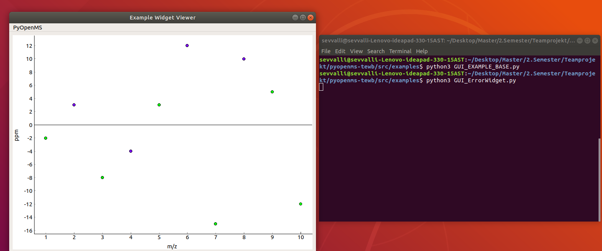
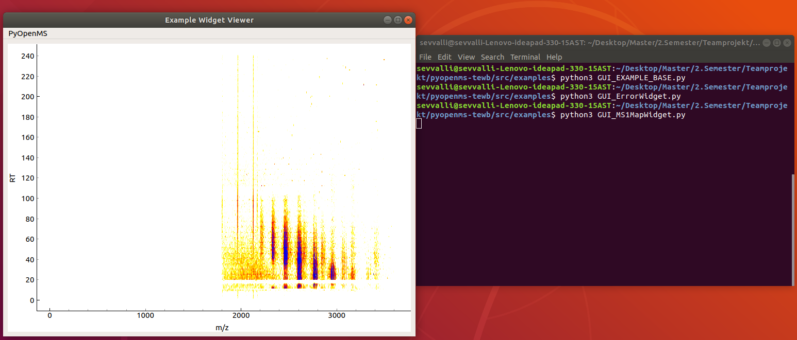
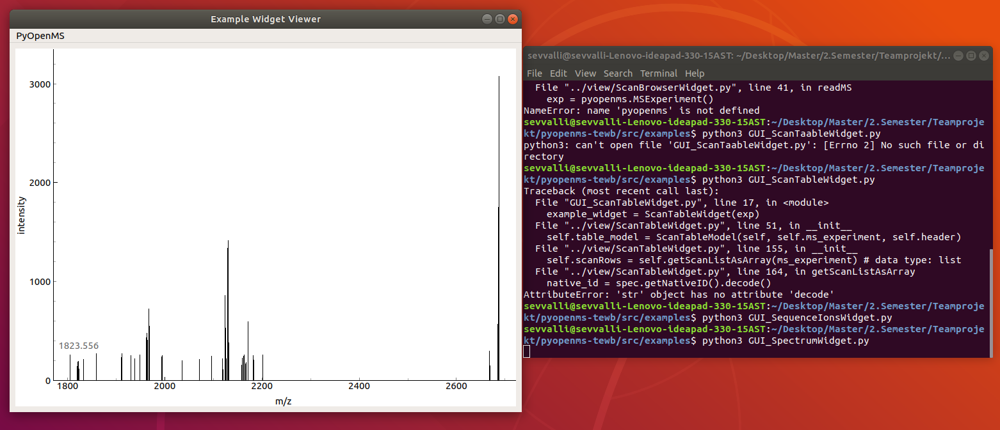
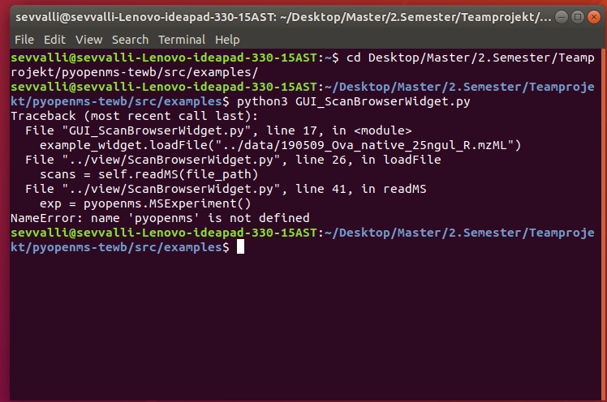
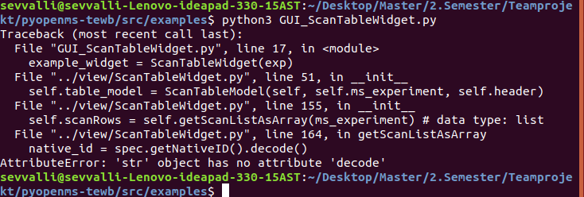

# PyQt Teamprojekt

Teammitglieder:
Philipp Baltik, Till Englert, Sevvalli Thavapalan, Fabian Wurth

## Useful Links:

- [MD-Cheatsheet](https://github.com/adam-p/markdown-here/wiki/Markdown-Cheatsheet)
- [ohshitgit](ohshitgit.com)
- [Continuous Integration](https://realpython.com/python-continuous-integration/)

## Woche 2

1. Jedes Team erstellt einen Fork von https://github.com/OpenMS/pyopenms-extra . Es bietet sich daher an ein neues Repository für das Team anzulegen und Teamkollegen sowie uns timosachsenberg, FabianAicheler, nicweb hinzuzufügen. ✔️

2. Zeigt anhand von ein paar Screenshots dass ihr die graphischen Komponenten in pyopenms-extra/tree/master/src/examples ausführen könnt.✔️
   - Example Screenshots:
##### Error Widget  

##### MS1Map Widget

##### Spectrum Widget

##### Probleme
 - Wir hatten Probleme folgende Widgets auszuführen: ScanBrowserWidget.py und ScanTableWidget.py
 
 

3. Erstellt eine github.io page für diese und die folgenden Wochen und erstellt einen kurzen Report der uns nachverfolgen lässt dass ihr die einzelnen Aufgaben erfüllt habt. Fügt hier auch die Screenshots ein. ✔️
4. Wir wollen in Zukunft mit Hilfe von Continuous Integration (CI) bei der Arbeit im Team sicherstellen dass gewisse Konventionen und Codingstandards eingehalten werden. Lest euch in https://realpython.com/python-continuous-integration/ ein. Fügt einen Flake8 Test hinzu der automatisch neu geöffnete Pull Requests auf Codingstandards analysiert. 
5. Zum Test der CI Funktionalität sollte jedes Mitglied eines Teams auf einem eigenen Branch eine kleine Änderung an einem Beispiel aus pyopenms-extra/tree/master/src/examples vornehmen und einen Pull Request auf euer Team Repository öffnen.

pyOpenMS Extra
=============

pyOpenMS are the Python bindings to the OpenMS open-source C++ library for
LC-MS data management and analyses. The Python bindings cover a large part of
the OpenMS API to enable rapid algorithm development and workflow development.
pyOpenMS supports the Proteomics Standard Initiative (PSI) formats for MS data. 

These utils contain documentation, installation instructions and example code
that show the different functions of pyOpenMS.

Installation
=============

Installation is best done through [PyPI](https://pypi.python.org/pypi/pyopenms)
(the Python package index) where binary packages are provided for the release
versions of OpenMS, covering Linux/Mac/Windows.

Documentation
=============
The pyOpenMS documentation is also contained in this repository, see [docs/README.md](docs/README.md)
