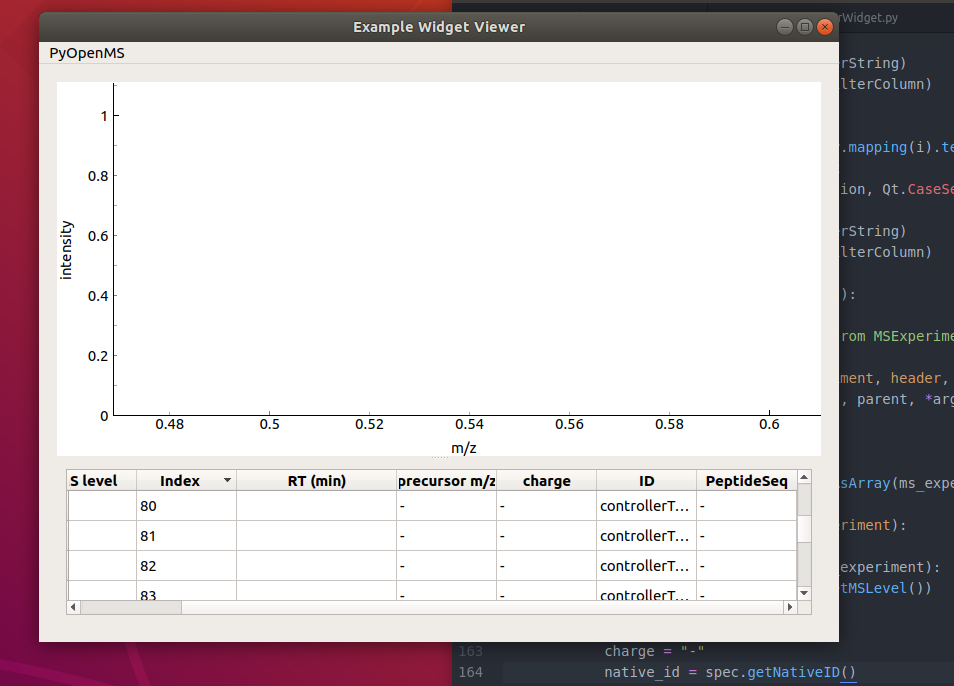
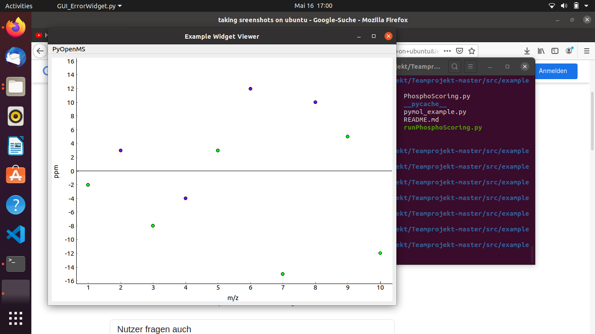
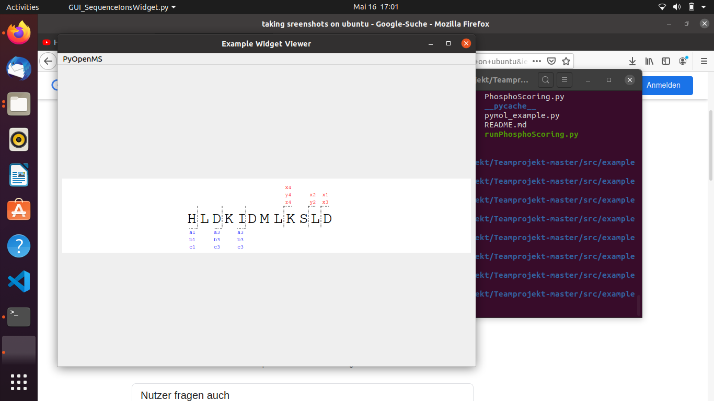
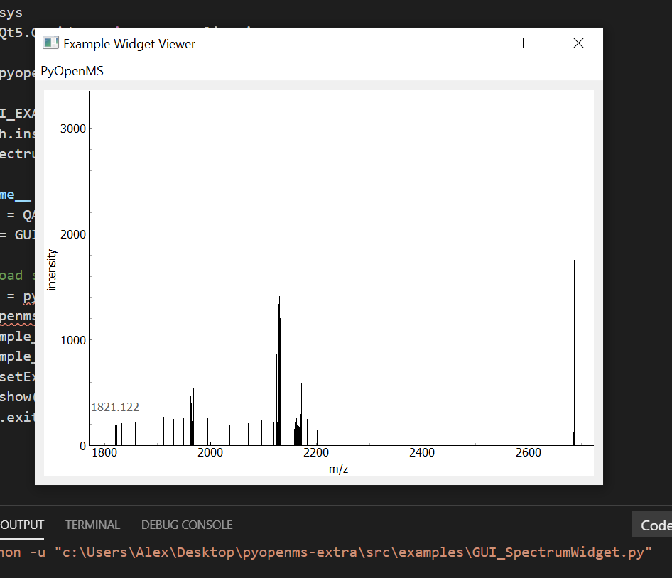

# Woche 2

* Es wurde ein Fork des Repositorys ​ https://github.com/OpenMS/pyopenms-extra​ erstellt und daraus ein neues Teamrepository angelegt.

* Für das Teamrepository wurde eine Continuous Integration Pipeline über Circleci aufgesetzt. Diese wird bei neuen Pull Requests automatisch durchgeführt. Die Pipeline beinhaltet einen Flake8 Test, der die Dateien auf Codingstandarts überprüft.

## Ausführung der graphischen Komponenten aus pyopenms-Extra

Zum Ausführen der GUI ist es erforderlich pyopenms zu installieren. Bei einigigen Komponenten traten Fehler auf die wie folgt verbessert wurden:
..* für eine Datei musste das package pyqtgraph instaliert werden
..* in einer Datei musste die decode() Funktion entfernt werden
..* in einer Datei musste pyopenms noch importiert werden

Anschließend konnten die GUI Komponenten ausgeführt werden.

**Example GUI Caro**

**Example GUI Hristian**

**Example GUI Alex**

## Zusätzliches Problem das Hrisitan und Alex betraf

Es gab Probleme bei der Auführung der GUI Elemente bedingt durch pyopenms. 
Hristian konnte es "fixen" indem er auf Linux/ Ubuntu gewechselt ist, wo es dann über die
Konsole funktioniert hat. Über VS Code ging es auch hier weiterhin nicht, da das Problem ja 
trotzdem weiterhin bestand. 
Ich (Alex) habe es auf Windows weiter versucht und habe dann in einem Forum die Lösung gefunden.
Die libraries QT5Network und Qt5Core waren veraltet. Durch Überschreiben der Selbigen aus PyQt5 
konnte das Problem gelöst werden. 
Der Zeitaufwand bis es irgendwann gelöst war lag locker bei sieben Stunden. Frustrierend.
Die entsprechenden Fehlermeldung hier:

**Fehlermeldungen durch veraltete Libraries**

pyOpenMS Extra
=============

pyOpenMS are the Python bindings to the OpenMS open-source C++ library for
LC-MS data management and analyses. The Python bindings cover a large part of
the OpenMS API to enable rapid algorithm development and workflow development.
pyOpenMS supports the Proteomics Standard Initiative (PSI) formats for MS data.

These utils contain documentation, installation instructions and example code
that show the different functions of pyOpenMS.

Installation
=============

Installation is best done through [PyPI](https://pypi.python.org/pypi/pyopenms)
(the Python package index) where binary packages are provided for the release
versions of OpenMS, covering Linux/Mac/Windows.

Documentation
=============
The pyOpenMS documentation is also contained in this repository, see [docs/README.md](docs/README.md)
