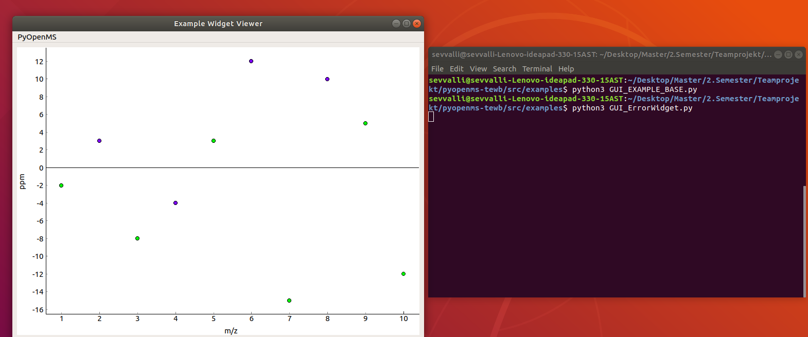
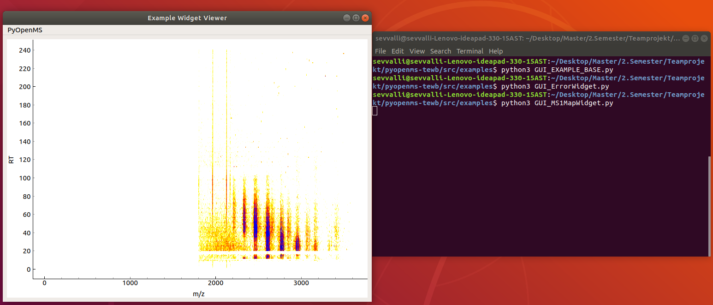
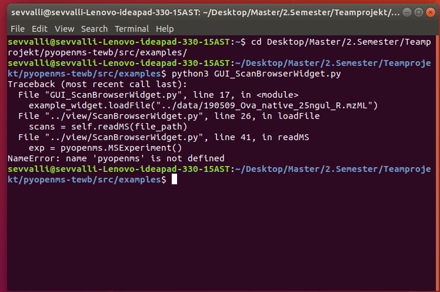
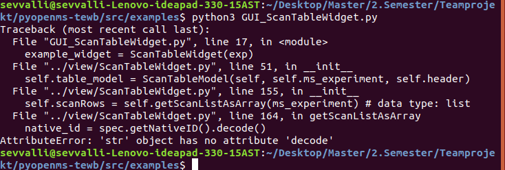
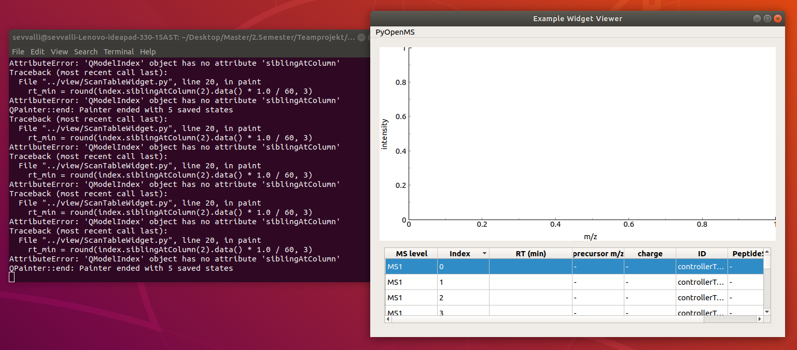
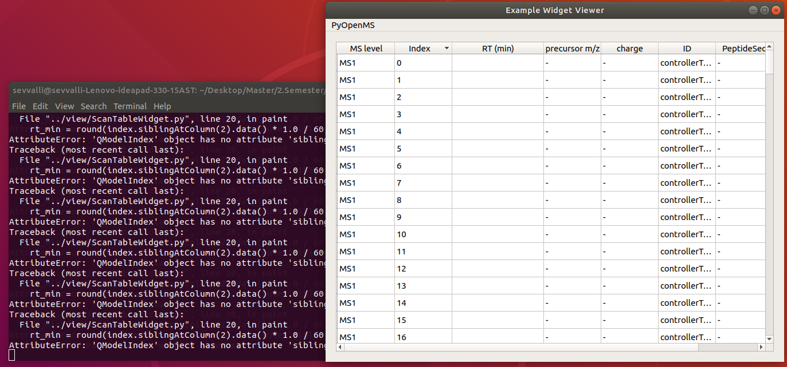

# Woche 2

1. Jedes Team erstellt einen Fork von <https://github.com/OpenMS/pyopenms-extra> . Es bietet sich daher an ein neues Repository für das Team anzulegen und Teamkollegen sowie uns timosachsenberg, FabianAicheler, nicweb hinzuzufügen. ✔️

2. Zeigt anhand von ein paar Screenshots dass ihr die graphischen Komponenten in pyopenms-extra/tree/master/src/examples ausführen könnt.✔️
   - Example Screenshots:

   - Error Widget

    

    - MS1Map Widget

    

    - Spectrum Widget

    

    - Probleme

    - Wir hatten Probleme folgende Widgets auszuführen: ScanBrowserWidget.py und ScanTableWidget.py
     
     

    - Lösung

    - ./src/view/ScanTableWidget.py: In Zeile 164 .decode() musste entfernt werden
    - ./src/view/ScanBrowserWidget.py: pyopenms musste importiert werden

    
    

3. Erstellt eine github.io page für diese und die folgenden Wochen und erstellt einen kurzen Report der uns nachverfolgen lässt dass ihr die einzelnen Aufgaben erfüllt habt. Fügt hier auch die Screenshots ein. ✔️
4. Wir wollen in Zukunft mit Hilfe von Continuous Integration (CI) bei der Arbeit im Team sicherstellen dass gewisse Konventionen und Codingstandards eingehalten werden. Lest euch in <https://realpython.com/python-continuous-integration/> ein. Fügt einen Flake8 Test hinzu der automatisch neu geöffnete Pull Requests auf Codingstandards analysiert. ✔️

5. Zum Test der CI Funktionalität sollte jedes Mitglied eines Teams auf einem eigenen Branch eine kleine Änderung an einem Beispiel aus pyopenms-extra/tree/master/src/examples vornehmen und einen Pull Request auf euer Team Repository öffnen.
