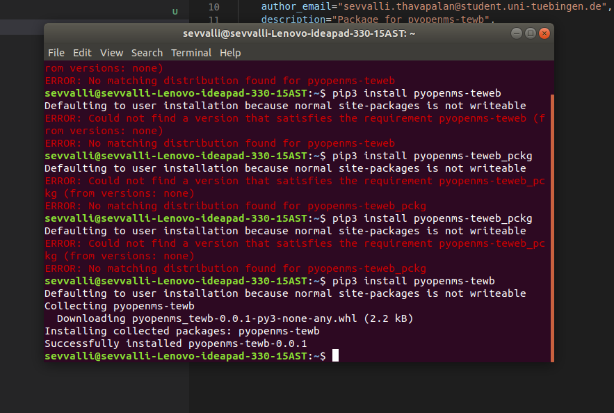
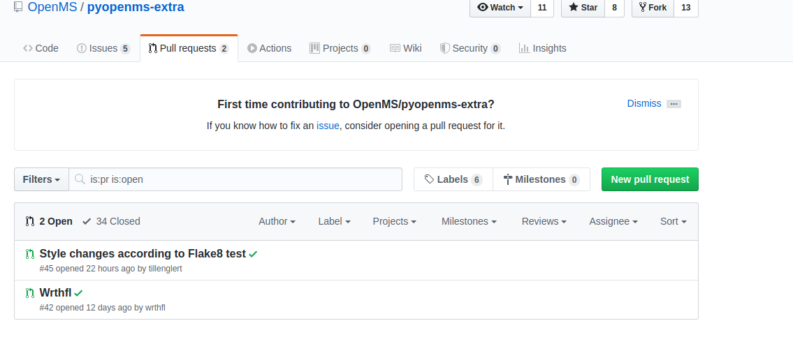
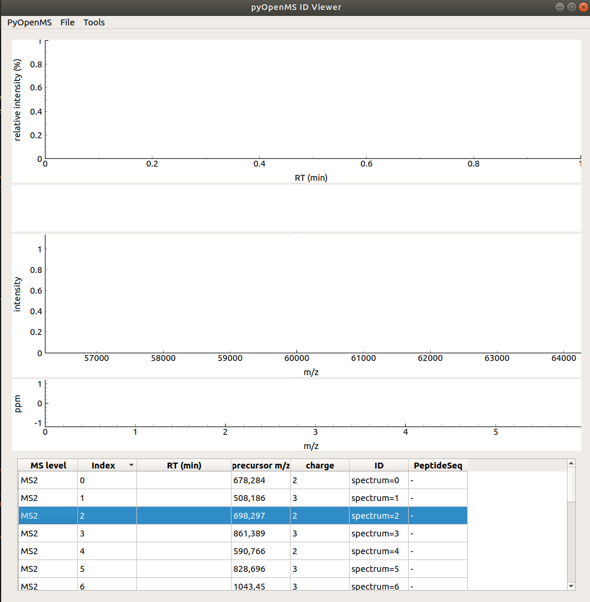
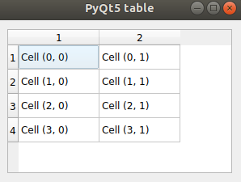

# Woche 3

1. Der nächste Schritt nach Continuous Integration ist Continuous Deployment - also das
    automatische Erzeugen funktionierender, installierbarer Pakete/Binaries. Erstellt alles
    nötige um aus eurem Projekt ein Python wheel zu generieren.
    <https://packaging.python.org/tutorials/packaging-projects/> ✔️
    

2. Korrigiert möglichst alle Violations (Tipp: mit Hilfe eines Tools) in eurem Repository in
    dem ihr einen branch namens “fix/style” anlegt und merged. ✔️

    - Die style violations, welche Flake8 aufgezeigt hat wurden mithilfe von Extensions des Programms VS Codium behoben. So konnten die Whitespaces durch das standart formatieren des programms behoben werden. Die zu langen Zeilen wurden von Hand behoben, genauso wie schlecht gesetzte indentationen.

3. Öffnet ein PR gegen das upstream pyopenms-extra repository. ✔️
    

4. Schaut euch die IDViewer.py Applikation an.
     Das Fenster sollte nach laden der Datei
    <https://github.com/OpenMS/pyopenms-extra/blob/master/src/data/MS2_spectra.idXML​> in
    etwa so aussehen. Versucht zu verstehen was die Applikation und der Code macht. Um
    euch ein bisschen mehr mit pyQt anzufreunden fügt über der Tabelle eine weitere
    Tabelle hinzu (die noch keine sinnvollen Daten enthalten muss und muss auch noch
    nicht auf Ereignisse reagieren).
   - Till: Vorerst musste die App gefixed werden, da sie das Modul ControllerWidget nicht laden konnte. Das Problem hierbei war, dass zuerst das Modul geladen werden sollte und dann das working directory festgelegt wurde. Diese beiden prozesse wurden getauscht. Die App selber zeigt jedoch kein TIC an und kann diese Daten nicht laden. Durch klicken in den TIC Graph crashed die app, da ein array index zu -1 wird. Zudem werden die peptidsequenzen falsch angezeigt. Siehe folgender Screenshot.

    

    - Sevvalli: ID Viewer konnte zunächst nicht geladen werden. Nach dem Fix und einladen der Datei werden keine Spektren angezeigt:

    

       - Trotz diesen Bugs wurde versucht eine Tabelle hinzuzufügen, jedoch schlägt das Laden der Datei nun direkt fehl ohne etwas anzuzeigen, mit dem Grund, dass  das TIC Spektrum leer ist. Die Tabelle sollte vorerst wie folgt aussehen.

    
