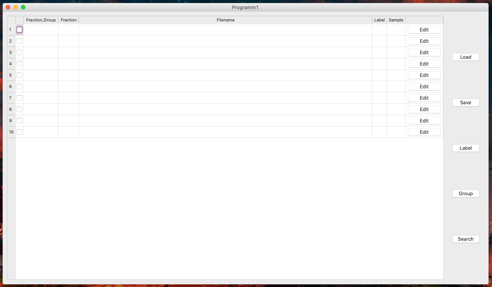
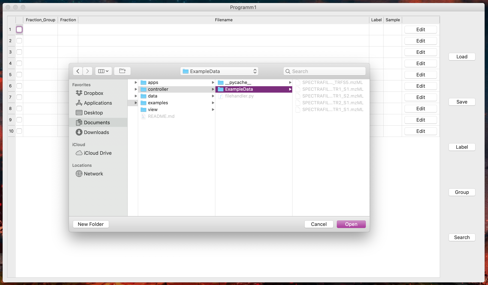
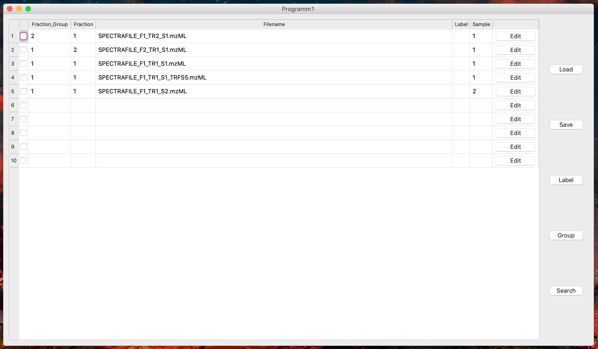

# Woche 4

1. Zusätzliche Userstories:

   1. Ich will mit Drag & Drop eine große Anzahl an Dateien (zB ein Ordner) in die Tabelle importieren können. Dafür muss eine Zielfläche für die Drag & Drop-Aktion bereitgestellt werden.

   2. Mithilfe eines Buttons will ich auswählen können welche Einträge einer bestimmten Gruppe oder Sample oder Fraktion angehören. Dafür muss eine Funktion bereitgestellt werden die Zugriff auf das Tabellen-Objekt erlaubt.

   3. Ich will mit einer von mir sortierbaren Liste automatisch die Fraktionen zB. 1-10 zuordnen können und zu einem Sample Gruppieren. Dafür muss eine Funktion bereitgestellt werden mit der man die Fraktionen zuordnen und danach gruppieren kann.

2. Projektänderungen:  
   1. Die Ordner model und controller zum Projekt hinzugefügt um eine MVC-Struktur herzustellen.
   2. FileHandler.py für Funktionen rund um das hinzufügen und bauen einer Tabelle zu garantieren in controller angelegt.
   3. Probefenster.py zum Testen des Tabellen-Widgets in apps angelegt.
   4. Tableview.py und ButtonView.py in view angelegt.
   5. Im nachhinein TableView und ButtonView in OverallView.py direkt vereint, daher TableView.py und ButtonView.py gelöscht.
   6. Funktionalität des Load-Buttons in Grundzügen implementiert durch Verwendung von Filehandler(Ordner können gewählt werden und deren Inhalte werden dann entsprechend gehandhabt.)

3. Userstories:
    1. Ich möchte die Messungen (mzML Dateien) einfach über einen Filedialog hinzufügen können.
        - filehandler.py scannt ein zuvor übergebenes Verzeichnis und importiert daraus alle mzML-Dateien. Danach werden aus dem Dateinamen,tags über   zuvor festgelegte Delimiter ("_","-",etc.)erstellt
    2. Zusätzlich möchte ich angeben wieviele Labels in einer mzML Datei gemessen wurden. Wir nehmen an dass dieser Wert derselbe für alle mzML Dateien ist.
        - es existiert eine Spalte für Labels.
    3. Unterstütze Vorfraktionierung indem du vom User für jede mzML Datei die Fraktionsnummer abfrägst.
        - Fractions werden aus dem Dateinamen ausgelesen.
    4. Unterstütze den Nutzer weiter indem du die restlichen fehlenden Informationen abfrägst und die Datei entsprechend den Eingaben automatisch erstellst.
        - Noch nicht implementiert, mögliche Lösung wäre eine Abfrage nachdem erkannt wird welche Einträge in der Tabelle noch leer sind.
4. Screenshots:
    
    
    
    
