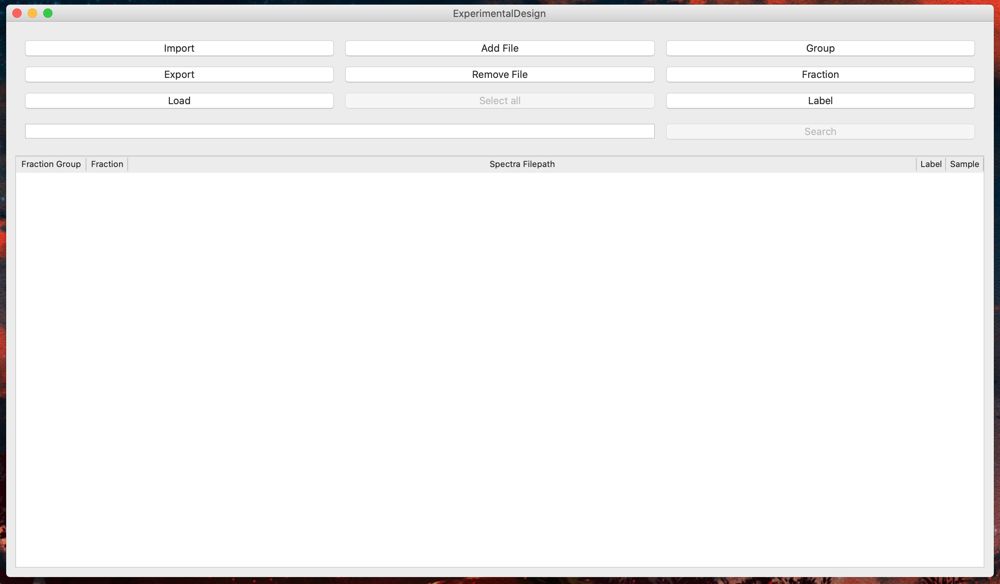
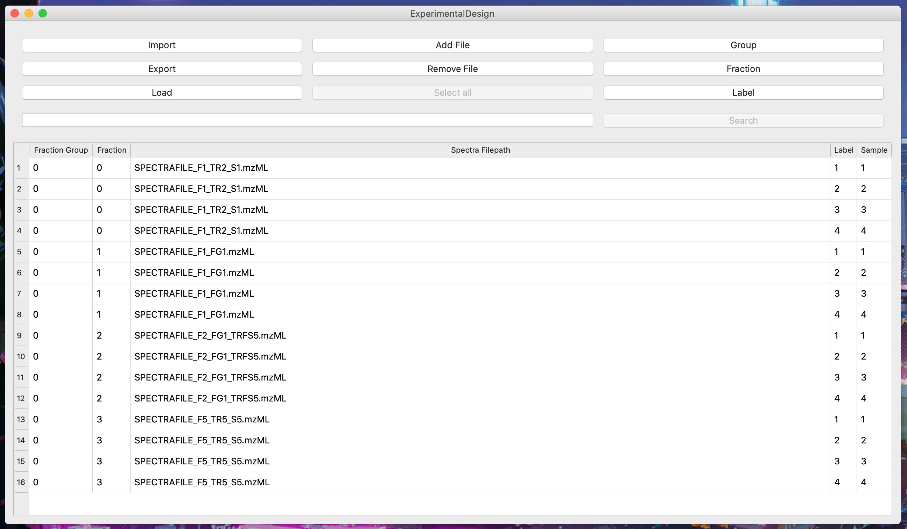

# Woche 5

1. Projektänderungen bzw. Nachtrag zu Aufgaben letzter Woche:  
   1. Im Ordner model eine tableDataFrame.py file angelegt, welche Funktionalitäten für Group, Fraction und Label beinhaltet.
   2. Design der Anwendung etwas angepasst.
   3. Save-Button entfernt und zusätzlich Import, Export, Add File, Remove File, Select All Buttons sowie ein Eingabefeld für den
      Search-Button hinzugefügt.
   4. Funktionalität für alle Buttons ausgenommen Search und Select All, implementiert.
   
2. Bugs:
  - Export crasht wenn bei Eingabe des Filenames nicht .tsv/.csv als Dateiendung steht und es wird immer in 
    den Ordner exportiert welcher zuletzt über Load geladen wurde
  - Label, Fraction und Group können mit manchen Eingaben zum Crash führen 
    (Bsp. Label mit Eingabe 0 und No erzeugt derzeit noch einen ValueError)

3. Aktuelle Aufgabe:
    1. Code nach NumPy/Scipy Standart Kommentiert.
    2. TypeHinting:
        - Definition: Type von Eingabe- und Ausgabeparameter einer Funktion festlegen.
         - Dies ist nützlich da jederzeit feststeht womit eine Funktion arbeitet, was beim Debugging hilfreich ist, da wir
            uns direkt Typefehler ausgeben lassen können, und das Verstehen der Funktion für andere erleichtert.

4. Screenshots:
    
    
    
