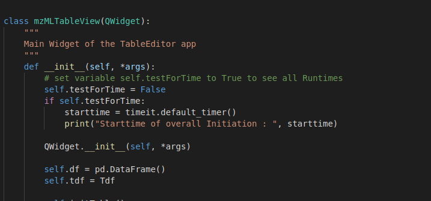
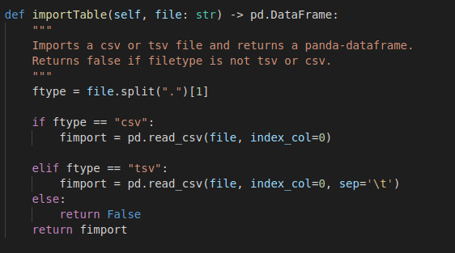

# Woche 6

1. Arbeitet ggf. vorhandene Rückstände auf✔️

2. Dokumentiert und Kommentiert euren Code und folgt dem NumPy/SciPy
docstring Standard.
     

3. Was versteht man unter Type Hinting? Warum ist es sinnvoll dies für
Funktionsparameter und Rückgabetypen umzusetzen?
     - Type hinting stellt eine zusäzliche Hilfe beim Lesen des Codes dar. Es soll dazu führen,
    dass der Code noch weniger kommentiert werden muss. Dies geschieht durch das Format, dass
    im Screenshot zu sehen ist. Und macht es leichter input und output einer Methode zu sehen.
     
