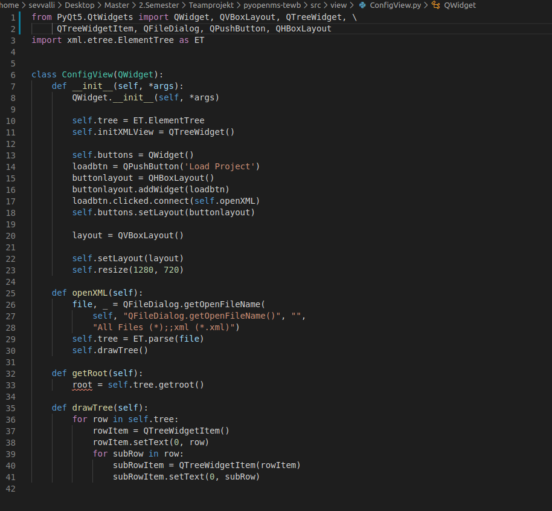

# Woche 7

1. Arbeitet euch in Profiling mit trace und timeit ein
     
2. Bugfix Remove Button:
    - Programm kann jetzt ohne Probleme mehrere Male hintereinander Files aus der Tabelle
    löschen ohne abzustürzen
3. To Do:
    - Arbeitet euch in Debugging mit Hilfe von pdb ein.
    - Bugs:
        - Export crasht wenn bei Eingabe des Filenames nicht .tsv/.csv als Dateiendung steht und es wird immer in
        den Ordner exportiert welcher zuletzt über Load geladen wurde
        - Label, Fraction und Group können mit manchen Eingaben zum Crash führen  und negative Werte können noch eingetragen werden
        (Bsp. Label mit Eingabe 0 und No erzeugt derzeit noch einen ValueError)
4. Erstellt ein Widget um Konfigurationsdateien wie z.B.:
    <https://github.com/OpenMS/OpenMS/blob/develop/src/tests/topp/OpenPepXLLF_>
    input2.ini zu visualisieren und vom Benutzer editierbar zu machen.
    - Erstes grobe Fenster ist erstellt -> Layout muss bearbeitet werden
      
5. TabellenFilter-Funktion implementiert
   - filtert Zeilen über den Wert aus dem Textinput basierend auf der zuvor spezifierten Spalte (Spectra_Filepath).
   - momentan wird die tabelle noch nicht upgedatet
   - stattdessen werden nur die Zeilen geprintet die den suchparameter(string) aus dem textinput enthalten
