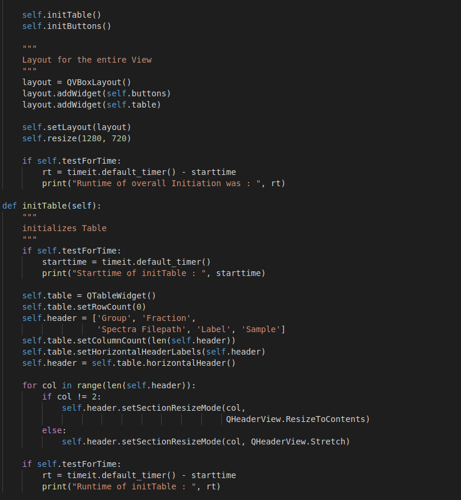
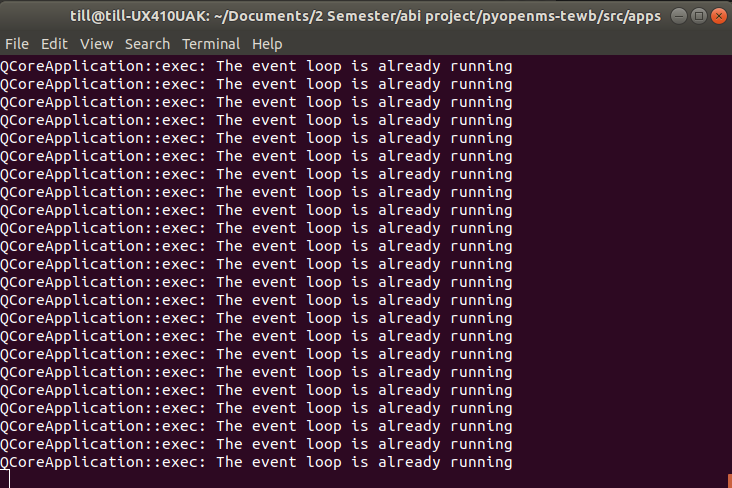
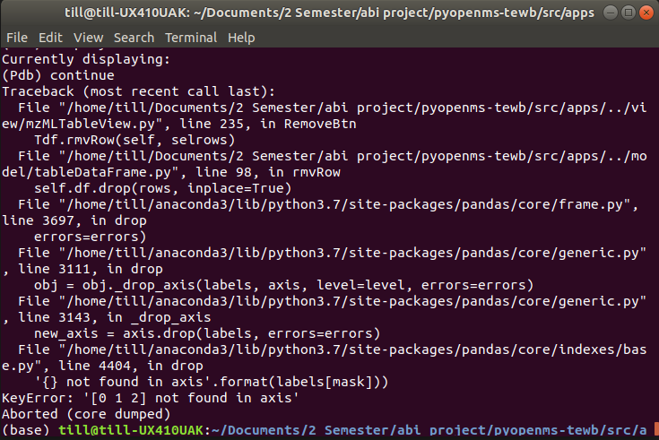

# Woche 7

1. Arbeitet euch in Profiling mit trace und timeit ein
     - trace gibt einfach in der Konsole aus was genau gemacht wird, mit der option --trace
       z.Bsp. wird jeder funktionsaufruf bis ins detail angezeigt
     - timeit stellt verschiedene Möglichkeiten zur Verfügung um runtime zu testen
        (bei uns wird über einen boolean bestimmt ob die runtimes der ausgeführten funktionen im
         Terminal angezeigt werden sollen, wobei timeit nur die Zeit zu Beginn der Funktion nimmt
         und dann die Zeit von der aktuellen abzieht um eine aktuelle runtime auszurechnen)
     
2. Bugfix Remove Button:
    - Vorerst große Probleme, da import funktionen immer wieder aufgerufen wurden, wenn breakpoints gesetzt wurden bzw der debugger gestartet.
        -> Lösung: Es musste eine seperate funktion geschrieben werden welche erst: pyqtRemoveInputHook() aufruft und dann in den Debugger geht.
      
      
    - Der Fehler konnte so eingedämmt werden auf den Punkt an dem er passiert.
    - Programm kann jetzt ohne Probleme mehrere Male hintereinander Files aus der Tabelle
    löschen ohne abzustürzen -> Problem war das Löschen der Zeilen im Dataframe, da der index nicht erneuert wurde.

3. Erstellt ein Widget um Konfigurationsdateien wie z.B.:
    <https://github.com/OpenMS/OpenMS/blob/develop/src/tests/topp/OpenPepXLLF_>
    input2.ini zu visualisieren und vom Benutzer editierbar zu machen.
    - Erstes grobe Fenster ist erstellt -> Layout muss bearbeitet werden
    - Noch keine funktionalität wie gewünscht, .ini ist in Objekt geparst aber ist noch nicht in QTreeWidget angezeigt.

4. TabellenFilter-Funktion implementiert
   - filtert Zeilen über den Wert aus dem Textinput basierend auf der zuvor spezifierten Spalte (Spectra_Filepath).
   - momentan wird die tabelle noch nicht upgedatet
   - stattdessen werden nur die Zeilen geprintet die den suchparameter(string) aus dem textinput enthalten
