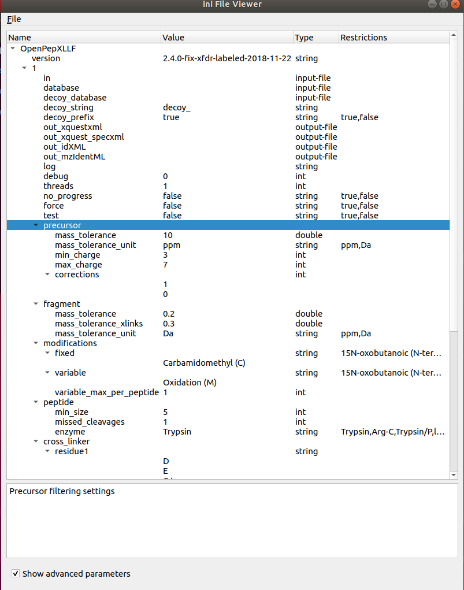

# Woche 8

1. Arbeitet eventuelle Rückstände auf
    - Fertige Version des XML - Viewers:
     
    - Das Widget parsed eine .ini Datei (XML format) in ein QTreeWidget
    - Beschreibungen eines Parameters werden in einem dictionary gespeichert und die Textbox unten je nach selected entry gefüllt
    - Die Checkbox show advanced parameters liest den Tree mit/ohne advanced flagged items ein.
    - Todo:
        - Noch ist das QTreeWidget unveränderbar
        - Bisher noch nicht möglich den Tree wieder zu speichern
    
    - Änderungen im TableEditor Widget:
        - Dataframe wurde nicht aktualisiert wenn von Hand Änderungen durchgeführt wurden. Dies führte zu Problemen beim Exportieren der Tabelle. ✔️

2. Jede Gruppe schickt bitte nochmal explizit den Github IO Pages Link per Email an alle Betreuer.✔️
3. Bis Mittwoch hat jede Gruppe einen sauberen(!) Pull Request erstellt, so dass die
anderen Teams anfangen können zu arbeiten ✔️
4. Erstellt eine Hauptapplikation die den Code der anderen Gruppen jeweils mit
verwendet.
