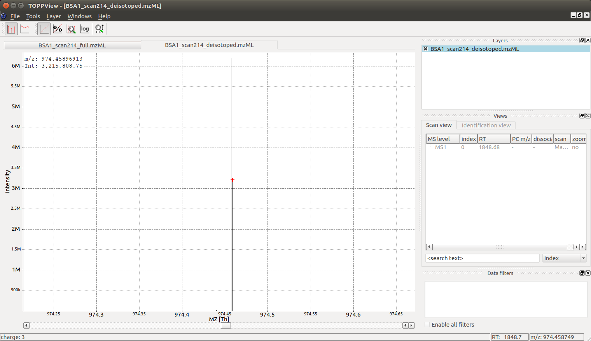

Charge and Isotope Deconvolution 
================================

A single :term:`mass spectrum` contains measurements of one or more analytes and the
:term:`m/z` values recorded for these analytes. Most analytes produce multiple signals
in the mass spectrometer, due to the natural abundance of carbon :math:`13` (naturally
occurring at ca. :math:`1%` frequency) and the large amount of carbon atoms in most
organic molecules, most analytes produce a so-called isotopic pattern with a
monoisotopic :term:`peak`  (all carbon are :math:`C12`) and a first isotopic :term:`peak` (exactly one
carbon atom is a :math:`C13`), a second isotopic :term:`peak` (exactly two atoms are :math:`C13`) etc.
Note that also other elements can contribute to the isotope pattern, see the 
`Chemistry section <chemistry.html>`_ for further details.

In addition, each analyte may appear in more than one charge state and adduct
state, a singly charge analyte :math:`[M+H]+` may be accompanied by a doubly
charged analyte :math:`[M+2H]++` or a sodium adduct :math:`[M+Na]+`. In the case of a
multiply charged peptide, the isotopic traces are spaced by ``PROTON_MASS /
charge_state`` which is often close to :math:`0.5` :term:`m/z` for doubly charged analytes,
:math:`0.33` :term:`m/z` for triply charged analytes etc. Note: tryptic peptides often appear
at least doubly charged, while small molecules often carry a single charge but
can have adducts other than hydrogen.

Single :term:`Peak<peak>` Example
*********************************

.. code-block:: python

    from pyopenms import *

    charge = 2
    seq = AASequence.fromString("DFPIANGER")
    seq_formula = seq.getFormula() + EmpiricalFormula("H" + str(charge))
    isotopes = seq_formula.getIsotopeDistribution(CoarseIsotopePatternGenerator(6))
    print("[M+H]+ weight:", seq.getMonoWeight(Residue.ResidueType.Full, 1))

    # Append isotopic distribution to spectrum
    s = MSSpectrum()
    for iso in isotopes.getContainer():
        iso.setMZ(iso.getMZ() / charge)
        s.push_back(iso)
        print("Isotope", iso.getMZ(), ":", iso.getIntensity())

    Deisotoper.deisotopeAndSingleChargeDefault(s, 10, True)

    for p in s:
        print(p.getMZ(), p.getIntensity())

Note that the algorithm presented here as some heuristics built into it, such
as assuming that the isotopic :term:`peaks` will decrease after the first isotopic
:term:`peak`. This heuristic can be tuned by changing the parameter
``use_decreasing_model`` and ``start_intensity_check``. In this case, the
second isotopic :term:`peak`  is the highest in intensity and the
``start_intensity_check`` parameter needs to be set to 3. 

.. code-block:: python

    charge = 4
    seq = AASequence.fromString("DFPIANGERDFPIANGERDFPIANGERDFPIANGER")
    seq_formula = seq.getFormula() + EmpiricalFormula("H" + str(charge))
    isotopes = seq_formula.getIsotopeDistribution(CoarseIsotopePatternGenerator(8))
    print("[M+H]+ weight:", seq.getMonoWeight(Residue.ResidueType.Full, 1))

    # Append isotopic distribution to spectrum
    s = MSSpectrum()
    for iso in isotopes.getContainer():
        iso.setMZ(iso.getMZ() / charge)
        s.push_back(iso)
        print("Isotope", iso.getMZ(), ":", iso.getIntensity())

    min_charge = 1
    min_isotopes = 2
    max_isotopes = 10
    use_decreasing_model = True
    start_intensity_check = 3
    Deisotoper.deisotopeAndSingleCharge(
        s,
        10,
        True,
        min_charge,
        charge,
        True,
        min_isotopes,
        max_isotopes,
        True,
        True,
        True,
        use_decreasing_model,
        start_intensity_check,
        False,
    )
    for p in s:
        print(p.getMZ(), p.getIntensity())

Full Spectral De-Isotoping
**************************

In the following code segment, we will use a sample measurement of BSA (Bovine
Serum Albumin), and apply a simple algorithm in OpenMS for "deisotoping" a
:term:`mass spectrum`, which means grouping :term:`peaks` of the same isotopic pattern charge
state:

.. code-block:: python

    from urllib.request import urlretrieve

    gh = "https://raw.githubusercontent.com/OpenMS/pyopenms-docs/master"
    urlretrieve(gh + "/src/data/BSA1.mzML", "BSA1.mzML")

    e = MSExperiment()
    MzMLFile().load("BSA1.mzML", e)
    s = e[214]
    s.setFloatDataArrays([])
    Deisotoper.deisotopeAndSingleCharge(
        s,
        0.1,
        False,
        1,
        3,
        True,
        min_isotopes,
        max_isotopes,
        True,
        True,
        True,
        use_decreasing_model,
        start_intensity_check,
        False,
    )

    print(e[214].size())
    print(s.size())

    e2 = MSExperiment()
    e2.addSpectrum(e[214])
    MzMLFile().store("BSA1_scan214_full.mzML", e2)
    e2 = MSExperiment()
    e2.addSpectrum(s)
    MzMLFile().store("BSA1_scan214_deisotoped.mzML", e2)

    maxvalue = max([p.getIntensity() for p in s])
    for p in s:
        if p.getIntensity() > 0.25 * maxvalue:
            print(p.getMZ(), p.getIntensity())

which produces the following output

.. code-block:: output

  140
  41

  974.4572680576728 6200571.5
  974.4589691256419 3215808.75

As we can see, the algorithm has reduced :math:`140` :term:`peaks` to :math:`41` deisotoped :term:`peaks`. It
also has identified a molecule at :math:`974.45` :term:`m/z` as the most intense :term:`peak` in the
data (base :term:`peak`).

Visualization
*************

The reason we see two :term:`peaks` very close together becomes apparent
once we look at the data in :term:`TOPPView` which indicates that the :math:`974.4572680576728`
:term:`peak` is derived from a :math:`2+` :term:`peak` at :term:`m/z` :math:`487.73` and the :term:`peak` at :math:`974.4589691256419`
is derived from a :math:`3+` :term:`peak` at :term:`m/z` :math:`325.49`: the algorithm has identified a single
analyte in two charge states and deconvoluted the :term:`peaks` to their nominal mass
of a :math:`[M+H]+` ion, which produces two :term:`peaks` very close together (:math:`2+` and :math:`3+`
peak):

Looking at the full :term:`mass spectrum` and comparing it to the original :term:`mass spectrum`, we can see the
original (centroided) :term:`mass spectrum` on the top and the deisotoped :term:`mass spectrum` on the
bottom in blue. Note how hovering over a :term:`peak` in the deisotoped :term:`mass spectrum`
indicates the charge state:

.. image:: img/deisotoped.png

In the next section (`Feature Detection <feature_detection.html>`_), we will look at 2-dimensional deisotoping where instead of
a single :term:`mass spectrum`, multiple :term:`mass spectra<mass spectrum>` from a :term:`LC-MS` experiment are analyzed
together. There algorithms analyze the full 2-dimensional (:term:`m/z` and :term:`RT`) signal
and are generally more powerful than the 1-dimensional algorithm discussed
here. However, not all data is 2 dimensional and the algorithm discussed here
has many application in practice (e.g. single :term:`mass spectra<mass spectrum>`, fragment ion
:term:`mass spectra<mass spectrum>` in DDA etc.).

