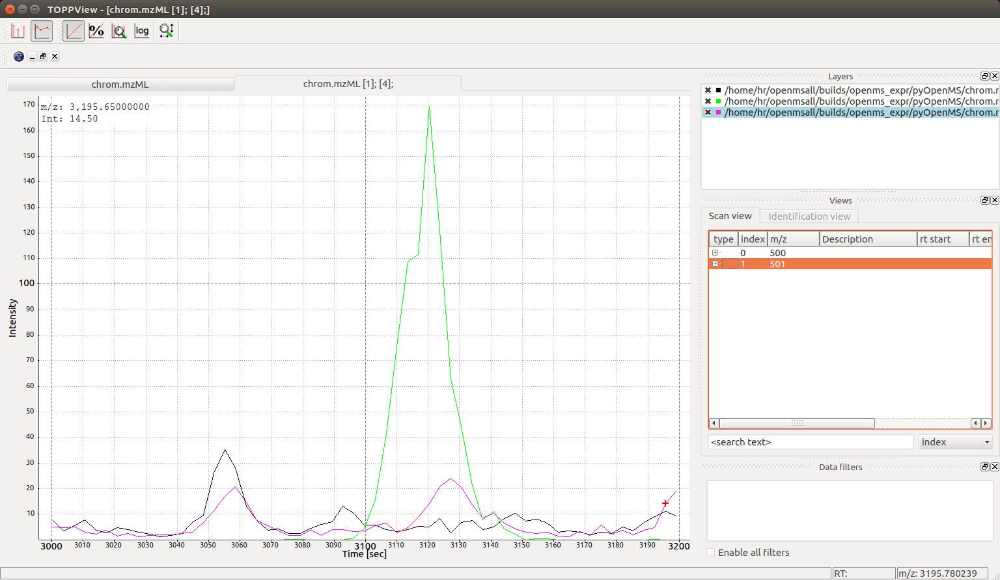
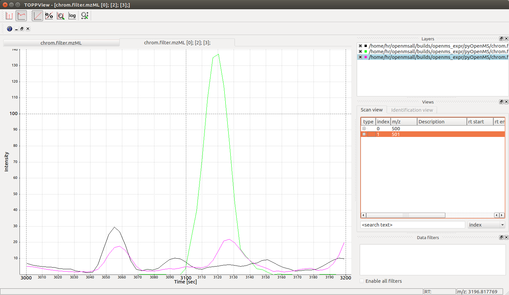

Chromagraphic Analysis
======================

In targeted proteomics, such as SRM / MRM / PRM / DIA applications, groups of
chromatograms need to be analyzed frequently. OpenMS provides several powerful
tools for analysis of chromatograms. Most of them are part of the OpenSWATH
suite of tools and are also discussed in the `OpenSwath documentation
<https://www.openswath.org>`_.

Peak Detection
**************

Here, we will focus on a simple example where 2 peptides are analyzed. We will
need 2 input files: the chromatogram files that contains the chromatographic
raw data (raw SRM traces or extracted ion chromatograms from PRM/DIA data) as
well as the library file used to generated the data which contains information
about the targeted peptides:

.. code-block:: python

    from urllib.request import urlretrieve
    from pyopenms import *
    gh = "https://raw.githubusercontent.com/OpenMS/pyopenms-docs/master"
    urlretrieve (gh + "/src/data/OpenSwathAnalyzer_1_input_chrom.mzML", "chrom.mzML")
    urlretrieve (gh + "/src/data/OpenSwathAnalyzer_1_input.TraML", "transitions.TraML")

    chroms = MSExperiment()
    library = TargetedExperiment()
    MzMLFile().load("chrom.mzML", chroms)
    TraMLFile().load("transitions.TraML", library)

    # Investigate library
    for t in library.getTransitions():
       print ("Transition", t.getNativeID(), "belongs to peptide group", t.getPeptideRef())      

    print ("Input contains", len(library.getTransitions()), "transitions and", len(chroms.getChromatograms()), "chromatograms.")
    features = FeatureMap()
    dummy_trafo = TransformationDescription()
    dummy_exp = MSExperiment()
    MRMFeatureFinderScoring().pickExperiment(chroms, features, library, dummy_trafo, dummy_exp) 
    for f in features: 
      print ("Feature for group", f.getMetaValue("PeptideRef"), "with precursor m/z", f.getMetaValue("PrecursorMZ"))
      print ("  Feature found at RT =", f.getRT(), "with library dot product", f.getMetaValue("var_library_dotprod"))

Here we see that for the first group of transitions (``tr_gr1``), a single peak
at retention time 3119 seconds was found. However, for the second group of
transitions, two peaks are found at retention times 3119 seconds and at
3055 seconds.

Visualization
*************

We can confirm the above analysis by visual inspection of the ``chrom.mzML``
file produced above in the TOPPView software:

However, our output above contains more information than only retention time:

.. code-block:: output

  Feature for group tr_gr1 with precursor m/z 500.0
    Feature found at RT = 3119.091968219877 with library dot product 0.9924204062692046
  Feature for group tr_gr2 with precursor m/z 501.0
    Feature found at RT = 3055.584481870532 with library dot product 0.952054383474221
  Feature for group tr_gr2 with precursor m/z 501.0
    Feature found at RT = 3119.0630105310684 with library dot product 0.7501676755451506  

Based on the output above, we can infer that the peak at 3055 seconds is
likely the correct peak for ``tr_gr2`` since it has a high library dot product
(0.95) while the peak at 3119 seconds is likely incorrect for ``tr_gr2`` since
its dot product is low (0.75). We also see that a peak at 3119 seconds is
likely correct for ``tr_gr1`` since it matches well with the expected library
intensities and has a high dot product (0.99).

Note: to get an overview over all available scores for a particular MRM feature ``f``, you can use

.. code-block:: python

    k = []
    f.getKeys(k)
    print (k)

.. TODO : change for 2.5 to something else

Smoothing
*********

Now you may want to show the chromatograms to your collaborator, but you notice
that most software solutions smooth the chromatograms before display. In order
to provide smooth chromatograms, you can apply a filter using pyOpenMS:

.. code-block:: python

    sg = SavitzkyGolayFilter()
    sg.filterExperiment(chroms)
    # MzMLFile().store("chrom.filter.mzML", chroms)

Which leads to the following smoothed chromatographic traces:

