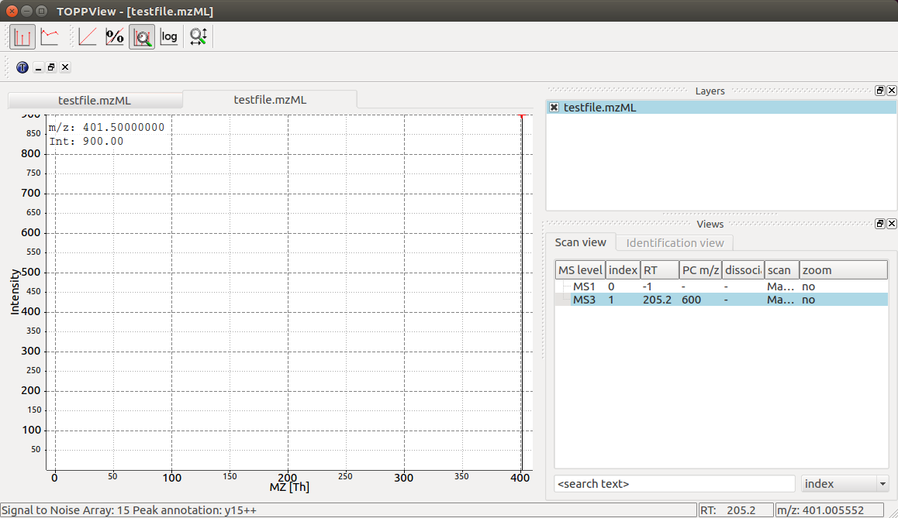

MS Data
=======

Spectrum
********

The most important container for raw data and peaks is ``MSSpectrum`` which we
have already worked with in the `Getting Started <getting_started.html>`_
tutorial.  ``MSSpectrum`` is a container for 1-dimensional peak data (a
container of ``Peak1D``). You can access these objects directly, however it is
faster to use the ``get_peaks()`` and ``set_peaks`` functions which use Python
numpy arrays for raw data access. Meta-data is accessible through inheritance
of the ``SpectrumSettings``  objects which handles meta data of a spectrum. 

In the following example program, a MSSpectrum is filled with peaks, sorted
according to mass-to-charge ratio and a selection of peak positions is
displayed.

First we create a spectrum and insert peaks with descending mass-to-charge ratios: 

.. code-block:: python
    :linenos:

    from pyopenms import *
    spectrum = MSSpectrum()
    mz = range(1500, 500, -100)
    i = [0 for mass in mz]
    spectrum.set_peaks([mz, i])

    # Sort the peaks according to ascending mass-to-charge ratio
    spectrum.sortByPosition()

    # Iterate over spectrum of those peaks
    for p in spectrum:
        print(p.getMZ(), p.getIntensity())

    # More efficient peak access with get_peaks()
    for mz, i in zip(*spectrum.get_peaks()):
        print(mz, i)

    # Access a peak by index
    print(spectrum[2].getMZ(), spectrum[2].getIntensity())

Note how lines 11-12 (as well as line 19) use the direct access to the
``Peak1D`` objects (explicit iteration through the ``MSSpectrum`` object, which
is convenient but slow since a new ``Peak1D`` object needs to be created each
time) while lines 15-16 use the faster access through numpy arrays. Direct
iteration is only shown for demonstration purposes and should not be used in
production code.

To discover the full set of functionality of ``MSSpectrum``, we use the
``help()`` function. In particular, we find several important sets of meta
information attached to the spectrum including retention time, the ms level
(MS1, MS2, ...), precursor ion, ion mobility drift time and extra data arrays.

.. code-block:: python

  from pyopenms import *
  help(MSSpectrum)

We now set several of these properties in a current MSSpectrum:

.. code-block:: python
    :linenos:

    from pyopenms import *

    spectrum = MSSpectrum()
    spectrum.setDriftTime(25) # 25 ms
    spectrum.setRT(205.2) # 205.2 s
    spectrum.setMSLevel(3) # MS3
    p = Precursor()
    p.setIsolationWindowLowerOffset(1.5)
    p.setIsolationWindowUpperOffset(1.5) 
    p.setMZ(600) # isolation at 600 +/- 1.5 Th
    p.setActivationEnergy(40) # 40 eV
    p.setCharge(4) # 4+ ion
    spectrum.setPrecursors( [p] )

    # Add raw data to spectrum
    spectrum.set_peaks( ([401.5], [900]) )

    # Additional data arrays / peak annotations
    fda = FloatDataArray()
    fda.setName("Signal to Noise Array")
    fda.push_back(15)
    sda = StringDataArray()
    sda.setName("Peak annotation")
    sda.push_back("y15++")
    spectrum.setFloatDataArrays( [fda] )
    spectrum.setStringDataArrays( [sda] )

    # Add spectrum to MSExperiment
    exp = MSExperiment()
    exp.addSpectrum(spectrum)

    # Add second spectrum and store as mzML file
    spectrum2 = MSSpectrum()
    spectrum2.set_peaks( ([1, 2], [1, 2]) )
    exp.addSpectrum(spectrum2)

    MzMLFile().store("testfile.mzML", exp)

We have created a single spectrum on line 3 and add meta information (drift
time, retention time, MS level, precursor charge, isolation window and
activation energy) on lines 4-13. We next add actual peaks into the spectrum (a
single peak at 401.5 *m/z* and 900 intensity) on line 16 and on lines 19-26 add
further meta information in the form of additional data arrays for each peak
(e.g. one trace describes "Signal to Noise" for each peak and the second traces
describes the "Peak annotation", identifying the peak at 401.5 *m/z* as a
doubly charged y15 ion). Finally, we add the spectrum to a ``MSExperiment``
container on lines 29-30 and store the container in using the ``MzMLFile``
class in a file called "testfile.mzML" on line 37.  To ensure our viewer works
as expected, we add a second spectrum to the file before storing the file.

You can now open the resulting spectrum in a spectrum viewer. We use the OpenMS
viewer ``TOPPView`` (which you will get when you install OpenMS from the
official website) and look at our MS3 spectrum:

TOPPView displays our MS3 spectrum with its single peak at 401.5 *m/z* and it
also correctly displays its retention time at 205.2 seconds and precursor
isolation target of 600.0 *m/z*.  Notice how TOPPView displays the information
about the S/N for the peak (S/N = 15) and its annotation as ``y15++`` in the status
bar below when the user clicks on the peak at 401.5 *m/z* as shown in the
screenshot.

LC-MS/MS Experiment
*******************

In OpenMS, LC-MS/MS injections are represented as so-called peak maps (using
the ``MSExperiment`` class), which we have already encountered above. The
``MSExperiment`` class can hold a list of ``MSSpectrum`` object (as well as a
list of ``MSChromatogram`` objects, see below). The ``MSExperiment`` object
holds such peak maps as well as meta-data about the injection. Access to
individual spectra is performed through ``MSExperiment.getSpectrum`` and
``MSExperiment.getChromatogram``.

In the following code, we create an ``MSExperiment`` and populate it with
several spectra:

.. code-block:: python
    :linenos:

    # The following examples creates an MSExperiment which holds six
    # MSSpectrum instances.
    exp = MSExperiment()
    for i in range(6):
        spectrum = MSSpectrum()
        spectrum.setRT(i)
        spectrum.setMSLevel(1)
        for mz in range(500, 900, 100):
          peak = Peak1D()
          peak.setMZ(mz + i)
          peak.setIntensity(100 - 25*abs(i-2.5) )
          spectrum.push_back(peak)
        exp.addSpectrum(spectrum)

    # Iterate over spectra
    for spectrum in exp:
        for peak in spectrum:
            print (peak.getRT(), peak.getMZ(), peak.getIntensity())

In the above code, we create six instances of ``MSSpectrum`` (line 4), populate
it with three peaks at 500, 900 and 100 *m/z* and append them to the
``MSExperiment`` object (line 13).  We can easily iterate over the spectra in
the whole experiment by using the intuitive iteration on lines 16-18 or we can
use list comprehensions to sum up intensities of all spectra that fulfill
certain conditions:

.. code-block:: python

		>>> # Sum intensity of all spectra between RT 2.0 and 3.0
		>>> print(sum([p.getIntensity() for s in exp
		...              if s.getRT() >= 2.0 and s.getRT() <= 3.0 for p in s]))
		700.0
		>>> 87.5 * 8
		700.0
		>>> 

We can again store the resulting experiment containing the six spectra as mzML
using the ``MzMLFile`` object:

.. code-block:: python

    # Store as mzML
    MzMLFile().store("testfile2.mzML", exp)

Again we can visualize the resulting data using ``TOPPView`` using its 3D
viewer capability, which shows the six scans over retention time where the
traces first increase and then decrease in intensity:

.. image:: img/spectrum2.png

Chromatogram
************

An additional container for raw data is the ``MSChromatogram`` container, which
is highly analogous to the ``MSSpectrum`` container, but contains an array of
``ChromatogramPeak`` and is derived from ``ChromatogramSettings``:

.. code-block:: python
    :linenos:

    from pyopenms import *
    import numpy as np

    def gaussian(x, mu, sig):
        return np.exp(-np.power(x - mu, 2.) / (2 * np.power(sig, 2.)))

    # Create new chromatogram 
    chromatogram = MSChromatogram()

    # Set raw data (RT and intensity)
    rt = range(1500, 500, -100)
    i = [gaussian(rtime, 1000, 150) for rtime in rt]
    chromatogram.set_peaks([rt, i])

    # Sort the peaks according to ascending retention time
    chromatogram.sortByPosition()

    # Iterate over chromatogram of those peaks
    for p in chromatogram:
        print(p.getRT(), p.getIntensity())

    # More efficient peak access with get_peaks()
    for rt, i in zip(*chromatogram.get_peaks()):
        print(rt, i)

    # Access a peak by index
    print(chromatogram[2].getRT(), chromatogram[2].getIntensity())

We now again add meta information to the chromatogram:

.. code-block:: python
    :linenos:

    chromatogram.setNativeID("Trace XIC@405.2")

    # Store a precursor ion for the chromatogram
    p = Precursor()
    p.setIsolationWindowLowerOffset(1.5)
    p.setIsolationWindowUpperOffset(1.5) 
    p.setMZ(405.2) # isolation at 405.2 +/- 1.5 Th
    p.setActivationEnergy(40) # 40 eV
    p.setCharge(2) # 2+ ion
    p.setMetaValue("description", chromatogram.getNativeID())
    p.setMetaValue("peptide_sequence", chromatogram.getNativeID())
    chromatogram.setPrecursor(p)

    # Also store a product ion for the chromatogram (e.g. for SRM)
    p = Product()
    p.setMZ(603.4) # transition from 405.2 -> 603.4
    chromatogram.setProduct(p)

    # Store as mzML
    exp = MSExperiment()
    exp.addChromatogram(chromatogram)
    MzMLFile().store("testfile3.mzML", exp)

This shows how the ``MSExperiment`` class can hold spectra as well as chromatograms.

Again we can visualize the resulting data using ``TOPPView`` using its chromatographic viewer
capability, which shows the peak over retention time:

.. image:: img/chromatogram1.png

Note how the annotation using precursor and production mass of our XIC
chromatogram is displayed in the viewer.

