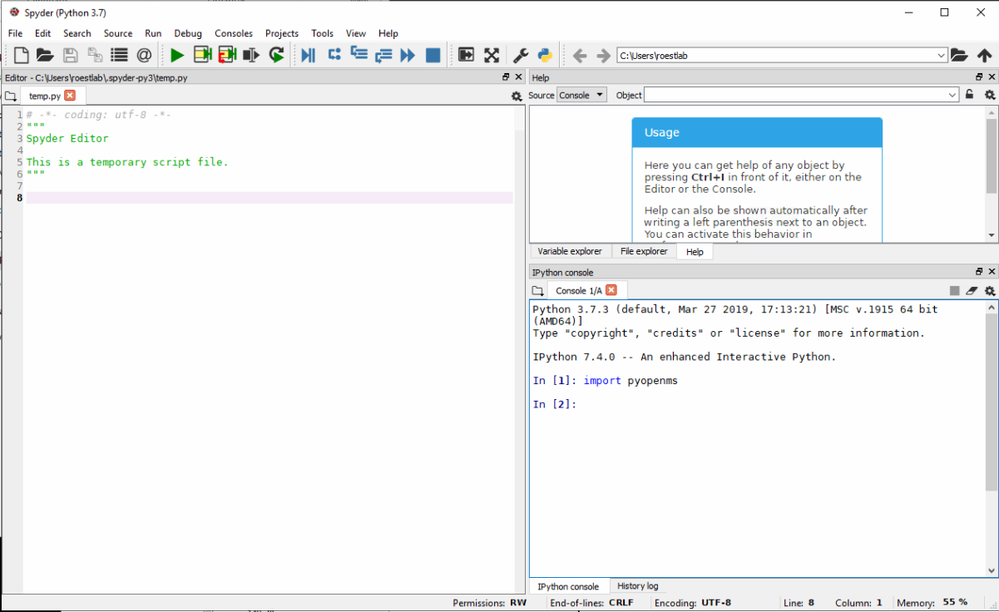

pyOpenMS Installation
=====================

Binaries
********

Spyder
------

On Microsoft Windows, we recommend to use pyopenms together with Anaconda and
the Spyder interface which you can download from the `Official Anaconda
repository <https://www.anaconda.com/distribution/>`_. After installation,
select the "Anaconda Powershell Prompt" from the start menu and enter the
following command:

.. code-block:: bash

  pip install pyopenms

which should result in the following output:

.. image:: img/anaconda_prompt.png

Once successfully installed, you can open the "Spyder" graphical user interface
and pyopenms will be available:

Note the console window (lower right) with the ``import pyopenms`` command,
which was executed without error. Next, the Python script on the right was
executed and the output is also shown on the console window.
You can now use pyopenms within the Spyder environment,
either `moving on with the pyOpenMS Tutorial <getting_started.html>`_ 
or familiarize yourself first with the Spyder environment using
the `Online Spyder Documentation <https://docs.spyder-ide.org/>`_.

.. Recommendation: In order to enable interactive plots that allow zooming, we recommend to change the default plotting backend in Spyder. Go to Tools > preferences > IPython console > Graphics > Graphics backend and then change "Backend" to "Automatic".
.. NOTE: this currently does not work, see https://github.com/spyder-ide/spyder/issues/9227
.. NOTE: this means currently there is no interactive plotting with Spyder :-(

Command Line
------------

To :index:`install` pyOpenMS from the command line using the binary wheels, you
can type

.. code-block:: bash

  pip install numpy
  pip install pyopenms

We have binary packages for OSX, Linux and Windows (64 bit only) available from
`PyPI <https://pypi.org/project/pyopenms>`_. Note that for Windows, we only
support Python 3.5, 3.6 and 3.7 in their 64 bit versions, therefore make sure
to download the 64bit Python release for Windows. For OSX and Linux, we
additionally also support Python 2.7 as well as Python 3.4 (Linux only).

You can install Python first from `here <https://www.python.org/downloads/>`_,
again make sure to download the 64bit release. You can then open a shell and
type the two commands above (on Windows you may potentially have to use
``C:\Python37\Scripts\pip.exe`` in case ``pip`` is not in your system path).

Nightly/ CI wheels
------------------

Additionally, you can also install nightly builds of pyOpenMS from the command line.
Visit the GitHub page that contains the action to build the nightly wheels: https://github.com/OpenMS/OpenMS/actions/workflows/pyopenms-wheels.yml .
Click on e.g., the newest nightly build on the top to get access to artefacts.

.. image:: img/githubActionWheels.png

Download the corresponding wheel for OSX, Linux, or Windows. Unzip
the folder and select the supported Python version for your environment.
The supported Python version is denoted as ``cp3X`` in the wheel file name. 

.. code-block:: bash

  pip install your-package.whl --no-cache-dir

You can then open a shell and type the command above. Note that the Github Action page
contains unstable builds and may not list a download for your operating system. 

Source
******

To install pyOpenMS from :index:`source`, you will first have to compile OpenMS
successfully on your platform of choice and then follow the `building from
source <build_from_source.html>`_ instructions. Note that this may be
non-trivial and *is not recommended* for most users.

Wrap Classes
************

In order to wrap new classes in pyOpenMS, read the following `guide
<wrap_classes.html>`_.
