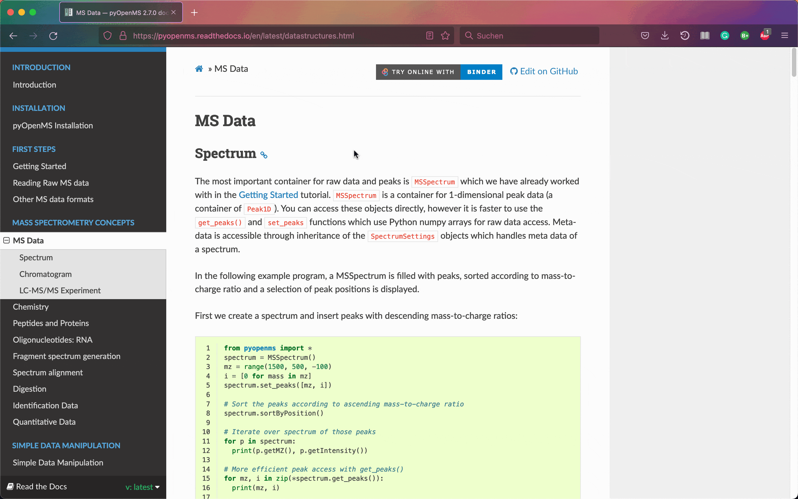

Installation
============

Try online
----------

You can try out pyOpenMS in your browser. Just navigate to a topic you are interested in
by clicking in the menu bar. Then click on the "Try online with Binder" button.

Note that the first start of binder might take a bit. While binder is perfect
for trying pyOpenMS it only offers a limited amount of memory. You should install
the pyOpenMS binaries on your PC for serious data processing.

Binaries
********

We recommend to use pyOpenMS in PyCharm as it works well with source code documentation.

Command Line
------------

To :index:`install` pyOpenMS from the command line using the binary wheels, you
can type

.. code-block:: bash

  pip install numpy
  pip install pyopenms

We have binary packages for OSX, Linux and Windows (64 bit only) available from
`PyPI <https://pypi.org/project/pyopenms>`_. Note that for Windows, we only
support Python 3.5, 3.6 and 3.7 in their 64 bit versions, therefore make sure
to download the 64bit Python release for Windows. For OSX and Linux, we
additionally also support Python 2.7 as well as Python 3.4 (Linux only).

You can install Python first from `here <https://www.python.org/downloads/>`_,
again make sure to download the 64bit release. You can then open a shell and
type the two commands above (on Windows you may potentially have to use
``C:\Python37\Scripts\pip.exe`` in case ``pip`` is not in your system path).

Nightly/ CI wheels
------------------

Additionally, you can also install nightly builds of pyOpenMS from the command line.
Visit the GitHub page that contains the action to build the nightly wheels: https://github.com/OpenMS/OpenMS/actions/workflows/pyopenms-wheels.yml .
Click on e.g., the newest nightly build on the top to get access to artefacts.

.. image:: img/githubActionWheels.png

Download the corresponding wheel for OSX, Linux, or Windows. Unzip
the folder and select the supported Python version for your environment.
The supported Python version is denoted as ``cp3X`` in the wheel file name. 

.. code-block:: bash

  pip install your-package.whl --no-cache-dir

You can then open a shell and type the command above. Note that the Github Action page
contains unstable builds and may not list a download for your operating system. 

Source (advanced users)
***********************

To install pyOpenMS from :index:`source`, you will first have to compile OpenMS
successfully on your platform of choice and then follow the `building from
source <build_from_source.html>`_ instructions. Note that this may be
non-trivial and *is not recommended* for most users.

Wrap Classes (advanced users)
*****************************

In order to wrap new classes in pyOpenMS, read the following `guide
<wrap_classes.html>`_.
