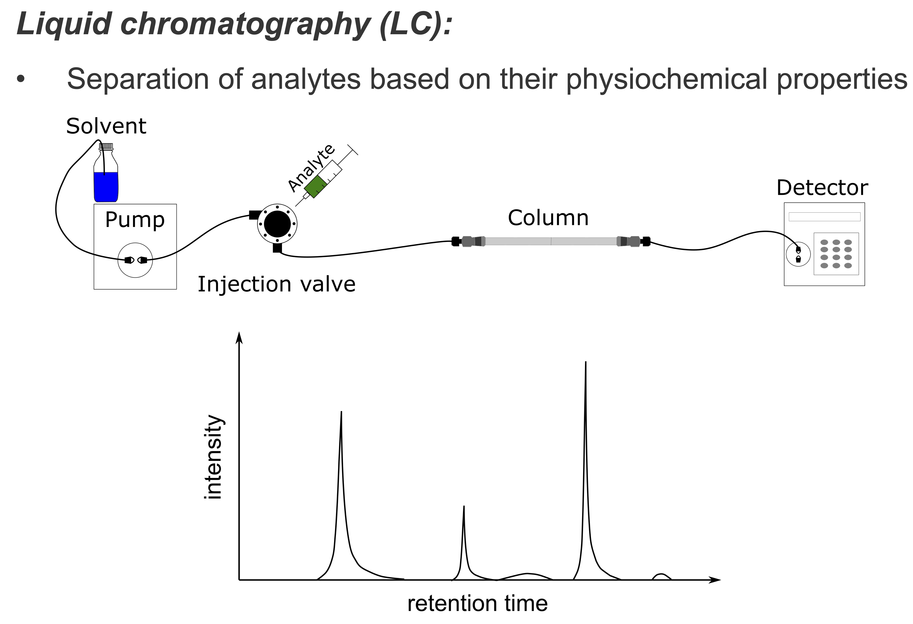
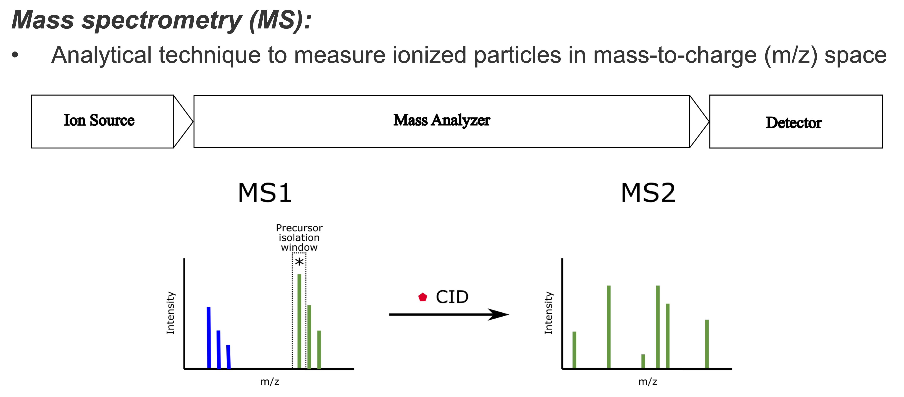

Introduction
============

pyOpenMS is a python library for Liquid Chromatography-Mass Spectrometry (LC-MS) data analysis.

Note: This introduction is aimed at users new to the field of LC-MS data analysis and will introduce some basics terms and concepts.
How to handle the data analysis, available data structures, algorithms and more are covered in the various subsections of this documentation.

Background
============

Proteomics and metabolomics are interdisciplinary research fields that study struc-
ture, function, and interaction of proteins and metabolites. They employ large-scale
experimental techniques that allow acquiring data at the level of cellular systems to
whole organisms. One of the main analytical method to identify, characterize or quantify
proteins and metabolites is mass spectrometry (MS) combined with chromatographic
separation.

In mass spectrometry-based proteomics and metabolomics, biological samples are
extracted, prepared, and separated to reduce sample complexity. The separated analytes
are ionized and measured in the mass spectrometer. Mass and abundance of ions are
stored in mass spectra and used to identify and quantify the analytes in the sample
using computational methods. The quantity and identity of analytes can then be used,
for instance, in biomarker discovery, medical diagnostics, or basic research.

Liquid Chromatography
---------------------
LC aims to reduce the complexity of the measured sample by separating analytes 
based on their physicochemical properties. Separating analytes in time ensures that 
a manageable amount of analytes elute at the same time.
In mass spectrometry-based proteomics, (high-pressure) liquid chromatographic
separation techniques (HPLC) are methods of choice to achieve a high degree of
separation. In HPLC, peptides are separated on a column. Solved in a pressurized liquid (mobile phase)
they are pumped through a solid adsorbent material (stationary phase) packet into a
capillary column. Physicochemical properties of each peptide determine how strongly it
interacts with the stationary phase. The most commonly HPLC technique in proteomics
and metabolomics uses reversed-phase chromatography (RPC) columns. RPC employs a hydrophobic
stationary phase like octadecyl (C18), a nonpolar carbon chain bonded to a silica base,
and a polar mobile phase. Polar molecules interact weakly with the stationary phase
and elute earlier, while non-polar molecules are retained. Interaction can be further
modulated by changing the gradient of solvent concentration in the mobile phase
over time. Elution times in LC are inherently prone to variation, for example, due
to fluctuations in the flow rate of the mobile phase or change of column. Retention
time shifts between runs may be compensated using computational chromatographic 
retention time alignment methods. In the LC-MS setup, the column is directly coupled
to the ion source of the mass spectrometer.

Mass Spectrometry 
-----------------
MS is an analytical technique used to determine the mass of molecules. In order to
achieve highly accurate and sensitive mass measurements at the atomic scale, mass
spectrometers manipulate charged particles using magnetic and electrostatic fields.

In a typical mass spectrometer, three principal components can be identified:

* Ion Source: A mass spectrometer only handles ions. Thus, charge needs first be transferred to uncharged particles. The component responsible for the ionization is the ion source. Different types of ion sources and ionization techniques exist with electrospray ionization (ESI) being currently the most widely used ionization technique for mass spectrometry-based proteomics.

* Mass Analyzer: Most commonly used mass analyzer in proteomics are time-of-flight (TOF) mass analyzers, quadrupole mass filters, and orbitrap analyzers. In TOF mass analyzers, the ions are accelerated in an electric field. The flight time of an ion allows calculating the velocity which in turn is used to calculate the mass-to-charge ratio (m/z). Varying the electric field allows filtering certain mass-to-charge ratios before they enter the detector. In quadrupole mass filters, ions pass through an oscillating electric field created by four parallel rods. For a particular voltage, only ions in a certain mass-to-charge range will reach the detector. The orbitrap is an ion trap mass analyzer (and detector) that traps ions in orbital motion between a barrel-like outer electrode and a spindle-like central electrode allowing for prolonged mass measurement. As a result of the prolonged mass measurements, a high mass resolution can be achieved.

* Detector: The last component of the mass spectrometer is the detector. It determines the abundance of ions that passed through the mass analyzer. Ion intensities (a value that relates to its abundance) and the mass-to-charge ratio are recorded in a mass spectrum.

A sample is measured over the retention time of the chromatography typically resulting in tens of thousands of spectra. The measurement of one sample is called an MS run and the set of spectra called an MS or peakmap.

.. image:: img/spectrum_peakmap.png

In proteomics and metabolomics, the MS1 intensity is often used for the quantification of an analyte. Identification based on the MS1 mass-to-charge and the isotope pattern is highly ambiguous. To improve identification, tandem mass spectrometry (MS/MS) can be applied to assess the analyte substructure. To this end, the precursor ion is isolated and kinetically fragmented using an inert gas (e.g., Argon). Fragments produced by collision-induced fragmentation (CID) are stored in an MS2 (MS/MS) spectrum and provide information that helps to resolve the ambiguities in identification. Alternatively, MS/MS spectra can be used for quantification.
