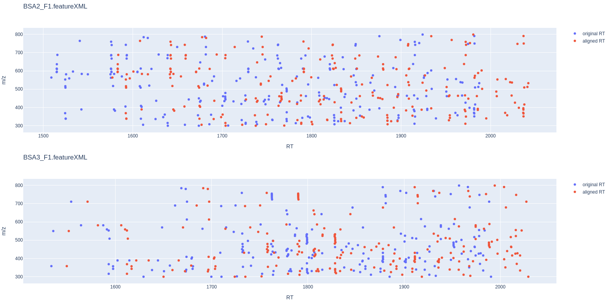

Map Alignment
===============

The pyOpenMS map alignment algorithms transform different maps (peak maps, feature maps) to a common retention time axis.

Different map alignment algorithms are available in pyOpenMS:

- MapAlignmentAlgorithmPoseClustering
- MapAlignmentAlgorithmIdentification
- MapAlignmentAlgorithmSpectrumAlignment
- MapAlignmentAlgorithmKD
- MapAlignmentTransformer

To perform a simple linear alignment we can employ the algorithm the MapAlignmentAlgorithmPoseClustering. In the example below it is used for the alignment of feature maps.

Download Example Data
*********************

.. code-block:: python

    from pyopenms import *
    from urllib.request import urlretrieve

    base_url = 'https://raw.githubusercontent.com/OpenMS/OpenMS/develop/share/OpenMS/examples/FRACTIONS/'

    feature_files = ['BSA1_F1.featureXML', 'BSA2_F1.featureXML', 'BSA3_F1.featureXML']

    feature_maps = []

    for feature_file in feature_files:
        urlretrieve (base_url + feature_file, feature_file)
        feature_map = FeatureMap()
        FeatureXMLFile().load(feature_file, feature_map)
        feature_maps.append(feature_map)

Map Alignment Algorithm
***********************

From the list of feature maps, the one with the largest number of features is selected for reference. The retention times of the other feature maps are aligned to this.

.. code-block:: python

    ref_index = [i[0] for i in sorted(enumerate([fm.size() for fm in feature_maps]), key=lambda x:x[1])][-1]

    aligner = MapAlignmentAlgorithmPoseClustering()

    aligner.setReference(feature_maps[ref_index])

    for feature_map in feature_maps[:ref_index] + feature_maps[ref_index+1:]:
        trafo = TransformationDescription()
        aligner.align(feature_map, trafo)
        transformer = MapAlignmentTransformer()
        transformer.transformRetentionTimes(feature_map, trafo, True) # store original RT as meta value

Visualization
*************

Plotting RTs prior and after alignment for each transformed feature map.

.. code-block:: python

    import plotly.graph_objects as go

    for fm in feature_maps[:ref_index] + feature_maps[ref_index+1:]:
        fig = go.Figure()

        fig.add_trace(go.Scatter(x=[f.getMetaValue('original_RT') for f in fm],y=[f.getMZ() for f in fm],
                                mode='markers', name='original RT'))

        fig.add_trace(go.Scatter(x=[f.getRT() for f in fm], y=[f.getMZ() for f in fm],
                                mode='markers', name='aligned RT'))

        fig.update_layout(title = fm.getDataProcessing()[0].getMetaValue('parameter: out'), xaxis_title = 'RT', yaxis_title = 'm/z')
        fig.show()

