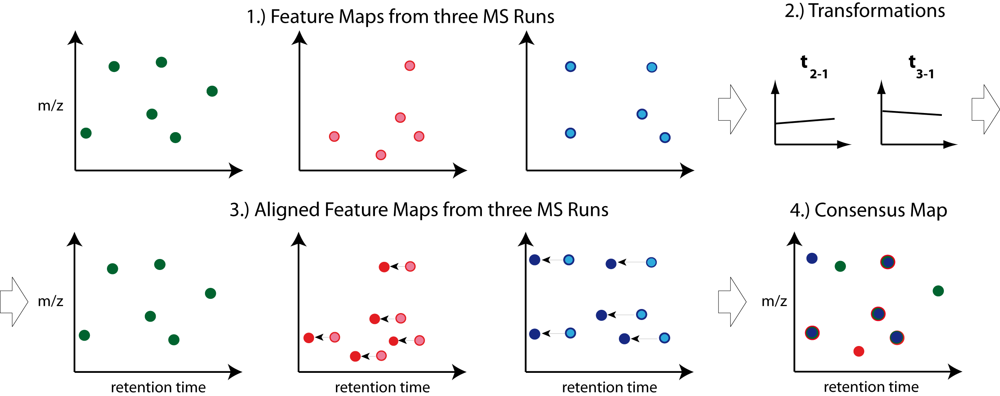

Map Alignment
===============

The pyOpenMS map alignment algorithms transform different maps (peak maps, feature maps) to a common retention time axis.

Note: Creating a consensus map from the aligned maps is performed by a feature linking algorithm (see next chapter).

Different map alignment algorithms are available in pyOpenMS:

- MapAlignmentAlgorithmPoseClustering
- MapAlignmentAlgorithmIdentification
- MapAlignmentAlgorithmSpectrumAlignment
- MapAlignmentAlgorithmKD
- MapAlignmentTransformer

To perform a simple linear alignment we can employ the algorithm MapAlignmentAlgorithmPoseClustering. In the example below it is used for the alignment of feature maps.

Download Example Data
*********************

.. code-block:: python

    from pyopenms import *
    from urllib.request import urlretrieve

    base_url = (
        "https://raw.githubusercontent.com/OpenMS/pyopenms-docs/master/src/data/"
    )

    feature_files = [
        "BSA1_F1.featureXML",
        "BSA2_F1.featureXML",
        "BSA3_F1.featureXML",
    ]

    feature_maps = []

    # download the feature files and store feature maps in list (feature_maps)
    for feature_file in feature_files:
        urlretrieve(base_url + feature_file, feature_file)
        feature_map = FeatureMap()
        FeatureXMLFile().load(feature_file, feature_map)
        feature_maps.append(feature_map)

Map Alignment Algorithm
***********************

From the list of feature maps, the one with the largest number of features is selected for reference. The retention times of the other feature maps are aligned to this.

.. code-block:: python

    # set ref_index to feature map index with largest number of features
    ref_index = [
        i[0]
        for i in sorted(
            enumerate([fm.size() for fm in feature_maps]), key=lambda x: x[1]
        )
    ][-1]

    aligner = MapAlignmentAlgorithmPoseClustering()

    aligner.setReference(feature_maps[ref_index])

    # perform alignment and transformation of feature maps to the reference map (exclude reference map)
    for feature_map in feature_maps[:ref_index] + feature_maps[ref_index + 1 :]:
        trafo = TransformationDescription()
        aligner.align(feature_map, trafo)
        transformer = MapAlignmentTransformer()
        transformer.transformRetentionTimes(
            feature_map, trafo, True
        )  # store original RT as meta value

Visualization
*************

Plotting consensus maps with features before and after alignment. 

.. code-block:: python

    import matplotlib.pyplot as plt
    import numpy as np

    fmaps = (
        [feature_maps[ref_index]]
        + feature_maps[:ref_index]
        + feature_maps[ref_index + 1 :]
    )

    fig = plt.figure(figsize=(10, 5))

    ax = fig.add_subplot(1, 2, 1)
    ax.set_title("consensus map before alignment")
    ax.set_ylabel("m/z")
    ax.set_xlabel("RT")

    # use alpha value to display feature intensity
    ax.scatter(
        [f.getRT() for f in fmaps[0]],
        [f.getMZ() for f in fmaps[0]],
        alpha=np.asarray([f.getIntensity() for f in fmaps[0]])
        / max([f.getIntensity() for f in fmaps[0]]),
    )

    for fm in fmaps[1:]:
        ax.scatter(
            [f.getMetaValue("original_RT") for f in fm],
            [f.getMZ() for f in fm],
            alpha=np.asarray([f.getIntensity() for f in fm])
            / max([f.getIntensity() for f in fm]),
        )

    ax = fig.add_subplot(1, 2, 2)
    ax.set_title("consensus map after alignment")
    ax.set_xlabel("RT")

    for fm in fmaps:
        ax.scatter(
            [f.getRT() for f in fm],
            [f.getMZ() for f in fm],
            alpha=np.asarray([f.getIntensity() for f in fm])
            / max([f.getIntensity() for f in fm]),
        )

    fig.tight_layout()
    fig.legend(
        [
            fmap.getDataProcessing()[0].getMetaValue("parameter: out")[:-11]
            for fmap in fmaps
        ],
        loc="lower center",
    )
    fig.show()

.. image:: img/map_alignment.png
