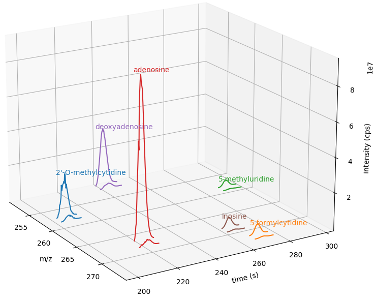

Metabolomics - targeted feature extraction
==========================================

``FeatureFinderAlgorithmMetaboIdent`` performs MS1-based targeted feature extraction based on user provided compounds, which are 
specified in an assay library (a tab-separated text file). Detected ``Features`` are stored in a ``FeatureMap`` which can be 
stored in a ``FeatureXMLFile``. This tool is useful for the targeted extraction of ``Features`` for a well defined set of compounds 
with known sum formulas and retention times. 
For more information on the format of the assay library and available parameters visit the `FeatureFinderMetaboIdent documentation
<https://abibuilder.informatik.uni-tuebingen.de/archive/openms/Documentation/release/latest/html/UTILS_FeatureFinderMetaboIdent.html>`_.

The pyOpenMS ``FeatureFinderAlgorithmMetaboIdent`` needs a list of ``FeatureFinderMetaboIdentCompound`` objects as an assay libray for it's
``run`` function. We could create that list ourselves or use the following function to read an assay library as ``.tsv`` file:

.. csv-table:: Coupounds tsv file
   :widths: 50 30 15 15 15 15 15 
   :header: "CompoundName", "SumFormula", "Mass", "Charge", "RetentionTime", "RetentionTimeRange", "IsoDistribution"

   "2'-O-methylcytidine", "C10H15N3O5",0,1,207.6,0,0
   "5-formylcytidine", "C10O6N3H13",0,1,269.4,0,0
   "5-methyluridine", "C10H14N2O6",0,1,291.6,0,0
   "adenosine","C10H13N5O4",0,1,220.8,0,0
   "deoxyadenosine","C10H13N5O3",0,1,243.0,0,0
   "inosine","C10H12N4O5",0,1,264.0,0,0

.. code-block:: python

  import csv
  # read tsv file and create list of FeatureFinderMetaboIdentCompound
  def metaboTableFromFile(path_to_library_file):
      metaboTable = []
      with open(path_to_library_file, 'r') as tsv_file:
          tsv_reader = csv.reader(tsv_file, delimiter="\t")
          next(tsv_reader) # skip header
          for row in tsv_reader:
              metaboTable.append(FeatureFinderMetaboIdentCompound(
                  row[0], # name
                  row[1], # sum formula
                  float(row[2]), # mass
                  [int(charge) for charge in row[3].split(',')], # charges
                  [float(rt) for rt in row[4].split(',')], # RTs
                  [float(rt_range) for rt_range in row[5].split(',')], # RT ranges
                  [float(iso_distrib) for iso_distrib in row[6].split(',')] # isotope distributions
              ))
      return metaboTable

Now we can use the following code to detect features with ``FeatureFinderAlgorithmMetaboIdent`` and store them in a ``FeatureXMLFile``:

.. code-block:: python

  from urllib.request import urlretrieve

  gh = "https://raw.githubusercontent.com/OpenMS/pyopenms-extra/master"
  mzML_path = gh + "/src/data/FeatureFinderMetaboIdent_1_input.mzML"
  urlretrieve (mzML_path, "ms_data.mzML")
  urlretrieve (gh + "/src/data/FeatureFinderMetaboIdent_1_input.tsv", "library.tsv")

  from pyopenms import *

  # load ms data from mzML file into MSExperiment
  spectra = MSExperiment()
  MzMLFile().load('ms_data.mzML', spectra)

  # create FeatureFinderAlgorithmMetaboIdent and assign ms data
  ff = FeatureFinderAlgorithmMetaboIdent()
  ff.setMSData(spectra)

  # read library generate a metabo table with compounds
  metabo_table = metaboTableFromFile('library.tsv')

  # FeatureMap to store results
  fm = FeatureMap()

  # edit some parameters
  params = ff.getParameters()
  params[b'extract:mz_window'] = 5.0 # 5 ppm
  params[b'extract:rt_window'] = 20.0 # 20 seconds
  params[b'detect:peak_width'] = 3.0 # 3 seconds
  ff.setParameters(params)

  # run the FeatureFinderMetaboIdent with the metabo_table and mzML file path -> store results in fm
  ff.run(metabo_table, fm, mzML_path)

  # save FeatureMap to file
  FeatureXMLFile().store('detected_features.featureXML', fm)

Note: the output file that we have written (``output.featureXML``) is an
OpenMS-internal XML format for storing features. You can learn more about file
formats in the `Reading MS data formats <other_file_handling.html>`_ section.

We can get a quick overview on the detected features by plotting them using the following function:

.. code-block:: python

  import matplotlib.pyplot as plt
  from mpl_toolkits.mplot3d import axes3d

  def plotDetectedFeatures3D(path_to_featureXML):
      fm = FeatureMap()
      fh = FeatureXMLFile()
      fh.load(path_to_featureXML, fm)

      fig = plt.figure()
      ax = fig.add_subplot(111, projection='3d')

      for feature in fm:
          color = next(ax._get_lines.prop_cycler)['color']
          # chromatogram data is stored in the subordinates of the feature
          for i, sub in enumerate(feature.getSubordinates()):
              retention_times = [x[0] for x in sub.getConvexHulls()[0].getHullPoints()]
              intensities = [int(y[1]) for y in sub.getConvexHulls()[0].getHullPoints()]
              mz = sub.getMetaValue('MZ')
              ax.plot(retention_times, intensities, zs = mz, zdir = 'x', color = color)
              if i == 0:
                  ax.text(mz,retention_times[0], max(intensities)*1.02, feature.getMetaValue('label'), color = color)

      ax.set_ylabel('time (s)')
      ax.set_xlabel('m/z')
      ax.set_zlabel('intensity (cps)')
      plt.show()

