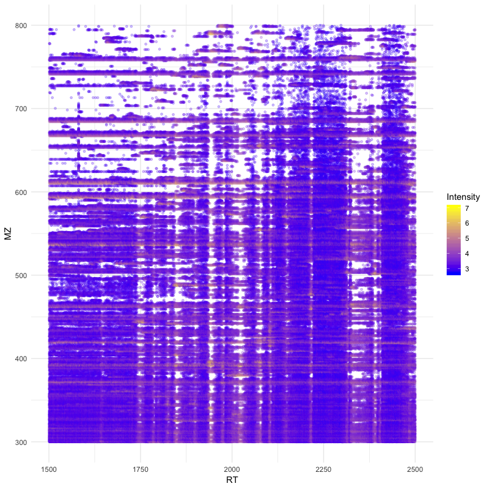

pyOpenMS in R
===============

Currently, there are no native wrappers for the OpenMS library in R, however we
can use the "reticulate" package in order to get access to the full
functionality of pyOpenMS in the R programming language.

Install the "reticulate" R package
**********************************

In order to use all pyopenms functionalities in R, we suggest to use the "reticulate" R package.

A thorough documentation is available at: https://rstudio.github.io/reticulate/

.. code-block:: R

    install.packages("reticulate")

Installation of pyopenms is a requirement as well and it is necessary to make sure that R is using the same Python environment.

In case R is having trouble to find the correct Python environment, you can set it by hand as in this example (using miniconda, you will have to adjust the file path to your system to make this work). You will need to do this before loading the "reticulate" library:

.. code-block:: R

   Sys.setenv(RETICULATE_PYTHON = "/usr/local/miniconda3/envs/py37/bin/python")

Or after loading the "reticulate" library:

.. code-block:: R

   library("reticulate")
   use_python("/usr/local/miniconda3/envs/py37/bin/python")

Import pyopenms in R
********************

After loading the "reticulate" library you should be able to import pyopenms into R

.. code-block:: R

    library(reticulate)
    ropenms=import("pyopenms", convert = FALSE)

This should now give you access to all of pyopenms in R. Importantly, the convert option
has to be set to FALSE, since type conversions such as 64bit integers will cause a problem.

You should now be able to interact with the OpenMS library and, for example, read and write mzML files:

.. code-block:: R

    library(reticulate)
    ropenms=import("pyopenms", convert = FALSE)
    exp = ropenms$MSExperiment()
    ropenms$MzMLFile()$store("testfile.mzML", exp)

which will create an empty mzML file called `testfile.mzML`.

Getting help
************

Using the "reticulate" R package provides a way to access the pyopenms information 
about the available functions and methods. We can inspect individual pyOpenMS objects 
through the ``py_help`` function:

.. code-block:: R

    library(reticulate)
    ropenms=import("pyopenms", convert = FALSE)
    idXML=ropenms$IdXMLFile
    py_help(idXML)

    Help on class IdXMLFile in module pyopenms.pyopenms_4:

   class IdXMLFile(__builtin__.object)
    |  Methods defined here:
    |  
    |  __init__(...)
    |      Cython signature: void IdXMLFile()
    |  
    |  load(...)
    |      Cython signature: void load(String filename, libcpp_vector[ProteinIdentification] & protein_ids, libcpp_vector[PeptideIdentification] & peptide_ids)
    [...]

Alternatively, the autocompletion functionality of RStudio can be used:

.. image:: img/R_autocompletion.png

In this case, the help function indicates that the ``idXML$load()`` function requires

       - a filename as string
       - an empty vector for pyopenms.ProteinIdentification objects
       - an empty vector for pyopenms.PeptideIdentification objects

In order to read peptide identification data, we can download the `idXML example file <https://github.com/OpenMS/OpenMS/raw/develop/master/OpenMS/examples/BSA/BSA1_OMSSA.idXML.mzML>`_

Creating an empty R ``list()`` unfortunately is not equal to the empty python ``list []``.

Therefore in this case we need to use the ``reticulate::r_to_py()`` and ``reticulate::py_to_r()`` functions:

.. code-block:: R

    idXML=ropenms$IdXMLFile()

    download.file("https://github.com/OpenMS/OpenMS/raw/master/share/OpenMS/examples/BSA/BSA1_OMSSA.idXML", "BSA1_OMSSA.idXML")

    f="BSA1_OMSSA.idXML"
    pepids=r_to_py(list())
    protids=r_to_py(list())

    idXML$load(f, protids, pepids)

    pepids=py_to_r(pepids)

    pephits=pepids[[1]]$getHits()

    pepseq=pephits[[1]]$getSequence()

    print(paste0("Sequence: ", pepseq))

    [1] "Sequence: SHC(Carbamidomethyl)IAEVEK"

In order to get more information about the wrapped functions, we can also 
consult the `pyOpenMS manual <http://proteomics.ethz.ch/pyOpenMS_Manual.pdf>`_ 
which references to all wrapped functions.

An example use case
*******************

Reading an mzML File
^^^^^^^^^^^^^^^^^^^^

pyOpenMS supports a variety of different files through the implementations in
OpenMS. In order to read mass spectrometric data, we can download the `mzML
example file <https://github.com/OpenMS/OpenMS/raw/develop/master/OpenMS/examples/BSA/BSA1.mzML>`_

.. code-block:: R

    download.file("https://github.com/OpenMS/OpenMS/raw/master/share/OpenMS/examples/BSA/BSA1.mzML", "BSA1.mzML")

    library(reticulate)
    ropenms=import("pyopenms", convert = FALSE)
    mzML=ropenms$MzMLFile()
    exp = ropenms$MSExperiment()
    mzML$load("BSA1.mzML", exp)

which will load the content of the "BSA1.mzML" file into the ``exp``
variable of type ``MSExperiment``.
We can now inspect the properties of this object:

.. code-block:: R

    py_help(exp)
    Help on MSExperiment object:

    class MSExperiment(__builtin__.object)
     |  Methods defined here:
     ...
     |  getNrChromatograms(...)
     |      Cython signature: size_t getNrChromatograms()
     |
     |  getNrSpectra(...)
     |      Cython signature: size_t getNrSpectra()
     |
     ...

which indicates that the variable ``exp`` has (among others) the functions
``getNrSpectra`` and ``getNrChromatograms``. We can now try one of these functions:

.. code-block:: R

    exp$getNrSpectra()
    1684

and indeed we see that we get information about the underlying MS data. We can
iterate through the spectra as follows:

Visualize spectra
^^^^^^^^^^^^^^^^^

You can easily visualise ms1 level precursor maps:

.. code-block:: R

    library(ggplot2)

    spectra = py_to_r(exp$getSpectra())

    peaks_df=c()
    for (i in spectra) {
      if (i$getMSLevel()==1){
        peaks=do.call("cbind", i$get_peaks())
        rt=i$getRT()
        peaks_df=rbind(peaks_df,cbind(peaks,rt))
      }
    }

    peaks_df=data.frame(peaks_df)    
    colnames(peaks_df)=c('MZ','Intensity','RT')
    peaks_df$Intensity=log10(peaks_df$Intensity)

    ggplot(peaks_df, aes(x=RT, y=MZ) ) +
    geom_point(size=1, aes(colour = Intensity), alpha=0.25) +
    theme_minimal() +
    scale_colour_gradient(low = "blue", high = "yellow")

Or visualize a particular ms2 spectrum:

.. code-block:: R

    library(ggplot2)

    spectra = py_to_r(exp$getSpectra())

    # Collect all MS2 peak data in a list
    peaks_ms2=list()
    for (i in spectra) {
      if (i$getMSLevel()==2){
        peaks=do.call("cbind",i$get_peaks())
        peaks_ms2[[i$getNativeID()]]=data.frame(peaks)
      }
    }

    ms2_spectrum=peaks_ms2[["spectrum=3529"]]
    colnames(ms2_spectrum)=c("MZ","Intensity")

    ggplot(ms2_spectrum, aes(x=MZ, y=Intensity)) +
    geom_segment( aes(x=MZ, xend=MZ, y=0, yend=Intensity)) +
    theme_minimal()

.. image:: img/R_ggplot_ms2.png

Alternatively, we could also have used ``apply`` to obtain the peak data, which
is more idiomatic way of doing things for the R programming language:

.. code-block:: R

    ms1 = sapply(spectra, function(x) x$getMSLevel()==1)
    peaks = sapply(spectra[ms1], function(x) cbind(do.call("cbind", x$get_peaks()),x$getRT()))
    peaks = data.frame( do.call("rbind", peaks) )

    ms2 = spectra[!ms1][[1]]$get_peaks()
    ms2_spectrum = data.frame( do.call("cbind", ms2) )

Iteration
^^^^^^^^^

Iterating over pyopenms objects is not equal to iterating over R vectors or
lists. Note that for many applications, there is a more efficient way to access
data (such as ``get_peaks`` instead of iterating over individual peaks).

Therefore we can not directly apply the usual functions such as ``apply()`` and have to use ``reticulate::iterate()`` instead:

.. code-block:: R

    spectrum = ropenms$MSSpectrum()
    mz = seq(1500, 500, -100)
    i = seq(10, 2000, length.out = length(mz))
    spectrum$set_peaks(list(mz, i))

    iterate(spectrum, function(x) {print(paste0("M/z :" , x$getMZ(), " Intensity: ", x$getIntensity()))})

    [1] "M/z :1500.0 Intensity: 10.0"
    [1] "M/z :1400.0 Intensity: 209.0"
    [1] "M/z :1300.0 Intensity: 408.0"
    [1] "M/z :1200.0 Intensity: 607.0"
    [1] "M/z :1100.0 Intensity: 806.0"
    [1] "M/z :1000.0 Intensity: 1005.0"
    [1] "M/z :900.0 Intensity: 1204.0"
    [1] "M/z :800.0 Intensity: 1403.0"
    [1] "M/z :700.0 Intensity: 1602.0"
    [1] "M/z :600.0 Intensity: 1801.0"
    [1] "M/z :500.0 Intensity: 2000.0"

or we can use a for-loop (note that we use zero-based indices as custom in Python):

.. code-block:: R

    for (i in seq(0,py_to_r(spectrum$size())-1)) {
          print(spectrum[i]$getMZ())
          print(spectrum[i]$getIntensity())
    }

.. image:: ./img/launch_binder.jpg
   :target: https://mybinder.org/v2/gh/OpenMS/pyopenms-extra/master+ipynb?urlpath=lab/tree/docs/source/pyopenms_in_r.ipynb
   :alt: Launch Binder
