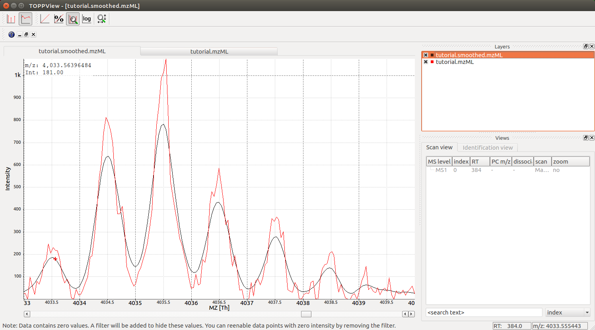

Smoothing 
==========

In many applications, mass spectrometric data should be smoothed first before
further analysis

.. code-block:: python

  from urllib.request import urlretrieve
  # from urllib import urlretrieve  # use this code for Python 2.x
  from pyopenms import *
  gh = "https://raw.githubusercontent.com/OpenMS/OpenMS/develop"
  urlretrieve (gh +"/share/OpenMS/examples/peakpicker_tutorial_1_baseline_filtered.mzML", "tutorial.mzML")

  exp = MSExperiment()
  gf = GaussFilter()
  param = gf.getParameters()
  param.setValue("gaussian_width", 1.0) # needs wider width 
  gf.setParameters(param)

  MzMLFile().load("tutorial.mzML", exp)
  gf.filterExperiment(exp)
  MzMLFile().store("tutorial.smoothed.mzML", exp)

We can now load our data into TOPPView to observe the effect of the smoothing,
which becomes apparent when we overlay the two files (drag onto each other) and
then zoom into a given mass range using Ctrl-G and select 4030 to 4045:

In the screenshot above we see the original data (red) and the smoothed data
(black), indicating that the smoothing does clean up noise in the data
significantly and will prepare the data for downstream processing, such as
peak-picking.

.. image:: ./img/launch_binder.jpg
   :class: ignore
   :target: https://mybinder.org/v2/gh/OpenMS/pyopenms-extra/master+ipynb?urlpath=lab/tree/docs/source/smoothing.ipynb
   :alt: Launch Binder
