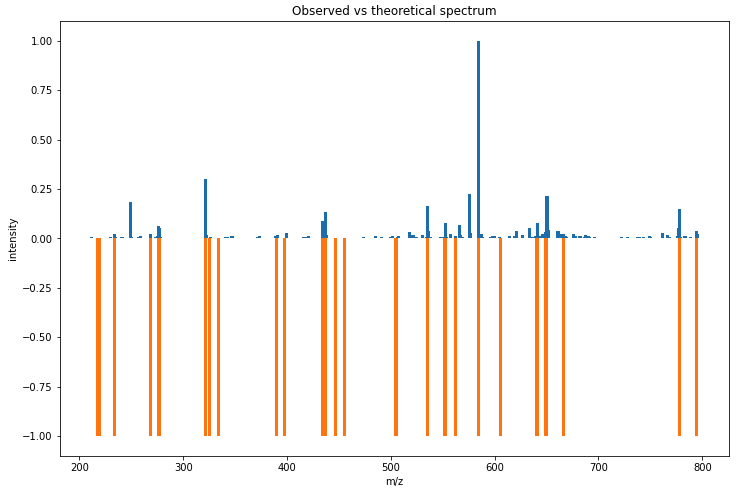
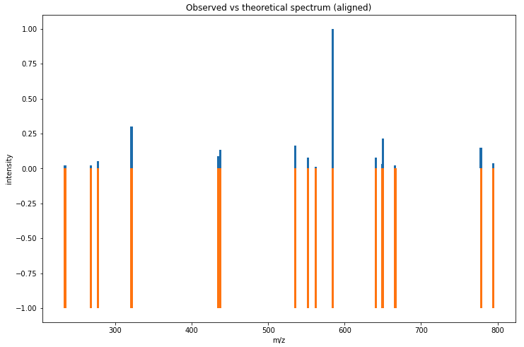

Spectrum alignment
==================

OpenMS provides several ways to find matching peaks between two spectra.
The most basic one SpectrumAlignment returns a list of matching peak indices between a query and target spectrum.
In this example, we take an observed (measured) spectrum and align a theoretical spectrum to it.

First we load a (chemically modified) peptide:

.. code-block:: python

    from urllib.request import urlretrieve
    from pyopenms import *
    gh = "https://raw.githubusercontent.com/OpenMS/pyopenms-extra/master"
    urlretrieve (gh + "/src/data/YIC(Carbamidomethyl)DNQDTISSK.mzML", "observed.mzML")

    exp = MSExperiment()
    # Load mzML file and obtain spectrum for peptide YIC(Carbamidomethyl)DNQDTISSK
    MzMLFile().load("observed.mzML", exp)
    
    # Get first spectrum
    spectra = exp.getSpectra()
    observed_spectrum = spectra[0]

Now we generate the theoretical spectrum of that peptide:

.. code-block:: python

    tsg = TheoreticalSpectrumGenerator()
    theo_spectrum = MSSpectrum()
    p = tsg.getParameters()
    p.setValue("add_y_ions", "true")
    p.setValue("add_b_ions", "true")
    p.setValue("add_metainfo", "true")
    tsg.setParameters(p)
    peptide = AASequence.fromString("YIC(Carbamidomethyl)DNQDTISSK")
    tsg.getSpectrum(theo_spectrum, peptide, 1, 2)        

Now we can plot the observed and theoretical spectrum as a mirror plot:

.. code-block:: python

  import numpy as np
  from matplotlib import pyplot as plt

  def mirror_plot(obs_mz, obs_int, theo_mz, theo_int, title):
      obs_int = [element / max(obs_int) for element in obs_int] # relative intenstiy
      theo_int = [element * -1 for element in theo_int] # invert the intensity for the mirror plot
      plt.figure(figsize=(12,8))
      plt.bar(obs_mz, obs_int, width = 3.0)
      plt.bar(theo_mz, theo_int, width = 3.0)
      plt.title(title)
      plt.ylabel('intensity')
      plt.xlabel('m/z')

  obs_mz, obs_int = observed_spectrum.get_peaks()

  # The mass-to-charge of our observed spectrum ranges from 200 - 800 m/z
  print(min(obs_mz)) # 212.012451171875
  print(max(obs_mz)) # 795.2837524414062

  # We filter the peaks of the theoretical spectrum to fit the range (to reduce image complexity)
  theo_mz, theo_int = [], []
  for mz, intensity in zip(*theo_spectrum.get_peaks()):
      if mz >= 200.0 and mz <= 800.0:
          theo_mz.append(mz)
          theo_int.append(intensity)

  title = 'Observed vs theoretical spectrum'
  mirror_plot(obs_mz, obs_int, theo_mz, theo_int, title)

which produces

Now we want to find matching peaks between observed and theoretical spectrum.

.. code-block:: python

  alignment = []
  spa = SpectrumAlignment()
  p = spa.getParameters()
  # use 0.5 Da tolerance (Note: for high-resolution data we could also use ppm by setting the is_relative_tolerance value to true)
  p.setValue("tolerance", 0.5)
  p.setValue("is_relative_tolerance", "false")  
  spa.setParameters(p)
  # align both spectra
  spa.getSpectrumAlignment(alignment, theo_spectrum, observed_spectrum)

The alignment contains a list of matched peak indices. We can simply inspect matching peaks with:

.. code-block:: python

  # Print matching ions and mz from theoretical spectrum
  print("Number of matched peaks: " + str(len(alignment)))
  print("ion\ttheo. m/z\tobserved m/z")

  for theo_idx, obs_idx in alignment:
      ion_name = theo_spectrum.getStringDataArrays()[0][theo_idx].decode()
      ion_charge = theo_spectrum.getIntegerDataArrays()[0][theo_idx]
      print(ion_name + "\t" + str(ion_charge) + "\t"
        + str(theo_spectrum[theo_idx].getMZ())
        + "\t" + str(observed_spectrum[obs_idx].getMZ()))

The mirror plot can also be used to visualize the aligned spectrum:

.. code-block:: python

  theo_mz, theo_int, obs_mz, obs_int = [], [], [], []
  for theo_idx, obs_idx in alignment:
      theo_mz.append(theo_spectrum[theo_idx].getMZ())
      theo_int.append(theo_spectrum[theo_idx].getIntensity())
      obs_mz.append(observed_spectrum[obs_idx].getMZ())
      obs_int.append(observed_spectrum[obs_idx].getIntensity())

  title = 'Observed vs theoretical spectrum (aligned)'
  mirror_plot(obs_mz, obs_int, theo_mz, theo_int, title)

which produces

