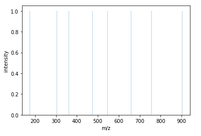
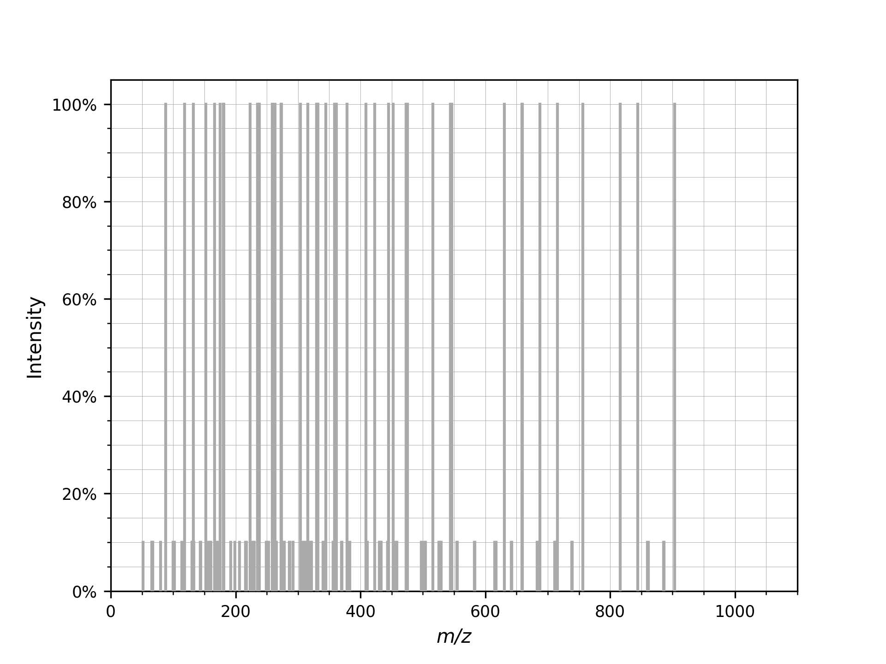
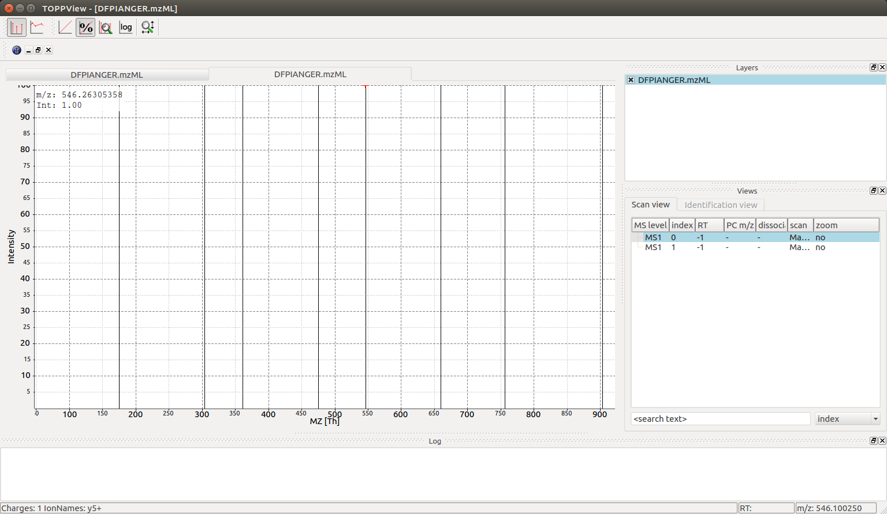
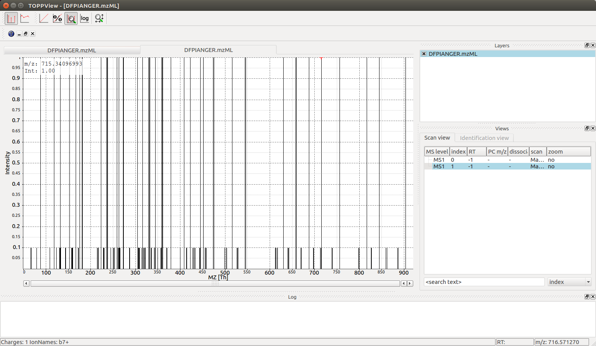

Fragment spectrum generation
============================

Generating theoretical fragment spectra is central to many identification tasks in computational mass spectrometry.
TheoreticalSpectrumGenerator can be configured to generate tandem MS spectra from
a given peptide charge combination. There are various parameters which influence
the generated ions e.g. simulating different fragmentation techniques.

Y-ion spectrum
**************

First, we will generate a simple spectrum that only contains y-ions

.. code-block:: python

    from pyopenms import *

    tsg = TheoreticalSpectrumGenerator()
    spec1 = MSSpectrum()
    peptide = AASequence.fromString("DFPIANGER")
    # standard behavior is adding b- and y-ions of charge 1
    p = Param()
    p.setValue("add_b_ions", "false")
    p.setValue("add_metainfo", "true")
    tsg.setParameters(p)
    tsg.getSpectrum(spec1, peptide, 1, 1)  # charge range 1:1

    # Iterate over annotated ions and their masses
    print("Spectrum 1 of", peptide, "has", spec1.size(), "peaks.")
    for ion, peak in zip(spec1.getStringDataArrays()[0], spec1):
        print(ion.decode(), "is generated at m/z", peak.getMZ())

which produces all y single charged ions:

.. code-block:: output

    Spectrum 1 of DFPIANGER has 8 peaks.
    y1+ is generated at m/z 175.118952913371
    y2+ is generated at m/z 304.161547136671
    y3+ is generated at m/z 361.18301123237103
    y4+ is generated at m/z 475.225939423771
    y5+ is generated at m/z 546.2630535832709
    y6+ is generated at m/z 659.3471179341709
    y7+ is generated at m/z 756.3998821574709
    y8+ is generated at m/z 903.4682964445709

which you could plot with :py:func:`~.plot_spectrum`, automatically showing annotated ions.:

.. code-block:: python

    import matplotlib.pyplot as plt

    plot_spectrum(spec1)
    plt.show()

Full fragment ion spectrum
**************************

We can also produce additional peaks in the fragment ion spectrum, such as
isotopic peaks, precursor peals, ions from higher charge states, additional ion series, or common neutral
losses:

.. code-block:: python

    spec2 = MSSpectrum()
    p.setValue("add_b_ions", "true")
    p.setValue("add_a_ions", "true")
    p.setValue("add_losses", "true")
    p.setValue("add_metainfo", "true")
    tsg.setParameters(p)
    tsg.getSpectrum(spec2, peptide, 1, 2)

    # Iterate over annotated ions and their masses
    print("Spectrum 2 of", peptide, "has", spec2.size(), "peaks.")
    for ion, peak in zip(spec2.getStringDataArrays()[0], spec2):
        print(ion.decode(), "is generated at m/z", peak.getMZ())

    exp = MSExperiment()
    exp.addSpectrum(spec1)
    exp.addSpectrum(spec2)
    MzMLFile().store("DFPIANGER.mzML", exp)

which outputs all 146 peaks that are generated (this is without isotopic
peaks), here we will just show the first few peaks:

.. code-block:: output

        Spectrum 2 of DFPIANGER has 146 peaks.
        y1-C1H2N1O1++ is generated at m/z 66.05629515817103
        y1-C1H2N2++ is generated at m/z 67.05221565817102
        y1-H3N1++ is generated at m/z 79.54984014222102
        y1++ is generated at m/z 88.06311469007102
        a2-H2O1++ is generated at m/z 109.05221565817101
        a2++ is generated at m/z 118.05749819007102
        b2-H2O1++ is generated at m/z 123.049673158171
        y2-C1H2N1O1++ is generated at m/z 130.57759226982103
        y1-C1H2N1O1+ is generated at m/z 131.10531384957102
        y2-C1H2N2++ is generated at m/z 131.573512769821
        b2++ is generated at m/z 132.054955690071
        y1-C1H2N2+ is generated at m/z 133.097154849571
        y2-H2O1++ is generated at m/z 143.579129269821
        y2-H3N1++ is generated at m/z 144.07113725387103
        y2++ is generated at m/z 152.58441180172102
        [...]

which you again can visualize with:

.. code-block:: python

    import matplotlib.pyplot as plt

    plot_spectrum(spec2, annotate_ions=False)
    plt.show()

The first example shows how to put peaks of a certain type, y-ions in this case, into
a spectrum. The second spectrum is filled with a complete fragment ion spectrum
of all peaks (a-, b-, y-ions and losses). The losses are based on commonly
observed fragment ion losses for specific amino acids and are defined in the
``Residues.xml`` file, which means that not all fragment ions will produce all
possible losses, as can be observed above: water loss is not observed for the
y1 ion but for the y2 ion since glutamic acid can have a neutral water loss but
arginine cannot. Similarly, only water loss and no ammonia loss is simulated in
the ``a/b/c`` ion series with the first fragment capable of ammonia loss being
asparagine at position 6.

The :py:class:`~.TheoreticalSpectrumGenerator`
has many parameters which have a detailed description located in the class
documentation. Note how the ``add_metainfo`` parameter 
populates the :py:class:`~.StringDataArray` of the output spectrum, allowing us to
iterate over annotated ions and their masses.

Visualization
*************

We can now visualize the resulting spectra using TOPPView when we open the
DFPIANGER.mzML file that we produced above in TOPPView:

We can see all eight y ion peaks that are produced in the
:py:class:`~.TheoreticalSpectrumGenerator` and when we hover over one of the peaks (546 mz in
this example) there is an annotation in the bottom left corner that indicates
charge state and ion name (``y5+`` for every peak). The larger spectrum with
146 peaks can also be interactively investigated with TOPPView (the second
spectrum in the file):

There are substantially more peaks here and the spectrum is much busier, with
singly and double charged peaks of the b, y and a series creating 44 different
individual fragment ion peaks as well as neutral losses adding an additional
102 peaks (neutral losses easily recognizable by their 10-fold lower intensity
in the simulated spectrum).
