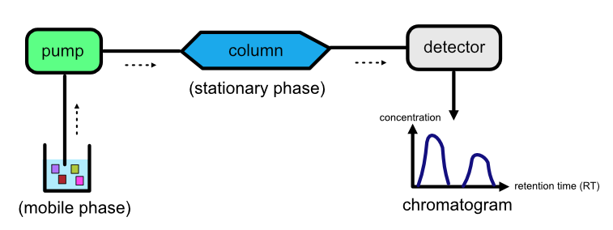
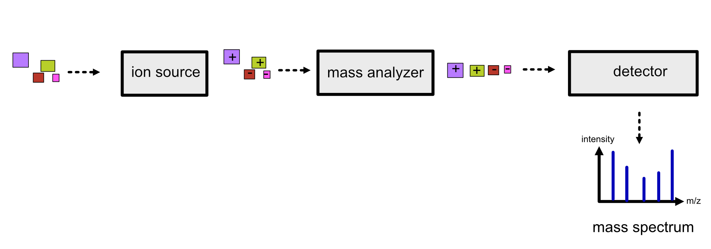
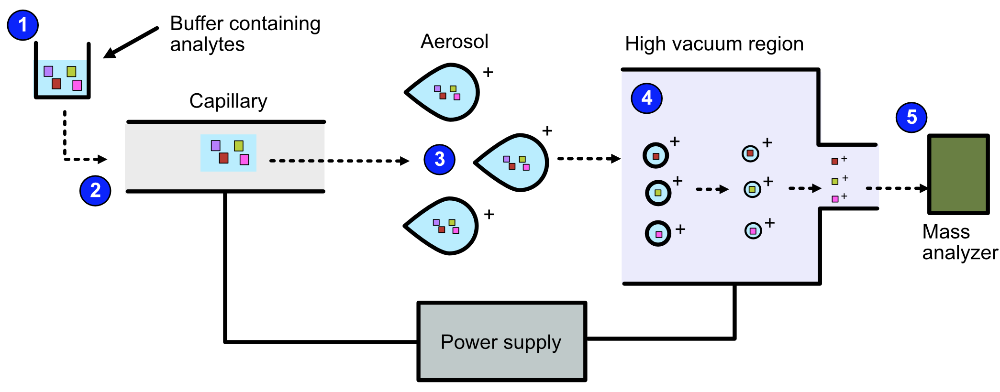
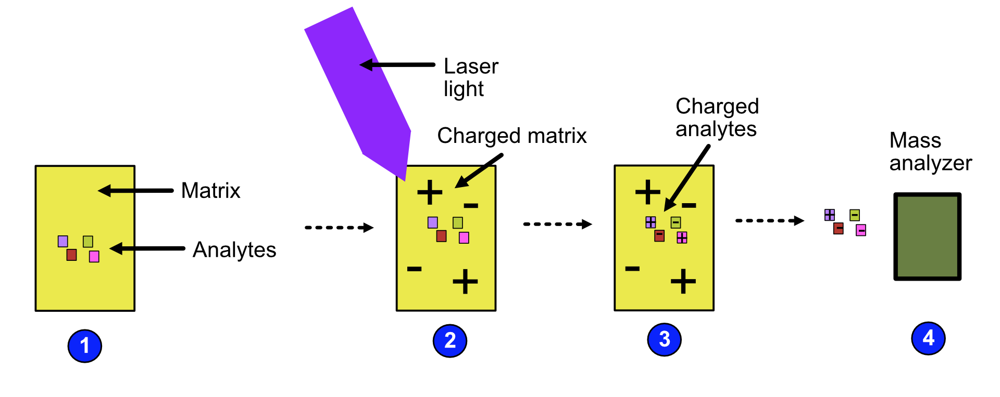
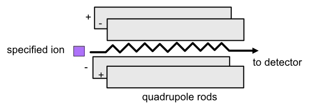
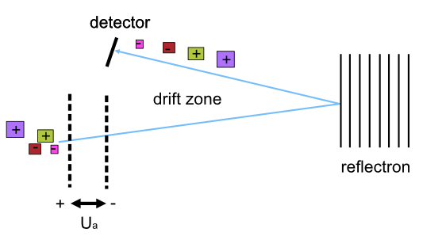
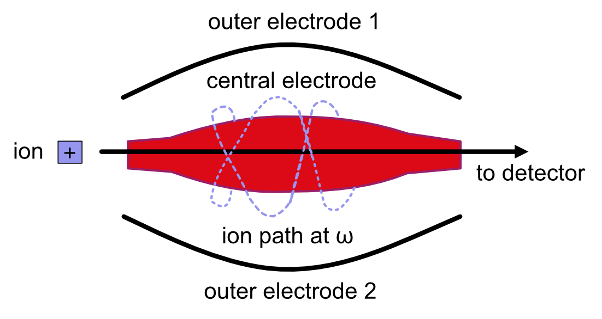
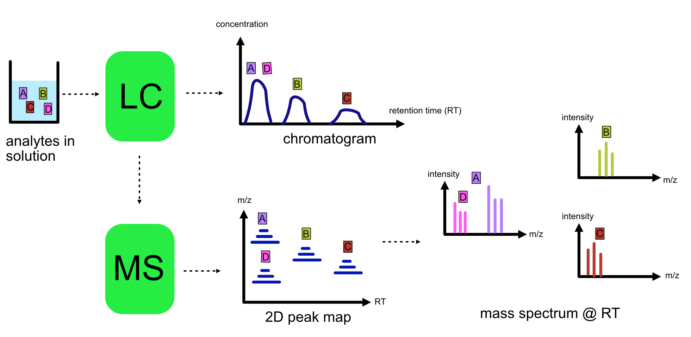
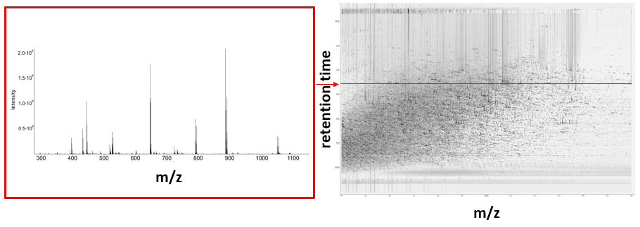

Welcome to the documentation for pyOpenMS! Here, you will find a comprehensive guide to using pyOpenMS for mass spectrometry analysis. Whether you are new to mass spectrometry or an experienced user, this documentation will provide you with a wealth of information to help you get the most out of pyOpenMS.

In the side panel you can navigate the different topics. You will find a basic introduction to mass spectrometry, including key concepts and terminology as well as detailed instructions for installing pyOpenMS on your system, so you can start using it right away.

We will then cover some basic mass spectrometry concepts and how they are represented in PyOpenMS. From there, we will dive into a selection of algorithms that are commonly used in mass spectrometry analysis, including peak picking, alignment, and quantification.

For more advanced users, we have included sections on some of the more complex topics in mass spectrometry analysis. And for those who want to get into the nitty-gritty, we have included a full API documentation and glossary.

We hope this documentation will serve as a valuable resource for you as you explore the world of mass spectrometry analysis with pyOpenMS.


Introduction
============

Proteomics and metabolomics focus on complex interactions within biological systems; the former is centered on proteins while the latter is based on metabolites. To understand these interactions, we need to accurately identify the different biological components involved.
:term:`Liquid chromatography<liquid chromatography>` (:term:`LC`) and mass spectrometry (MS) are the analytical techniques used to isolate and identify biological components in proteomics and metabolomics. :term:`LC-MS` data can be difficult to analyze manually given its amount and complexity. Therefore, we need specialized software that can analyze high-throughput :term:`LC-MS` data quickly and accurately.

Why use OpenMS
==============
OpenMS is an open-source, C++ framework for analyzing large volumes of mass spectrometry data.
It has been specially designed for analyzing high performance :term:`LC-MS` data but over recent times,
has been extended to analyze data generated by other techniques.

.. note::

    OpenMS in recent times has been expanded to support a wide variety of mass spectrometry experiments.
    To design your analysis solution, `contact the OpenMS team <https://openms.github.io/community/>`_ today.

To use OpenMS effectively, an understanding of :term:`liquid chromatography` (:term:`LC`) and
mass spectrometry (MS) is required as many of the algorithms are based on these techniques. This
section provides a detailed explanation on :term:`LC` and MS, and how they are combined to identify and
quantify substances.


:term:`Liquid chromatography<liquid chromatography>` (:term:`LC`)
=================================================================

:term:`Liquid chromatography<liquid chromatography>` is a technique used by life scientists to separate molecules based
on a specific physical or chemical property.

.. admonition:: Video

    For more information on :term:`LC`, `view this video <https://timms.uni-tuebingen.de:/tp/UT_20141028_001_cpm_0001?t=210.00>`_.

There are many types of chromatography, but this section focuses on :term:`LC` as it is widely used in proteomics and
metabolomics.

:term:`LC` separates molecules based on a specific physical or chemical property by mixing a sample containing the
molecules of interest (otherwise known as **analytes**) in a liquid solution.

Key components of :term:`LC`
````````````````````````````
A :term:`LC` setup is made up of the following components:

* **A liquid solution**, known as the **mobile phase**, containing the analytes.
* **A pump** which transports the liquid solution.
* **A stationary phase** which is a solid, homogeneous substance.
* **A column** that contains the stationary phase.
* **A detector** that plots the time it takes for the analyte to escape the column (retention time) against the analyte's concentration. This plot is called a  chromatogram.

Refer to the image below for a diagrammatic representation of a :term:`LC` setup.



How does :term:`LC` work?
`````````````````````````
The liquid solution containing the analytes is pumped through a column that is attached to the stationary phase.
Analytes are separated based on how strongly they interact with each phase. Some analytes will interact strongly
with the mobile phase while others will be strongly attracted to the stationary phase, depending on their physical or
chemical properties. The stronger an analyte's attraction is to the mobile phase, the faster it will leave the column.
The time it takes for an analyte to escape from the column is called the analyte's retention time (RT).
As a result of their differing attractions to the mobile and stationary phases, different analytes will have different
RTs, which is how separation occurs.

The RTs for each analyte are recorded by a detector. The most common detector used is the
mass spectrometer, which we discuss later. However, other detection methods exist, such as:

* Light absorption (photometric detector)
* Fluorescence
* Change in diffraction index

High Performance :term:`Liquid Chromatography<liquid chromatography>` (HPLC)
````````````````````````````````````````````````````````````````````````````
HPLC is the most commonly used technique for separating proteins and metabolites. In HPLC, a high-pressured pump is
used to transport a liquid (solvent) containing the molecules of interest through a thin capillary column.
The stationary phase is ‘packed’ into the column.

.. raw:: html

    <div class="admonition video">
    <p class="admonition-title">Video</p>
    For more information on HPLC, <a href="https://timms.uni-tuebingen.de:/tp/UT_20141028_001_cpm_0001?t=699.69">view this video</a>.
    </div>

Several variations of HPLC exist such as:
- Reversed-phase (RP) chromatography
- Strong cation/anion exchange (SCX/SAX) chromatography
- Affinity chromatography
- Size exclusion chromatography

Special Case of HPLC: Reversed-Phase (RP) Chromatography
:::::::::::::::::::::::::::::::::::::::::::::::::::::::::

RP chromatography is the most commony type of HPLC with biological samples. In reversed-phase :term:`liquid chromatography`,
the solid phase is modified to become hydrophobic, when it is originally hydrophilic, hence the term ‘reversed-phase’.
The liquid phase is a mixture of water and an organic solvent. The separation of molecules happens based on the
following behavior: hydrophilic analytes have a high affinity to the mobile phase and escape the column quickly
while hydrophobic analytes have a high affinity towards the organic solvent and therefore, take a longer time to
escape the column.

.. raw:: html

    <div class="admonition video">
    <p class="admonition-title">Video</p>
    For more information on RP chromatography,
    <a href="https://timms.uni-tuebingen.de:/tp/UT_20141028_001_cpm_0001?t=1399.85">view this video</a>.
    </div>

Mass Spectrometry (MS)
=========================================================

Mass spectrometry is an analytical technique used to determine the abundance of molecules in a sample.

Key components of MS
````````````````````````````

There are three key components in a mass spectrometer:

* An **ion source**, which generates ions from the incoming sample. All MS techniques rely
    on ionized molecules to control their movement in an electric field.
* A **mass analyzer**, which separates the ions according to their mass-to-charge (m/z) ratio.
    There are several types such as time of flight (:term:`tandem mass spectrometry`), :term:`orbitrap` and :term:`quadrupole` mass analyzers.
    Depending on the mass analyzer, OpenMS offers calibration tools, so that highly accurate results can be achieved.
* A **detector**, which scans ions at a given time point producing a mass spectrum, where the intensity is
    plotted against the m/z.

Refer to the image below for a diagrammatic representation of the key components in MS.



Ion Source
::::::::::

We want the analytes to move through the electrostatic and electromagnetic fields in the mass analyzer.
To achieve this objective, we need to convert them to ions by charging them. There are a number of
ways to charge our analytes including:

* Electrospray Ionization (:term:`ESI`)
* Matrix Assisted Laser Desorption/Ionization (MALDI)
* Electron Impact Ionization (EI)

In proteomics and metabolomics, :term:`ESI` and MALDI are used because they are soft ionization techniques.
A soft ionization technique is one which charges analytes while keeping the molecules of interest largely intact,
so that they can be characterized easily at a later stage. Hard ionization techniques such as EI shatter analytes in
smaller fragments, making it difficult to characterize large molecules.

Given that OpenMS focuses on proteomics and metabolomics applications, we will describe :term:`ESI` and MALDI in further detail.

:term:`Electrospray Ionization<electrospray ionization>` (:term:`ESI`)
''''''''''''''''''''''''''''''''''''''''''''''''''''''''''''''''''''''

:term:`ESI` can be broken down into the following steps.

1. The sample is dissolved in a polar, volatile buffer.
2. The sample - dissolved in the buffer - is pumped through a thin, stainless steel capillary.
3. The sample is converted to small, charged, stable droplets (aerosolized) by applying high voltage.   
4. The aerosol is directed through regions of high vacuum until the droplets evaporate until only the charged molecules are left.
5. The particles are fed to the mass analyzer. 

Refer to the image below for a diagrammatic representation of the steps in :term:`ESI`.



.. raw:: html

    <div class="admonition video">
    <p class="admonition-title">Video</p>
    For more information on ESI, <a href="https://timms.uni-tuebingen.de:/tp/UT_20141028_002_cpm_0001?t=624.28">view this video</a>.
    </div>

Matrix Assisted Laser Desorption/Ionization (MALDI)
'''''''''''''''''''''''''''''''''''''''''''''''''''

MALDI can be broken down into the following steps:
1. The analytes are mixed with a small organic molecule known as a matrix.
2. The mixture is exposed to radiation with short pulses of laser light, charging the matrix. 
3. The matrix transfers its charge to the analytes because the wavelength of the laser light is the same as the
absorbance maximum of the matrix.
4. The analytes become charged and are fed to the mass analyzer.

Refer to the image below for a diagrammatic representation of the steps in MALDI.



.. raw:: html

    <div class="admonition video">
    <p class="admonition-title">Video</p>
    For more information on MALDI, <a href="https://timms.uni-tuebingen.de:/tp/UT_20141028_002_cpm_0001?t=838.40">view this video</a>.
    </div>

Mass analyzer
:::::::::::::

Once the analytes have been charged by the ion source, we want to now sort the analytes by their mass-to-charge ratio for easy identification.

A number of mass analyzers exists. These include:

* :term:`Quadrupole<quadrupole>` analyzer
* :term:`Time-of-flight<time-of-flight>` analyzer
* :term:`Orbitrap<orbitrap>` analyzer

The next sections describe each analyzer type in detail.

:term:`Quadrupole<quadrupole>`
''''''''''''''''''''''''''''''

In a :term:`quadrupole` analyzer, you can set the :term:`quadrupole` voltage so that ions with a specific m/z ratio travel through. The oscillating electrostatic fields stabilize the flight path for the ions so that they can pass through the :term:`quadrupole`. Other ions will be accelerated out of the :term:`quadrupole` and will not make it to the end.

Refer to the image below for a diagrammatic representation of the :term:`quadrupole` analyzer.



.. raw:: html

    <div class="admonition video">
    <p class="admonition-title">Video</p>
    For more information on :term:`quadrupole` analyzers, <a href="https://timms.uni-tuebingen.de:/tp/UT_20141028_002_cpm_0001?t=1477.00">view this video</a>.
    </div>

:term:`Time-of-Flight<time-of-flight>` (:term:`TOF`)
'''''''''''''''''''''''''''''''''''''''''''''''''''''''''

In a :term:`time-of-flight` analyzer, ions are extracted from the ion source through an electrostatic field in pulses in a field-free drift zone. An electrostatic mirror called a reflectron reflects the ions back onto the next component of mass spectrometry, the detector. The detector counts the particles and records the time of flight from extraction to the moment the particle hits the detector.

Refer to the image below for a diagrammatic representation of the :term:`TOF` analyzer.



Lighter ions fly faster than heavier ions of the same charge and will arrive earlier at the detector. Therefore, an ion’s time of flight depends on the ion’s mass.  The ion's time of flight is also dependant on the ion's charge. This can be demonstrated by using the following equations:
1. Potential energy is transferred to an ion with charge **q** accelerated by an electrostatic field with voltage.

.. math::

    \begin{equation} E_p = qU_a
    \end{equation}

2. The potential energy is converted to kinetic energy as the ion accelerates.

.. math::

    \begin{equation} E_p = E_k = \frac{1}{2}mv^2
    \end{equation}

3. We know that for a given path,**s**, from extraction to the detector, the :term:`time of flight<TOF>`, **t** is equal to:

.. math::

    \begin{equation} t = \frac{s}{v}
    \end{equation}

Therefore,, **t**, for a given instrument's path length, **s**, depends on an ion's charge and mass. 

.. math::

    \begin{equation} t = \frac{s}{v} = \frac{s}{\sqrt{\frac{2qU_a}{m}}}
    \end{equation}

.. raw:: html

    <div class="admonition video">
    <p class="admonition-title">Video</p>
    For more information on TOF analyzers, <a href="https://timms.uni-tuebingen.de:/tp/UT_20141028_002_cpm_0001?t=1262.00">view this video</a>.
    </div>

:term:`Orbitrap<orbitrap>`
''''''''''''''''''''''''''

The :term:`orbitrap` analyzer is the most frequently used analyzer in mass spectrometry for
proteomics and metabolomics applications. It consists of two outer electrodes and a central electrode.
Ions are captured inside the analyzer because of an applied electrostatic field. The ions in the :term:`orbitrap`
analyzer oscillate around the central electrode along the axis of the electrostatic field at a set frequency, ω.
This frequency is used to determine the mass-to-charge ratio using the following formula:

.. math::

    \begin{equation} ω = \sqrt{\frac{kz}{m}}
    \end{equation}

, where *k* is a constant.

.. raw:: html

    <div class="admonition video">
    <p class="admonition-title">Video</p>
    For more information on orbitrap analyzers, <a href="https://timms.uni-tuebingen.de:/tp/UT_20141028_002_cpm_0001?t=1572.96">view this video</a>.
    </div>

The following diagram is a conceptual representation of an :term:`orbitrap` mass analyzer.



Identifying Molecules with :term:`tandem mass spectrometry<Tandem Mass Spectrometry>` (:term:`MS2`)
```````````````````````````````````````````````````````````````````````````````````````````````````
To get better results, we can use two mass analyzers sequentially to generate and analyze ions.
This technique is called :term:`tandem mass spectrometry` :term:`MS2`. :term:`Tandem mass spectrometry<tandem mass spectrometry>` is
especially useful for linear polymers like proteins, RNA and DNA.

With :term:`MS2`, ions called **precursor ions** are isolated and fragmented into ion fragments or **product ions**.
A mass spectrum is recorded for both the precursor and the product ions.

.. raw:: html

    <div class="admonition video">
    <p class="admonition-title">Video</p>
    For more information on MS2, <a href="https://timms.uni-tuebingen.de:/tp/UT_20141028_002_cpm_0001?t=1650.00">view this video</a>.
    </div>

Different fragmentation techniques to fragment peptides exist:

- :term:`Collision-induced dissociation<collision-induced dissociation>` (:term:`CID`)
- Pulsed Q Dissociation (PQD)
- Electron transfer dissociation (ETD)
- Electron capture dissociation (ECD)
- Higher energy collision dissociation (HCD)

:term:`CID` is the most frequently used fragmentation technique and will therefore be discussed in more detail in the following section.

:term:`Collision-Induced Dissociation<collision-induced dissociation>`
::::::::::::::::::::::::::::::::::::::::::::::::::::::::::::::::::::::

:term:`Collision-induced dissociation<collision-induced dissociation>` is a method to fragment peptides using an
inert gas such as argon or helium. Selected primary or precursor ions enter a collision cell filled with the inert gas.
The application of the inert gas on the precursor ions causes the precursor ions that reach the energy threshold to
fragment into smaller, product ions and or neutral losses. A mass spectrum is recorded for both the precursor
ions and the product ions. The mass spectrum for the precursor ions will give you the mass for the entire
peptide while the product ions will inform you about it’s amino acid composition.

.. raw:: html

    <div class="admonition video">
    <p class="admonition-title">Video</p>
    For more information on CID, <a href="https://timms.uni-tuebingen.de:/tp/UT_20141028_002_cpm_0001?t=1757.45">view this video</a>.
    </div>


:term:`LC-MS`
:::::::::::::

Liquid chromatography is often coupled with mass spectrometry to reduce complexity in the
mass spectra. If complex samples were directly fed to a mass spectrometer,
you would not be able to detect the less abundant analyte ions.
The separated analytes from the :term:`liquid chromatography` setup are directly injected into the ion source from
the mass spectrometry setup. Multiple analytes that escape the column at the same time
are separated by their mass-to-charge ratio using the mass spectrometer.

Refer to the image below for a diagrammatic representation of the :term:`LC-MS` setup.



From the :term:`LC-MS` setup, a set of spectra called a peak map is produced. In a peak map,
each spectrum represents the ions detected at a particular retention time.
Each peak in a spectrum has a retention time, :term`mass-to-charge` and intensity dimension.

From the :term:`LC-MS` setup, a series of spectra are 'stacked' together to form what is known as a peak map.
Each spectrum in a peak map is a collection of data points called peaks which indicate the
retention time, mass-to-charge and intensity of each detected ion.
Analyzing peak maps is difficult as different compounds can elute at the same time which means that
peaks can overlap. Therefore, sophisticated techniques are required for the accurate identification
and quantification of molecules.

The image below includes a spectrum at a given retention time (left) and a peak map (right).



.. raw:: html

    <div class="admonition video">
    <p class="admonition-title">Video</p>
    For more information on a *specific* application of LC-MS, <a href="https://timms.uni-tuebingen.de:/tp/UT_20141014_002_cpm_0001?t=946.20">view this video<a/>.
    </div>


Identification and Quantification of Ions
=========================================

While the combination of :term:`liquid chromatography` and mass spectrometry can ease the process of
characterising molecules of interest, further techniques are required to easily identify and quantify these molecules.
This section discusses both labeled and label-free quantification techniques.

Labeling
````````

Relative quantification is one strategy where one sample is chemically treated and compared to another sample
without treatment. This section discusses a particular relative quantification technique called **labeling** or
**stable isotope labeling** which involves the addition of isotopes to one sample. An isotope of an element behaves
the same chemically but has a different mass. Stable isotope labeling is used in mass spectrometry so that
scientists can easily identify proteins and metabolites.

Two types of stable isotope labeling exist: chemical labeling and metabolic labeling.

Chemical labeling
:::::::::::::::::

During chemical labeling, the label is attached at specific functional groups in a molecule like the N-terminus of a
peptide or specific side chains.

Chemical labeling occurs late in the process, therefore experiments that incorporate this technique are not highly
reproducible.

Isobaric labeling
'''''''''''''''''

Isobaric labeling, is a technique where peptides and proteins are labeled with chemical groups that have an identical
mass, but vary in terms of of distribution of heavy isotopes in their structure.

.. raw:: html

    <div class="admonition video">
    <p class="admonition-title">Video</p>
    For more information on isobaric labeling, view the following links:
    <ul>
    <li><a href="https://timms.uni-tuebingen.de:/tp/UT_20141118_002_cpm_0001?t=1108.15">Video 1</a>
    </li>
    <li><a href="https://timms.uni-tuebingen.de:/tp/UT_20141202_002_cpm_0001?t=311.78">Video 2</a>
    </li>
    <ul>
    </div>

OpenMS contains tools that analyze data from isobaric labeling experiments. 

Metabolic labeling
::::::::::::::::::

During metabolic labeling, the organism is 'fed' with labeled metabolites. Metabolites include but are not limited to
amino acids, nitrogen sources and glucose. Unlike chemical labeling, metabolic labeling occurs early in the study.
Therefore, experiments that incorporate metabolic labeling are highly reproducible.

Stable Isotope Labeling with Amino Acids in Cell Culture (:term:`SILAC`)
''''''''''''''''''''''''''''''''''''''''''''''''''''''''''''''''''''''''

In :term:`SILAC`, the labeled amino acids are fed to the cell culture. The labels are integrated into the proteins after
a period. The labeled sample is then compared with the unlabeled sample.

OpenMS contains tools that analyze data from :term:`SILAC` experiments.

.. raw:: html

    <div class="admonition video">
    <p class="admonition-title">Video</p>
    For more information on SILAC, view the following links:
    <ul>
    <li><a href="https://timms.uni-tuebingen.de:/tp/UT_20141118_002_cpm_0001?t=18.25">Video 1</a></li>
    <li><a href="https://timms.uni-tuebingen.de:/tp/UT_20141202_001_cpm_0001?t=540.13">Video 2</a></li>
    </ul>
    </div>

Label-free quantification (LFQ)
```````````````````````````````
LFQ is a cheap and natural method of quantifying molecules of interest. As the name suggests, no labeling of molecules
is involved.

LFQ includes the following steps:

1. **Conduct replicate experiments**.
2. **Generate** :term:`LC-MS` **maps** for each experiment.
3. **Find features** in all :term:`LC-MS` maps. A features is a collection of peaks that belong to a chemical compound.
4. **Align maps** to address shifts in retention times.
5. **Match corresponding features** in different maps. We refer to this as **grouping** or **linking**.
6. **Identify feature groups**, called :term:`consensus features`.
7. **Quantify consensus features**.

.. raw:: html

    <div class="admonition video">
    <p class="admonition-title">Video</p>
    For more information on LFQ, <a href="https://timms.uni-tuebingen.de:/tp/UT_20141118_002_cpm_0001?t=2115.00">view this video</a>.
    For more information on the steps involved in LFQ, <a href="https://timms.uni-tuebingen.de:/tp/UT_20141118_002_cpm_0001?t=2230.18">view this video</a>.
    </div>

Feature Finding
:::::::::::::::

features finding is method for identifying all peaks belonging to a chemical compound. Feature finding
involves the following steps:

1. **Extension** where we collect all data points we think belong to the peptide.
2. **Refinement** where we remove peaks that we think do not belong to the peptide.
3. **Fit an optimal model** to the isolated peaks.

The above steps are iterative; we repeat these steps until no improvement can be made to the model. 

OpenMS contains a number of feature finding algorithms.

.. raw:: html

    <div class="admonition video">
    <p class="admonition-title">Video</p>
    For more information on feature finding, <a href="https://timms.uni-tuebingen.de:/tp/UT_20141118_002_cpm_0001?t=2670.44">view this video</a>.
    </div>
