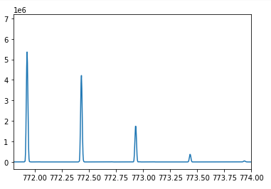
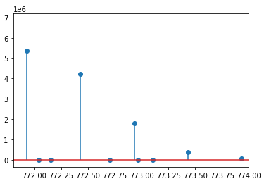

Centroiding 
===========

MS instruments typically allow storing spectra in profile mode (several data points per m/z peak)
or in the more condensed centroid mode (one data point per m/z peak). The process of converting
a profile mass spectrum into a centroided one is called peak centroiding or peak picking.

.. Note::
  
    The term peak picking is ambiguous as it is also used for features detection (i.e., 3D peak finding).

First, we load some profile data:

.. code-block:: python
    :linenos:

    from urllib.request import urlretrieve
    import pyopenms as oms
    import matplotlib.pyplot as plt

    gh = "https://raw.githubusercontent.com/OpenMS/pyopenms-docs/master"
    urlretrieve(gh + "/src/data/PeakPickerHiRes_input.mzML", "tutorial.mzML")

    profile_spectra = oms.MSExperiment()
    oms.MzMLFile().load("tutorial.mzML", profile_spectra)

Let's zoom in on an isotopic pattern in profile mode and plot it.

.. code-block:: python
    :linenos:

    plt.xlim(771.8, 774)  # zoom into isotopic pattern
    plt.plot(
        profile_spectra[0].get_peaks()[0], profile_spectra[0].get_peaks()[1]
    )  # plot the first spectrum
    plt.show()
    

Due to the limited resolution of mass spectrometry (MS) instruments, m/z measurements exhibit a certain spread
when multiple copies of a molecule are measured. Even with identical mass and charge, the copies are recorded with 
slight deviations in the m/z dimension. Consequently, peak shapes in this dimension adopt a Gaussian-like distribution.
The number of copies correlates with the peak height (or rather peak volume).

A single peptide species, e.g. "DPFINAGER" at charge 2, typically consists of various molecular
entities that differ in the number of neutrons, leading to an isotopic distribution and resulting in multiple peaks.

Using the :py:class:`~.PeakPickerHiRes` algorithm, we can convert data from profile to centroided mode. Usually, not much information is lost
by storing only centroided data. Thus, many algorithms and tools assume that centroided data is provided.

.. code-block:: python
    :linenos:

    centroided_spectra = oms.MSExperiment()

    # input, output, chec_spectrum_type (if set, checks spectrum type and throws an exception if a centroided spectrum is passed)
    oms.PeakPickerHiRes().pickExperiment(
        profile_spectra, centroided_spectra, True
    )  # pick all spectra

    plt.xlim(771.8, 774)  # zoom into isotopic pattern
    plt.stem(
        centroided_spectra[0].get_peaks()[0], centroided_spectra[0].get_peaks()[1]
    )  # plot as vertical lines
    plt.show()
    

After centroiding, a single m/z value for every isotopic peak is retained. By plotting the centroided data as stem plot
we discover that (in addition to the isotopic peaks) some low intensity peaks (intensity at approx. 4k units on the y-axis) were present in the profile data.
