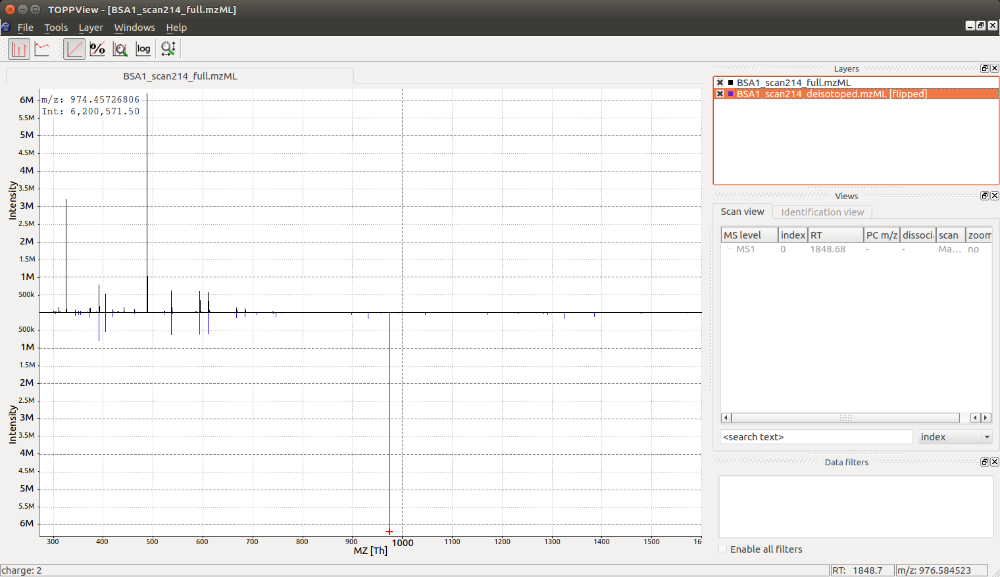

Charge and Isotope Deconvolution 
================================

A single mass spectrum contains measurements of one or more analytes and the
m/z values recorded for these analytes. Most analytes produce multiple signals
in the mass spectrometer, due to the natural abundance of heavy isotopes.
The most dominant isotope in proteins is carbon :math:`13` (naturally
occurring at ca. :math:`1.1\%` frequency). Other elements such as Hydrogen also have heavy isotopes, but
they contribute to a much lesser extend, since the heavy isotopes are very low abundant, 
e.g. hydrogen :math:`2` (Deuterium), occurs at a frequency of only :math:`0.0156\%`.

All analytes produce a so-called isotopic pattern, consisting of a
monoisotopic peak and a first isotopic peak (exactly one
extra neutron in one of the atoms of the molecule), a second isotopic peak (exactly two extra neutrons) etc.
With higher mass, the monoisotopic peak will become dimishingly small, up to the point where it is not detectable
any more (although this is rarely the case with peptides and more problematic for whole proteins in Top-Down approaches).

By definition, the monoisotopic peak is the peak which contains only isotopes of the most abundant type.
For peptides and proteins, the constituent atoms are C,H,N,O,P,S, where incidentally, the
most abundant isotope is also the lightest isotope. Hence, for peptides and proteins, the monoisotopic peak is always 
the lightest peak in an isotopic distribution.

See the `chemistry section <chemistry.html>`_ for further details on isotope abundances and how to compute isotope patterns.

In addition, each analyte may appear in more than one charge state and adduct
state, a singly charged analyte :chem:`[M +H]+` may be accompanied by a doubly
charged analyte :chem:`[M +2H]++` or a sodium adduct :chem:`[M +Na]+`. In the case of a
multiply charged peptide, the isotopic traces are spaced by ``NEUTRON_MASS /
charge_state`` which is often close to :math:`0.5\ m/z` for doubly charged analytes,
:math:`0.33\ m/z` for triply charged analytes etc. Note: tryptic peptides often appear
either singly charged (when ionized with  :term:`MALDI`), or doubly charged (when ionized with  :term:`ESI`).
Higher charges are also possible, but usually connected to incomplete tryptic digestions with missed cleavages.
Small molecules in metabolomics often carry a single charge but can have adducts other than hydrogen.

Single Peak Example
*********************************

Let's compute the isotope distribution of the peptide ``DFPIANGER`` using the classes :py:class:`~.AASequence` and 
:py:class:`~.EmpiricalFormula`. Then we use the :py:class:`~.Deisotoper` to find the monoisotopic peak:

.. code-block:: python
    :linenos:

    import pyopenms as oms

    seq = oms.AASequence.fromString("DFPIANGER")
    print("[M+H]+ weight:", seq.getMonoWeight(oms.Residue.ResidueType.Full, 1))

    ## get isotopic distribution for two additional hydrogens (which carry the charge)
    charge = 2
    seq_formula = seq.getFormula() + oms.EmpiricalFormula("H" + str(charge))
    isotopes = seq_formula.getIsotopeDistribution(oms.CoarseIsotopePatternGenerator(6))

    # Append isotopic distribution to spectrum
    s = oms.MSSpectrum()
    for iso in isotopes.getContainer():  # the container contains masses, not m/z!
        iso.setMZ(iso.getMZ() / charge) #  ... even though it's called '.getMZ()'
        s.push_back(iso)
        print("Isotope", iso.getMZ(), ":", iso.getIntensity())

    # deisotope with 10 ppm mass tolerance
    oms.Deisotoper.deisotopeAndSingleChargeDefault(s, 10, True)

    for p in s:
        print("Mono peaks:", p.getMZ(), p.getIntensity())

which will print:

.. code-block:: output
    :linenos:
    
    [M+H]+ weight: 1018.495240604071
    Isotope 509.75180710055 : 0.5680345296859741
    Isotope 510.25348451945 : 0.3053518533706665
    Isotope 510.75516193835 : 0.09806874394416809
    Isotope 511.25683935725004 : 0.023309258744120598
    Isotope 511.75851677615003 : 0.0044969217851758
    Isotope 512.2601941950501 : 0.000738693168386817
    Mono peaks: 1018.496337734329 0.5680345296859741

Note that the algorithm presented here as some heuristics built into it, such
as assuming that the isotopic peaks will decrease after the first isotopic
peak. This heuristic can be tuned by setting the parameter
``use_decreasing_model`` to ``False``.
For more fine-grained control use ``start_intensity_check`` and leave ``use_decreasing_model = True`` (see :py:class:`~.Deisotoper` --> C++ documentation).
Let's look at a very heavy peptide, whose isotopic distribution is dominated by the first and second isotopic peak.

.. code-block:: python
    :linenos:

    seq = oms.AASequence.fromString("DFPIANGERDFPIANGERDFPIANGERDFPIANGER")
    print("[M+H]+ weight:", seq.getMonoWeight(oms.Residue.ResidueType.Full, 1))

    charge = 4
    seq_formula = seq.getFormula() + oms.EmpiricalFormula("H" + str(charge))
    isotopes = seq_formula.getIsotopeDistribution(oms.CoarseIsotopePatternGenerator(8))

    # Append isotopic distribution to spectrum
    s = oms.MSSpectrum()
    for iso in isotopes.getContainer():
        iso.setMZ(iso.getMZ() / charge)
        s.push_back(iso)
        print("Isotope", iso.getMZ(), ":", iso.getIntensity())

    min_charge = 1
    min_isotopes = 2
    max_isotopes = 10
    use_decreasing_model = True   # ignores all intensities
    start_intensity_check = 3     # here, the value does not matter, since we ignore intensities (see above)
    oms.Deisotoper.deisotopeAndSingleCharge( ## a function with all parameters exposed
        s,
        10,
        True,
        min_charge,
        charge,
        True,
        min_isotopes,
        max_isotopes,
        True,
        True,
        True,
        use_decreasing_model,
        start_intensity_check,
        False,
    )
    for p in s:
        print("Mono peaks:", p.getMZ(), p.getIntensity())

.. code-block:: output
    :linenos:
        
    [M+H]+ weight: 4016.927437824572
    Isotope 1004.9878653713499 : 0.10543462634086609
    Isotope 1005.2387040808 : 0.22646738588809967
    Isotope 1005.48954279025 : 0.25444599986076355
    Isotope 1005.7403814996999 : 0.19825772941112518
    Isotope 1005.9912202091499 : 0.12000058591365814
    Isotope 1006.2420589185999 : 0.05997777357697487
    Isotope 1006.49289762805 : 0.025713207200169563
    Isotope 1006.7437363375 : 0.009702674113214016
    Mono peaks: 4016.9296320850867 0.10543462634086609

This successfully recovers the monoisotopic peak, even though it is not the most abundant peak.

Full Spectral De-Isotoping
**************************

In the following code segment, we will use a sample measurement of BSA (Bovine
Serum Albumin), and apply a simple algorithm in OpenMS for "deisotoping" a
mass spectrum, which means grouping peaks of the same isotopic pattern charge
state:

.. code-block:: python
    :linenos:

    from urllib.request import urlretrieve

    gh = "https://raw.githubusercontent.com/OpenMS/pyopenms-docs/master"
    urlretrieve(gh + "/src/data/BSA1.mzML", "BSA1.mzML")

    e = oms.MSExperiment()
    oms.MzMLFile().load("BSA1.mzML", e)
    s = e[214]
    s.setFloatDataArrays([])
    oms.Deisotoper.deisotopeAndSingleCharge(
        s,
        0.1,
        False,
        1,
        3,
        True,
        min_isotopes,
        max_isotopes,
        True,
        True,
        True,
        use_decreasing_model,
        start_intensity_check,
        False,
    )

    print(e[214].size())
    print(s.size())

    e2 = oms.MSExperiment()
    e2.addSpectrum(e[214])
    oms.MzMLFile().store("BSA1_scan214_full.mzML", e2)
    e2 = oms.MSExperiment()
    e2.addSpectrum(s)
    oms.MzMLFile().store("BSA1_scan214_deisotoped.mzML", e2)

    maxvalue = max([p.getIntensity() for p in s])
    for p in s:
        if p.getIntensity() > 0.25 * maxvalue:
            print(p.getMZ(), p.getIntensity())

    unpicked_peak_data = e[214].get_peaks()
    plt.bar(unpicked_peak_data[0], unpicked_peak_data[1], snap=False)
    plt.show()
    
    picked_peak_data = s.get_peaks()
    plt.bar(picked_peak_data[0], picked_peak_data[1], snap=False)
    plt.show()
    
    
which produces the following output

.. code-block:: output

  140
  41

  974.4572680576728 6200571.5
  974.4589691256419 3215808.75

As we can see, the algorithm has reduced :math:`140` peaks to :math:`41` deisotoped peaks. It
also has identified a molecule with a singly charged mass of  :math:`974.45\ Da` as the most intense peak in the
data (base peak).

Visualization
*************

The reason we see two peaks very close together becomes apparent
once we look at the data in :term:`TOPPView` which indicates that the :math:`974.4572680576728`
peak is derived from a :chem:`2+` peak at m/z :math:`487.73` and the peak at :math:`974.4589691256419`
is derived from a :chem:`3+` peak at m/z :math:`325.49`: the algorithm has identified a single
analyte in two charge states and deconvoluted the peaks to their nominal mass
of a :chem:`[M +H]+` ion, which produces two peaks very close together (:chem:`2+` and :chem:`3+`
peak):

Looking at the full mass spectrum and comparing it to the original mass spectrum, we can see the
original (centroided) mass spectrum on the top and the deisotoped mass spectrum on the
bottom in blue. Note how hovering over a peak in the deisotoped mass spectrum
indicates the charge state:

In the next section (`Feature Detection <feature_detection.html>`_), we will look at 2-dimensional deisotoping where instead of
a single mass spectrum, multiple mass spectra from a :term:`LC-MS` experiment are analyzed
together. There algorithms analyze the full 2-dimensional (m/z and RT) signal
and are generally more powerful than the 1-dimensional algorithm discussed
here. However, not all data is 2 dimensional and the algorithm discussed here
has many application in practice (e.g. single mass spectra, fragment ion
mass spectra in DDA etc.).

