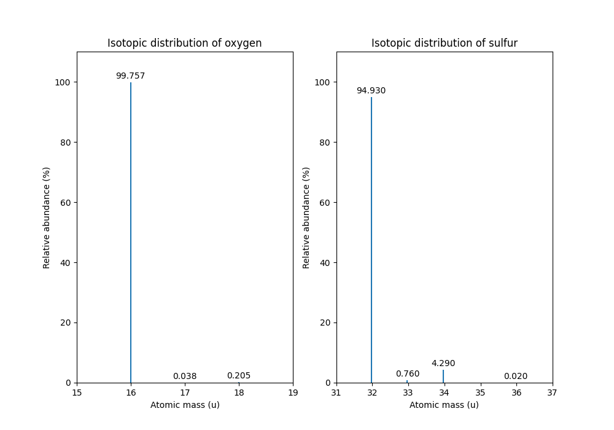
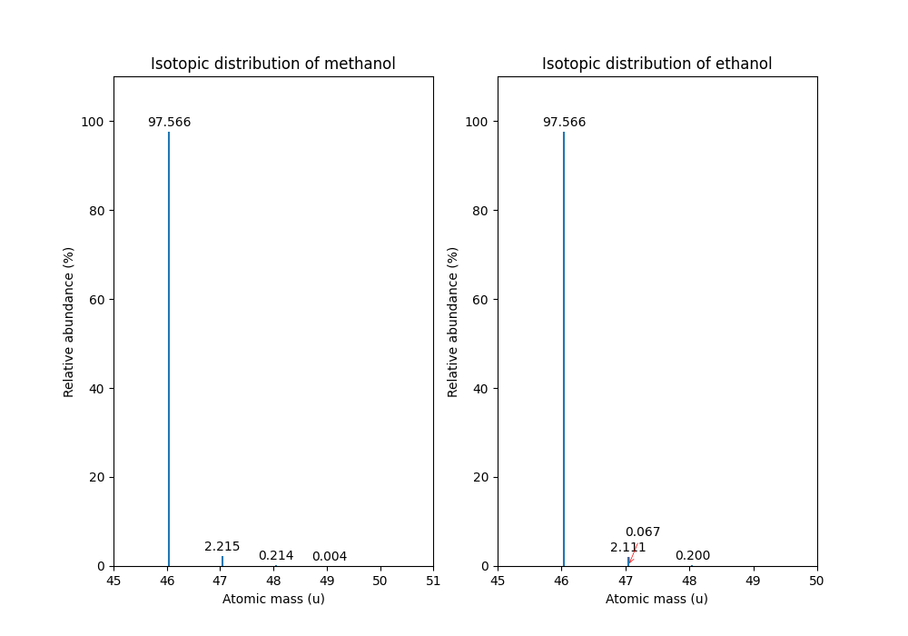

Chemistry
=========

OpenMS has representations for various chemical concepts including molecular
formulas, isotopes, ribonucleotide and amino acid sequences as well as common
modifications of amino acids or ribonucleotides.

Constants
---------

OpenMS has many chemical and physical constants built in:

.. code-block:: python
    :linenos:

    import pyopenms.Constants

    help(pyopenms.Constants)
    print("Avogadro's number is", pyopenms.Constants.AVOGADRO)

which provides access to constants such as Avogadro's number or the electron
mass.

Elements
--------

In OpenMS, elements are stored in :py:class:`~.ElementDB` which has entries for dozens of
elements commonly used in mass spectrometry.

.. code-block:: python
    :linenos:

    import pyopenms as oms

    edb = oms.ElementDB()

    edb.hasElement("O")
    edb.hasElement("S")

    oxygen = edb.getElement("O")
    print(oxygen.getName())
    print(oxygen.getSymbol())
    print(oxygen.getMonoWeight())
    print(oxygen.getAverageWeight())

    sulfur = edb.getElement("S")
    print(sulfur.getName())
    print(sulfur.getSymbol())
    print(sulfur.getMonoWeight())
    print(sulfur.getAverageWeight())
    isotopes = sulfur.getIsotopeDistribution()

    print("One mole of oxygen weighs", 2 * oxygen.getAverageWeight(), "grams")
    print("One mole of 16O2 weighs", 2 * oxygen.getMonoWeight(), "grams")

As we can see, the OpenMS :py:class:`~.ElementDB` has entries for common elements like
oxygen and sulfur as well as information on their average and monoisotopic
weight. Note that the monoisotopic weight is the weight of the most abundant
isotope while the average weight is the sum across all isotopes, weighted by
their natural abundance. Therefore, one mole of oxygen (:chem:`O2`) weighs slightly
more than a mole of only its monoisotopic isotope since natural oxygen is a
mixture of multiple isotopes.

.. code-block:: output

    Oxygen
    O
    15.994915
    15.999405323160001
    Sulfur
    S
    31.97207073
    32.066084735289
    One mole of oxygen weighs 31.998810646320003 grams
    One mole of 16O2 weighs 31.98983 grams

Isotopes
~~~~~~~~

We can also inspect the full isotopic distribution of oxygen and sulfur:

.. code-block:: python
    :linenos:

    edb = oms.ElementDB()
    oxygen_isoDist = {"mass": [], "abundance": []}
    sulfur_isoDist = {"mass": [], "abundance": []}

    oxygen = edb.getElement("O")
    isotopes = oxygen.getIsotopeDistribution()
    for iso in isotopes.getContainer():
        print(
            "Oxygen isotope",
            iso.getMZ(),
            "has abundance",
            iso.getIntensity() * 100,
            "%",
        )
        oxygen_isoDist["mass"].append(iso.getMZ())
        oxygen_isoDist["abundance"].append((iso.getIntensity() * 100))

    sulfur = edb.getElement("S")
    isotopes = sulfur.getIsotopeDistribution()
    for iso in isotopes.getContainer():
        print(
            "Sulfur isotope",
            iso.getMZ(),
            "has abundance",
            iso.getIntensity() * 100,
            "%",
        )
        sulfur_isoDist["mass"].append(iso.getMZ())
        sulfur_isoDist["abundance"].append((iso.getIntensity() * 100))

OpenMS can compute isotopic distributions for individual elements which contain
information for all stable elements. The current values in the file are
average abundances found in nature, which may differ depending on location. The
above code outputs the isotopes of oxygen and sulfur as well as their
abundance:

.. code-block:: output

    Oxygen isotope 15.994915 has abundance 99.75699782371521 %
    Oxygen isotope 16.999132 has abundance 0.03800000122282654 %
    Oxygen isotope 17.999169 has abundance 0.20500000100582838 %

    Sulfur isotope 31.97207073 has abundance 94.92999911308289 %
    Sulfur isotope 32.971458 has abundance 0.7600000128149986 %
    Sulfur isotope 33.967867 has abundance 4.2899999767541885 %
    Sulfur isotope 35.967081 has abundance 0.019999999494757503 %

The isotope distribution of oxygen and sulfur can be displayed with the following extra code:

.. code-block:: python

    import math
    from matplotlib import pyplot as plt

    # very simple overlappping correction of annotations
    def adjustText(x1, y1, x2, y2):
        if y1 > y2:
            plt.annotate(
                "%0.3f" % (y2),
                xy=(x2, y2),
                xytext=(x2 + 0.5, y2 + 9),
                textcoords="data",
                arrowprops=dict(arrowstyle="->", color="r", lw=0.5),
                horizontalalignment="right",
                verticalalignment="top",
            )
        else:
            plt.annotate(
                "%0.3f" % (y1),
                xy=(x1, y1),
                xytext=(x1 + 0.5, y1 + 9),
                textcoords="data",
                arrowprops=dict(arrowstyle="->", color="r", lw=0.5),
                horizontalalignment="right",
                verticalalignment="top",
            )

    def plotDistribution(distribution):
        n = len(distribution["mass"])
        for i in range(0, n):
            plt.vlines(
                x=distribution["mass"][i], ymin=0, ymax=distribution["abundance"][i]
            )
            if (
                int(distribution["mass"][i - 1]) == int(distribution["mass"][i])
                and i != 0
            ):
                adjustText(
                    distribution["mass"][i - 1],
                    distribution["abundance"][i - 1],
                    distribution["mass"][i],
                    distribution["abundance"][i],
                )
            else:
                plt.text(
                    x=distribution["mass"][i],
                    y=(distribution["abundance"][i] + 2),
                    s="%0.3f" % (distribution["abundance"][i]),
                    va="center",
                    ha="center",
                )
        plt.ylim([0, 110])
        plt.xticks(
            range(
                math.ceil(distribution["mass"][0]) - 2,
                math.ceil(distribution["mass"][-1]) + 2,
            )
        )

    plt.figure(figsize=(10, 7))

    plt.subplot(1, 2, 1)
    plt.title("Isotopic distribution of oxygen")
    plotDistribution(oxygen_isoDist)
    plt.xlabel("Atomic mass (u)")
    plt.ylabel("Relative abundance (%)")

    plt.subplot(1, 2, 2)
    plt.title("Isotopic distribution of sulfur")
    plotDistribution(sulfur_isoDist)
    plt.xlabel("Atomic mass (u)")
    plt.ylabel("Relative abundance (%)")

    plt.show()

which produces

.. _Mass Defect Section:

Mass Defect
~~~~~~~~~~~

.. NOTE::
    While all isotopes are created by adding one or more neutrons to the
    nucleus, this leads to different observed masses due to the
    `mass defect <https://en.wikipedia.org/wiki/Nuclear_binding_energy#Mass_defect>`_, which
    describes the difference between the mass of an atom and the mass of
    its constituent particles. For example, the mass difference between :chem:`^{12}C` and
    :chem:`^{13}C` is slightly different than the mass difference between :chem:`^{14}N` and :chem:`^{15}N`, even
    though both only differ by a neutron from their monoisotopic element:

   .. code-block:: python

       edb = oms.ElementDB()
       isotopes = edb.getElement("C").getIsotopeDistribution().getContainer()
       carbon_isotope_difference = isotopes[1].getMZ() - isotopes[0].getMZ()
       isotopes = edb.getElement("N").getIsotopeDistribution().getContainer()
       nitrogen_isotope_difference = isotopes[1].getMZ() - isotopes[0].getMZ()

       print("Mass difference between 12C and 13C:", carbon_isotope_difference)
       print("Mass difference between 14N and N15:", nitrogen_isotope_difference)
       print(
           "Relative deviation:",
           100
           * (carbon_isotope_difference - nitrogen_isotope_difference)
           / carbon_isotope_difference,
           "%",
       )

   .. code-block:: output
       
       Mass difference between 12C and 13C: 1.003355
       Mass difference between 14N and 15N: 0.997035
       Relative deviation: 0.6298867300208343 %

This difference can actually be measured by a high resolution mass spectrometry
instrument and is used in the `tandem mass tag (TMT) <https://en.wikipedia.org/wiki/Tandem_mass_tag>`_
labelling strategy.

For the same reason, the helium atom has a slightly lower mass than the mass
of its constituent particles (two protons, two neutrons and two electrons):

   .. code-block:: python

       from pyopenms.Constants import PROTON_MASS_U, ELECTRON_MASS_U, NEUTRON_MASS_U

       helium = oms.ElementDB().getElement("He")
       isotopes = helium.getIsotopeDistribution()

       mass_sum = 2 * PROTON_MASS_U + 2 * ELECTRON_MASS_U + 2 * NEUTRON_MASS_U
       helium4 = isotopes.getContainer()[1].getMZ()
       print("Sum of masses of 2 protons, neutrons and electrons:", mass_sum)
       print("Mass of He4:", helium4)
       print(
           "Difference between the two masses:",
           100 * (mass_sum - helium4) / mass_sum,
           "%",
       )

   .. code-block:: output
       
       Sum of masses of 2 protons, neutrons and electrons: 4.032979924670597
       Mass of He4: 4.00260325415
       Difference between the two masses: 0.7532065888743016 %

   The difference in mass is the energy released when the atom was formed (or
   in other words, it is the energy required to disassemble the nucleus into
   its particles).

Molecular Formulas
------------------

Elements can be combined to molecular formulas (:py:class:`~.EmpiricalFormula`) which can
be used to describe molecules such as metabolites, amino acid sequences or
oligonucleotides. The class supports a large number of operations like
addition and subtraction. A simple example is given in the next few lines of
code.

.. code-block:: python
    :linenos:

    methanol = oms.EmpiricalFormula("CH3OH")
    water = oms.EmpiricalFormula("H2O")
    ethanol = oms.EmpiricalFormula("CH2") + methanol
    print("Ethanol chemical formula:", ethanol.toString())
    print("Ethanol composition:", ethanol.getElementalComposition())
    print("Ethanol has", ethanol.getElementalComposition()[b"H"], "hydrogen atoms")

which produces

.. code-block:: output

    Ethanol chemical formula: C2H6O1
    Ethanol composition: {b'C': 2, b'H': 6, b'O': 1}
    Ethanol has 6 hydrogen atoms

Note how in line 5 we were able to make a new molecule by adding existing
molecules (for example by adding two :py:class:`~.EmpiricalFormula` objects). In this
case, we illustrated how to make ethanol by adding a :chem:`CH2` methyl group to an
existing methanol molecule. Note that OpenMS describes sum formulas with the
:py:class:`~.EmpiricalFormula` object and does store structural information in this class.

Isotopes
~~~~~~~~

Specific isotopes can be incorporated into a molecular formula using bracket
notation. For example, ethanol with one or two :chem:`C13` can be specified using :chem:`(13)C` as follows:

.. code-block:: python
    :linenos:

    ethanol = oms.EmpiricalFormula("C2H6O")
    print("Ethanol chemical formula:", ethanol.toString())
    print("Ethanol composition:", ethanol.getElementalComposition())
    print("Ethanol weight:", ethanol.getMonoWeight())

    ethanol = oms.EmpiricalFormula("(13)C1CH6O")
    print("Ethanol chemical formula:", ethanol.toString())
    print("Ethanol composition:", ethanol.getElementalComposition())
    print("Ethanol weight:", ethanol.getMonoWeight())

    ethanol = oms.EmpiricalFormula("(13)C2H6O")
    print("Ethanol chemical formula:", ethanol.toString())
    print("Ethanol composition:", ethanol.getElementalComposition())
    print("Ethanol weight:", ethanol.getMonoWeight())

which produces

.. code-block:: output

  Ethanol chemical formula: C2H6O1
  Ethanol composition: {b'C': 2, b'H': 6, b'O': 1}
  Ethanol weight: 46.0418651914

  Ethanol chemical formula: (13)C1C1H6O1
  Ethanol composition: {b'(13)C': 1, b'C': 1, b'H': 6, b'O': 1}
  Ethanol weight: 47.0452201914

  Ethanol chemical formula: (13)C2H6O1
  Ethanol composition: {b'(13)C': 2, b'H': 6, b'O': 1}
  Ethanol weight: 48.0485751914

Isotopic Distributions
~~~~~~~~~~~~~~~~~~~~~~

OpenMS can also generate theoretical isotopic distributions from analytes
represented as :py:class:`~.EmpiricalFormula`. Currently there are two algorithms
implemented, :py:class:`~.CoarseIsotopePatternGenerator` which produces unit mass isotope
patterns and :py:class:`~.FineIsotopePatternGenerator` which is based on the IsoSpec
algorithm [1]_ :

.. code-block:: python

    methanol = oms.EmpiricalFormula("CH3OH")
    ethanol = oms.EmpiricalFormula("CH2") + methanol

    methanol_isoDist = {"mass": [], "abundance": []}
    ethanol_isoDist = {"mass": [], "abundance": []}

    print("Coarse Isotope Distribution:")
    isotopes = ethanol.getIsotopeDistribution(oms.CoarseIsotopePatternGenerator(4))
    prob_sum = sum([iso.getIntensity() for iso in isotopes.getContainer()])
    print("This covers", prob_sum, "probability")
    for iso in isotopes.getContainer():
        print(
            "Isotope", iso.getMZ(), "has abundance", iso.getIntensity() * 100, "%"
        )
        methanol_isoDist["mass"].append(iso.getMZ())
        methanol_isoDist["abundance"].append((iso.getIntensity() * 100))

    print("Fine Isotope Distribution:")
    isotopes = ethanol.getIsotopeDistribution(oms.FineIsotopePatternGenerator(1e-3))
    prob_sum = sum([iso.getIntensity() for iso in isotopes.getContainer()])
    print("This covers", prob_sum, "probability")
    for iso in isotopes.getContainer():
        print(
            "Isotope", iso.getMZ(), "has abundance", iso.getIntensity() * 100, "%"
        )
        ethanol_isoDist["mass"].append(iso.getMZ())
        ethanol_isoDist["abundance"].append((iso.getIntensity() * 100))

which produces

.. code-block:: output

    Coarse Isotope Distribution:
    This covers 0.9999999753596569 probability
    Isotope 46.0418651914 has abundance 97.56630063056946 %
    Isotope 47.045220029199996 has abundance 2.21499539911747 %
    Isotope 48.048574867 has abundance 0.2142168115824461 %
    Isotope 49.0519297048 has abundance 0.004488634294830263 %

    Fine Isotope Distribution:
    This covers 0.9994461630121805 probability
    Isotope 46.0418651914 has abundance 97.5662887096405 %
    Isotope 47.0452201914 has abundance 2.110501006245613 %
    Isotope 47.0481419395 has abundance 0.06732848123647273 %
    Isotope 48.046119191399995 has abundance 0.20049810409545898 %

Together with the ``plotDistribution()`` function from above and the extra code:

.. code-block:: python
    :linenos:

    plt.figure(figsize=(10, 7))

    plt.subplot(1, 2, 1)
    plt.title("Isotopic distribution of methanol")
    plotDistribution(methanol_isoDist)
    plt.xlabel("Atomic mass (u)")
    plt.ylabel("Relative abundance (%)")

    plt.subplot(1, 2, 2)
    plt.title("Isotopic distribution of ethanol")
    plotDistribution(ethanol_isoDist)
    plt.xlabel("Atomic mass (u)")
    plt.ylabel("Relative abundance (%)")

    plt.savefig("methanol_ethanol_isoDistribution.png")

we can produce the following visualization

The result calculated with the :py:class:`~.FineIsotopePatternGenerator`
contains the hyperfine isotope structure with heavy isotopes of Carbon and 
Hydrogen clearly distinguished while the coarse (unit resolution)
isotopic distribution contains summed probabilities for each isotopic peak
without the hyperfine resolution.  

Please refer to our previous discussion on the `mass defect <#Mass-Defect>`__ to understand the
results of the hyperfine algorithm and why different elements produce slightly
different masses.
In this example, the hyperfine isotopic distribution will 
contain two peaks for the nominal mass of :math:`47`: one at :math:`47.045` for the
incorporation of one heavy :math:`13C` with a delta mass of :math:`1.003355` and one at :math:`47.048`
for the incorporation of one heavy deuterium with a delta mass of :math:`1.006277`.
These two peaks also have two different abundances (the heavy carbon one has
:math:`2.1%` abundance and the deuterium one has :math:`0.07%` abundance). This can be understood given that
there are 2 :chem:`C` atoms and the natural abundance of :chem:`13C` is about
:math:`1.1%`, while the molecule has :chem:`6H` atoms and the natural abundance of
deuterium is about :math:`0.02%`. The fine isotopic generator will not generate the
peak at nominal mass :math:`49` since we specified our cutoff at :math:`0.1%` total abundance
and the four peaks above cover :math:`99.9%` of the
isotopic abundance.

We can also decrease our cutoff and ask for more isotopes to be calculated: 

.. code-block:: python

    methanol = oms.EmpiricalFormula("CH3OH")
    ethanol = oms.EmpiricalFormula("CH2") + methanol

    print("Fine Isotope Distribution:")
    isotopes = ethanol.getIsotopeDistribution(FineIsotopePatternGenerator(1e-6))
    prob_sum = sum([iso.getIntensity() for iso in isotopes.getContainer()])
    print("This covers", prob_sum, "probability")
    for iso in isotopes.getContainer():
        print(
            "Isotope", iso.getMZ(), "has abundance", iso.getIntensity() * 100, "%"
        )

which produces

.. code-block:: output

    Fine Isotope Distribution:
    This covers 0.9999993089130612 probability
    Isotope 46.0418651914 has abundance 97.5662887096405 %
    Isotope 47.0452201914 has abundance 2.110501006245613 %
    Isotope 47.046082191400004 has abundance 0.03716550418175757 %
    Isotope 47.0481419395 has abundance 0.06732848123647273 %
    Isotope 48.046119191399995 has abundance 0.20049810409545898 %
    Isotope 48.0485751914 has abundance 0.011413302854634821 %
    Isotope 48.0494371914 has abundance 0.0008039440217544325 %
    Isotope 48.0514969395 has abundance 0.0014564131561201066 %
    Isotope 49.049474191399995 has abundance 0.004337066275184043 %
    Isotope 49.0523959395 has abundance 0.00013835959862262825 %

Here we can observe more peaks and now also see the heavy oxygen peak at
:math:`47.04608` with a delta mass of :math:`1.004217` (difference between :math:`16O` and :math:`17O`) at an
abundance of :math:`0.04%`, which is what we would expect for a single :chem:`O` atom.
Even though the natural abundance of deuterium (:math:`0.02%`) is lower than :math:`17O`
(:math:`0.04%`), since there are :chem:`6H` atoms in the molecule and only one
:chem:`O`, it is more likely that we will see a deuterium peak than a heavy oxygen
peak. Also, even for a small molecule like ethanol, the differences in mass
between the hyperfine peaks can reach more than :math:`110` ppm (:math:`48.046` vs :math:`48.051`).
Note that the :py:class:`~.FineIsotopePatternGenerator` will generate peaks until the total
error has decreased to :math:`1e^{-6}`, allowing us to cover :math:`0.999999` of the probability.

OpenMS can also produce isotopic distribution with masses rounded to the
nearest integer:

.. code-block:: python

    isotopes = ethanol.getIsotopeDistribution(
        oms.CoarseIsotopePatternGenerator(5, True)
    )
    for iso in isotopes.getContainer():
        print(
            "Isotope", iso.getMZ(), "has abundance", iso.getIntensity() * 100, "%"
        )

.. code-block:: output

    Isotope 46.0 has abundance 97.56627082824707 %
    Isotope 47.0 has abundance 2.214994840323925 %
    Isotope 48.0 has abundance 0.214216741733253 %
    Isotope 49.0 has abundance 0.0044886332034366205 %
    Isotope 50.0 has abundance 2.64924580051229e-05 %

Amino Acids
-----------

An amino acid residue is represented in OpenMS by the class :py:class:`~.Residue`. It provides a
container for the amino acids as well as some functionality. The class is able
to provide information such as the isotope distribution of the residue, the
average and monoisotopic weight. The residues can be identified by their full
name, their three letter abbreviation or the single letter abbreviation. The
residue can also be modified, which is implemented in the :py:class:`~.Modification` class.
Additional less frequently used parameters of a residue like the gas-phase
basicity and pk values are also available.

.. code-block:: python

    lys = oms.ResidueDB().getResidue("Lysine")
    print(lys.getName())
    print(lys.getThreeLetterCode())
    print(lys.getOneLetterCode())
    print(lys.getAverageWeight())
    print(lys.getMonoWeight())
    print(lys.getPka())
    print(lys.getFormula().toString())

.. code-block:: output

    'Lysine'
    'LYS'
    'K'
    146.18788276708443
    146.1055284466
    2.16
    u'C6H14N2O2'

As we can see, OpenMS knows common amino acids like lysine as well as
some properties of them. These values are stored in ``Residues.xml`` in the
OpenMS share folder and can, in principle, be modified.

Amino Acid Modifications
------------------------

An amino acid residue modification is represented in OpenMS by the class
:py:class:`~.ResidueModification`. The known modifications are stored in the
:py:class:`~.ModificationsDB` object, which is capable of retrieving specific
modifications. It contains UniMod as well as PSI modifications.

.. code-block:: python

    ox = oms.ModificationsDB().getModification("Oxidation")
    print(ox.getUniModAccession())
    print(ox.getUniModRecordId())
    print(ox.getDiffMonoMass())
    print(ox.getId())
    print(ox.getFullId())
    print(ox.getFullName())
    print(ox.getDiffFormula())

.. code-block:: output

    UniMod:35
    35
    15.994915
    Oxidation
    Oxidation (N)
    Oxidation or Hydroxylation
    O1

thus providing information about the "Oxidation" modification. As above, we can
investigate the isotopic distribution of the modification (which in this case
is identical to the one of Oxygen by itself):

.. code-block:: python

    isotopes = ox.getDiffFormula().getIsotopeDistribution(
        oms.CoarseIsotopePatternGenerator(5)
    )
    for iso in isotopes.getContainer():
        print(iso.getMZ(), ":", iso.getIntensity())

Which will print the isotopic pattern of the modification (Oxygen):

.. code-block:: output

  15.994915 : 0.9975699782371521
  16.998269837800002 : 0.0003800000122282654
  18.0016246756 : 0.002050000010058284

All available modifications can be stored in a Dictionary by:

.. code-block:: python

    num_mod = oms.ModificationsDB().getNumberOfModifications()

    all_mods={}
    for index in range(0, num_mod):
        mod = oms.ModificationsDB().getModification(index)
        all_mods[mod.getUniModRecordId()] = mod

And the modification can be accessed by UniMod Accesstion by:

.. code-block:: python

    # obtain modification with UniMod Accession 122
    ox = all_mods[122]

    print(ox.getUniModAccession())
    print(ox.getUniModRecordId())
    print(ox.getDiffMonoMass())
    print(ox.getId())
    print(ox.getFullId())
    print(ox.getFullName())
    print(ox.getDiffFormula())

to output:

.. code-block:: output

    UniMod:122
    122
    27.994915
    Formyl
    Formyl (S)
    Formylation
    C1O1

Ribonucleotides
---------------

A `ribonucleotide <https://en.wikipedia.org/wiki/Ribonucleotide>`_ describes
one of the building blocks of DNA and RNA. In OpenMS, a ribonucleotide in its
modified or unmodified form is represented by the :py:class:`~.Ribonucleotide` class in
OpenMS. The class is able to provide information such as the isotope
distribution of the residue, the average and monoisotopic weight. The residues
can be identified by their full name, their three letter abbreviation or the
single letter abbreviation. Modified ribonucleotides are represented by the
same class. Currently, support for RNA is implemented.

.. code-block:: python

    uridine = oms.RibonucleotideDB().getRibonucleotide(b"U")
    print(uridine.getName())
    print(uridine.getCode())
    print(uridine.getAvgMass())
    print(uridine.getMonoMass())
    print(uridine.getFormula().toString())
    print(uridine.isModified())
    methyladenosine = oms.RibonucleotideDB().getRibonucleotide(b"m1A")
    print(methyladenosine.getName())
    print(methyladenosine.isModified())

.. code-block:: output

    'uridine'
    'U'
    244.2043
    244.0695
    'C9H12N2O6'
    False
    '1-methyladenosine'
    True

.. We could also showcase the "get alternatives" method
.. for alt in RibonucleotideDB().getRibonucleotideAlternatives(b"mmA?"):  print(alt.getName())

.. [1] Łącki MK, Startek M, Valkenborg D, Gambin A.
    IsoSpec: Hyperfast Fine Structure Calculator.
    Anal Chem. 2017 Mar 21;89(6):3272-3277. `doi: 10.1021/acs.analchem.6b01459. <http://doi.org/10.1021/acs.analchem.6b01459>`_

