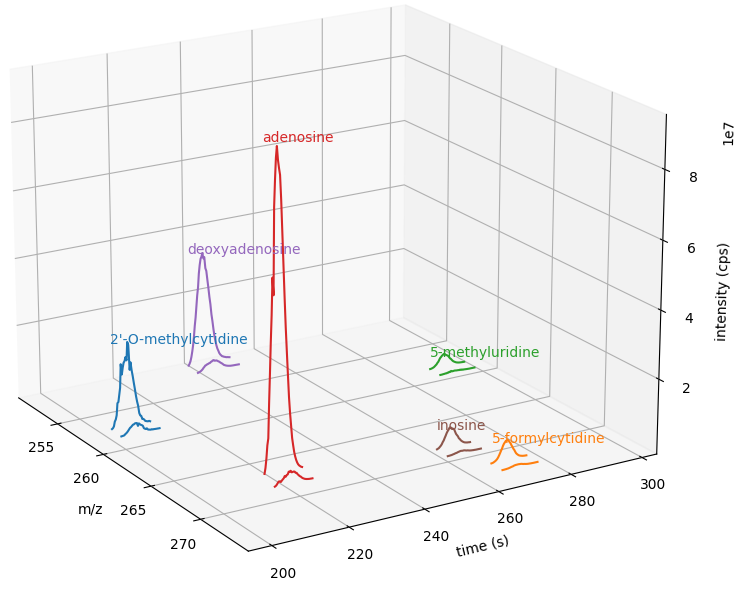

Feature Detection
=================

One very common task in mass spectrometry is the detection of 2-dimensional
patterns in m/z and time (RT) dimension from a series of :term:`MS1` scans. These
patterns are called ``Features`` and they exhibit a chromatographic elution
profile in the time dimension and an isotopic pattern in the m/z dimension (see
`previous section <deisotoping.html>`_ for the 1-dimensional problem).
OpenMS has multiple tools that can identify these features in 2-dimensional
data, these tools are called :py:class:`~.FeatureFinder`.  Currently the following
FeatureFinders are available in pyOpenMS:

  - :py:class:`~.FeatureFinderMultiplexAlgorithm` (e.g., :term:`SILAC`, Dimethyl labeling, (and label-free), identification free feature detection of peptides)
  - :py:class:`~.FeatureFinderAlgorithmPicked` (Label-free, identification free feature detection of peptides)
  - :py:class:`~.FeatureFinderIdentificationAlgorithm` (Label-free identification-guided feature detection of peptides)
  - :py:class:`~.FeatureFindingMetabo` (Label-free, identification free feature detection of metabolites)
  - :py:class:`~.FeatureFinderAlgorithmMetaboIdent` (Label-free, identification guided feature detection of metabolites)

All of the algorithms above are for proteomics data with the exception of :py:class:`~.FeatureFindingMetabo` and :py:class:`~.FeatureFinderMetaboIdentCompound` for metabolomics data and small molecules in general.

Proteomics
******************************

Two of the most commonly used feature finders for proteomics in OpenMS are the :py:class:`~.FeatureFinder` and :py:class:`~.FeatureFinderIdentificationAlgorithm` which both work on (high
resolution) centroided data. We can use the following code to find features in MS data:

.. code-block:: python

  from urllib.request import urlretrieve

  gh = "https://raw.githubusercontent.com/OpenMS/pyopenms-docs/master"
  urlretrieve(
      gh + "/src/data/FeatureFinderCentroided_1_input.mzML", "feature_test.mzML"
  )

  import pyopenms as oms

  # Prepare data loading (save memory by only
  # loading MS1 spectra into memory)
  options = oms.PeakFileOptions()
  options.setMSLevels([1])
  fh = oms.MzMLFile()
  fh.setOptions(options)

  # Load data
  input_map = oms.MSExperiment()
  fh.load("feature_test.mzML", input_map)
  input_map.updateRanges()

  ff = oms.FeatureFinder()
  ff.setLogType(oms.LogType.CMD)

  # Run the feature finder
  name = "centroided"
  features = oms.FeatureMap()
  seeds = oms.FeatureMap()
  params = oms.FeatureFinder().getParameters(name)
  ff.run(name, input_map, features, params, seeds)

  features.setUniqueIds()
  fh = oms.FeatureXMLFile()
  fh.store("output.featureXML", features)
  print("Found", features.size(), "features")

With a few lines of Python, we are able to run powerful algorithms available in
OpenMS. The resulting data is held in memory (a :py:class:`~.FeatureMap` object) and can be
inspected directly using the ``help(features)`` comment. It reveals that the
object supports iteration (through the ``__iter__`` function) as well as direct
access (through the ``__getitem__`` function). This means we write code that uses direct access and iteration in
Python as follows:

.. code-block:: python

  f0 = features[0]
  for f in features:
      print(f.getRT(), f.getMZ())

Each entry in the :py:class:`~.FeatureMap` is a so-called :py:class:`~.Feature` and allows direct
access to the m/z and RT value from Python. Again, we can learn this by
inspecting ``help(f)`` or by consulting the manual.

Note: the output file that we have written (``output.featureXML``) is an
OpenMS-internal XML format for storing features. You can learn more about file
formats in the `Reading MS data formats <other_file_handling.html>`_ section.

Metabolomics - Untargeted
*************************

For the untargeted detection of small molecule features we can use the :py:class:`~.FeatureFindingMetabo` with prior :py:class:`~.MassTraceDetection` and :py:class:`~.ElutionPeakDetection`.

.. code-block:: python

  import pyopenms as oms
  from urllib.request import urlretrieve

  gh = "https://raw.githubusercontent.com/OpenMS/pyopenms-docs/master"
  mzML_path = gh + "/src/data/FeatureFinderMetaboIdent_1_input.mzML"
  urlretrieve(mzML_path, "ms_data.mzML")

  exp = oms.MSExperiment()
  oms.MzMLFile().load("ms_data.mzML", exp)

  exp.sortSpectra(True)

  mass_traces = []
  mtd = oms.MassTraceDetection()
  mtd_params = mtd.getDefaults()
  mtd_params.setValue(
      "mass_error_ppm", 5.0
  )  # set according to your instrument mass error
  mtd_params.setValue(
      "noise_threshold_int", 3000.0
  )  # adjust to noise level in your data
  mtd.setParameters(mtd_params)
  mtd.run(exp, mass_traces, 0)

  mass_traces_split = []
  mass_traces_final = []
  epd = oms.ElutionPeakDetection()
  epd_params = epd.getDefaults()
  epd_params.setValue("width_filtering", "fixed")
  epd.setParameters(epd_params)
  epd.detectPeaks(mass_traces, mass_traces_split)

  if epd.getParameters().getValue("width_filtering") == "auto":
      epd.filterByPeakWidth(mass_traces_split, mass_traces_final)
  else:
      mass_traces_final = mass_traces_split

  fm = oms.FeatureMap()
  feat_chrom = []
  ffm = oms.FeatureFindingMetabo()
  ffm_params = ffm.getDefaults()
  ffm_params.setValue("isotope_filtering_model", "none")
  ffm_params.setValue(
      "remove_single_traces", "true"
  )  # set false to keep features with only one mass trace
  ffm_params.setValue("mz_scoring_by_elements", "false")
  ffm_params.setValue("report_convex_hulls", "true")
  ffm.setParameters(ffm_params)
  ffm.run(mass_traces_final, fm, feat_chrom)

  fm.setUniqueIds()
  fm.setPrimaryMSRunPath(["ms_data.mzML".encode()])

Metabolomics - Targeted
***********************

:py:class:`~.FeatureFinderAlgorithmMetaboIdent` performs :term:`MS1`-based **targeted feature extraction** based on user provided compounds, which are
specified in an assay library (a tab-separated text file). Detected features are stored in a :py:class:`~.FeatureMap` which can be
stored in a :py:class:`~.FeatureXMLFile`. This tool is useful for the targeted extraction of features for a well-defined set of compounds
with known sum formulas and retention times.
For more information on the format of the assay library and available parameters visit the `FeatureFinderMetaboIdent documentation
<https://abibuilder.cs.uni-tuebingen.de/archive/openms/Documentation/release/latest/html/UTILS_FeatureFinderMetaboIdent.html>`_.

The pyOpenMS :py:class:`~.FeatureFinderAlgorithmMetaboIdent` needs a list of :py:class:`~.FeatureFinderMetaboIdentCompound` objects as an assay libray for it's
:py:meth:`~.FeatureFinderAlgorithmMetaboIdent.run()` function. We could create that list ourselves or use the following function to read an assay library as ``.tsv`` file:

.. csv-table:: Compounds tsv file
   :widths: 50 30 15 15 15 15 15 
   :header: "CompoundName", "SumFormula", "Mass", "Charge", "RetentionTime", "RetentionTimeRange", "IsoDistribution"

   "2'-O-methylcytidine", "C10H15N3O5",0,1,207.6,0,0
   "5-formylcytidine", "C10O6N3H13",0,1,269.4,0,0
   "5-methyluridine", "C10H14N2O6",0,1,291.6,0,0
   "adenosine","C10H13N5O4",0,1,220.8,0,0
   "deoxyadenosine","C10H13N5O3",0,1,243.0,0,0
   "inosine","C10H12N4O5",0,1,264.0,0,0

.. code-block:: python

  import csv

  # read tsv file and create list of FeatureFinderMetaboIdentCompound
  def metaboTableFromFile(path_to_library_file):
      metaboTable = []
      with open(path_to_library_file, "r") as tsv_file:
          tsv_reader = csv.reader(tsv_file, delimiter="\t")
          next(tsv_reader)  # skip header
          for row in tsv_reader:
              metaboTable.append(
                  oms.FeatureFinderMetaboIdentCompound(
                      row[0],  # name
                      row[1],  # sum formula
                      float(row[2]),  # mass
                      [int(charge) for charge in row[3].split(",")],  # charges
                      [float(rt) for rt in row[4].split(",")],  # RTs
                      [
                          float(rt_range) for rt_range in row[5].split(",")
                      ],  # RT ranges
                      [
                          float(iso_distrib) for iso_distrib in row[6].split(",")
                      ],  # isotope distributions
                  )
              )
      return metaboTable

Now we can use the following code to detect features with :py:class:`~.FeatureFinderAlgorithmMetaboIdent` and store them in a :py:class:`~.FeatureXMLFile`:

.. code-block:: python

  from urllib.request import urlretrieve
  import pyopenms as oms

  gh = "https://raw.githubusercontent.com/OpenMS/pyopenms-docs/master"
  mzML_path = gh + "/src/data/FeatureFinderMetaboIdent_1_input.mzML"
  urlretrieve(mzML_path, "ms_data.mzML")
  urlretrieve(
      gh + "/src/data/FeatureFinderMetaboIdent_1_input.tsv", "library.tsv"
  )

  # load ms data from mzML file into MSExperiment
  spectra = oms.MSExperiment()
  oms.MzMLFile().load("ms_data.mzML", spectra)

  # create FeatureFinderAlgorithmMetaboIdent and assign ms data
  ff = oms.FeatureFinderAlgorithmMetaboIdent()
  ff.setMSData(spectra)

  # read library generate a metabo table with compounds
  metabo_table = metaboTableFromFile("library.tsv")

  # FeatureMap to store results
  fm = oms.FeatureMap()

  # edit some parameters
  params = ff.getParameters()
  params[b"extract:mz_window"] = 5.0  # 5 ppm
  params[b"extract:rt_window"] = 20.0  # 20 seconds
  params[b"detect:peak_width"] = 3.0  # 3 seconds
  ff.setParameters(params)

  # run the FeatureFinderMetaboIdent with the metabo_table and mzML file path -> store results in fm
  ff.run(metabo_table, fm, mzML_path)

  # save FeatureMap to file
  oms.FeatureXMLFile().store("detected_features.featureXML", fm)

Note: the output file that we have written (``output.featureXML``) is an
OpenMS-internal XML format for storing features. You can learn more about file
formats in the `Reading MS data formats <other_file_handling.html>`_ section.

We can get a quick overview on the detected features by plotting them using the following function:

.. code-block:: python
    :linenos:

    import matplotlib.pyplot as plt

    def plotDetectedFeatures3D(path_to_featureXML):
      fm = oms.FeatureMap()
      fh = oms.FeatureXMLFile()
      fh.load(path_to_featureXML, fm)

      fig = plt.figure()
      ax = fig.add_subplot(111, projection="3d")

      for feature in fm:
          color = next(ax._get_lines.prop_cycler)["color"]
          # chromatogram data is stored in the subordinates of the feature
          for i, sub in enumerate(feature.getSubordinates()):
              retention_times = [
                  x[0] for x in sub.getConvexHulls()[0].getHullPoints()
              ]
              intensities = [
                  int(y[1]) for y in sub.getConvexHulls()[0].getHullPoints()
              ]
              mz = sub.getMetaValue("MZ")
              ax.plot(retention_times, intensities, zs=mz, zdir="x", color=color)
              if i == 0:
                  ax.text(
                      mz,
                      retention_times[0],
                      max(intensities) * 1.02,
                      feature.getMetaValue("label"),
                      color=color,
                  )

      ax.set_ylabel("time (s)")
      ax.set_xlabel("m/z")
      ax.set_zlabel("intensity (cps)")
      plt.show()

