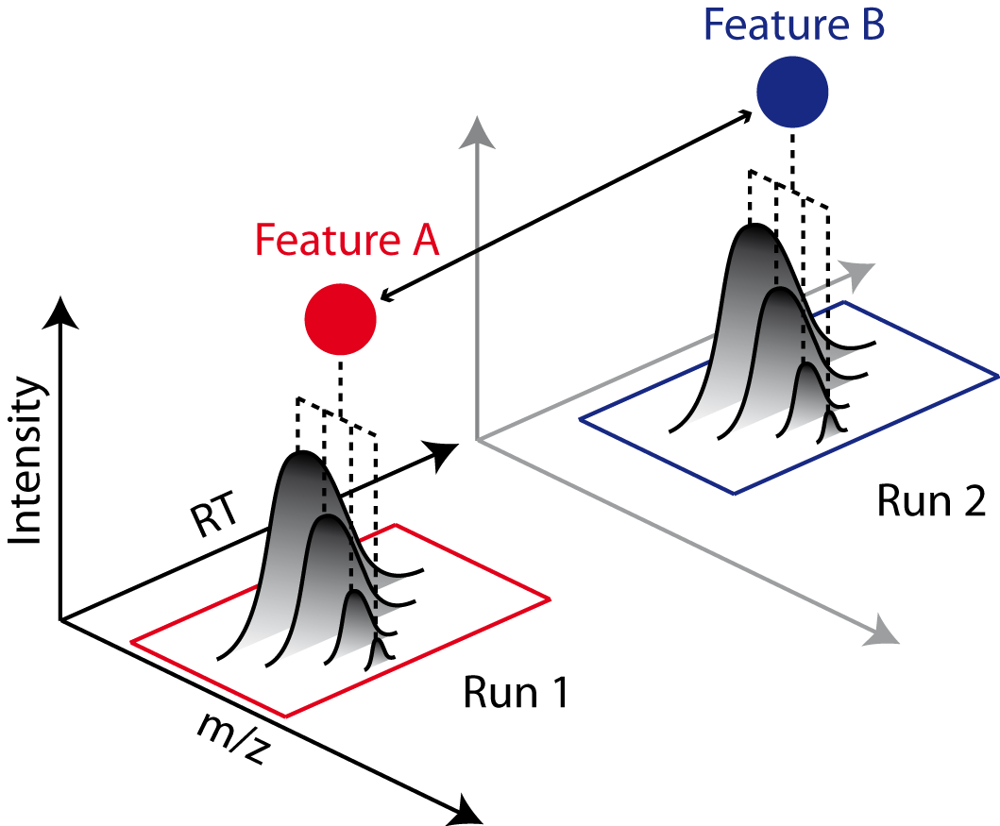

Feature Linking
===============

The pyOpenMS feature grouping algorithms group corresponding features (e.g., of same analyte) from multiple :py:class:`~.FeatureMap` objects into a :py:class:`~.ConsensusMap`.
Linking is primarily done based on spatial proximity (e.g., similar retention time and m/z).
It is, thus, advisable to perform a map alignment before features linking.

Optionally, identification data can be considered to prevent linking of features with different identifications.

Different feature grouping algorithms with slightly different implementations are runtime characteristics 
are available in pyOpenMS:

- :py:class:`~.FeatureGroupingAlgorithmQT`
- :py:class:`~.FeatureGroupingAlgorithmKD`
- :py:class:`~.FeatureGroupingAlgorithmLabeled`
- :py:class:`~.FeatureGroupingAlgorithmUnlabeled`

We now perform feature linking using the :py:class:`~.FeatureGroupingAlgorithmQT` algorithm.

Download Example Data
*********************

.. code-block:: python
    :linenos:
    
    import pyopenms as oms
    from urllib.request import urlretrieve

    base_url = (
        "https://raw.githubusercontent.com/OpenMS/pyopenms-docs/master/src/data/"
    )

    feature_files = [
        "BSA1_F1.featureXML",
        "BSA2_F1.featureXML",
        "BSA3_F1.featureXML",
    ]

    feature_maps = []

    # download the feature files and store feature maps in list (feature_maps)
    for feature_file in feature_files:
        urlretrieve(base_url + feature_file, feature_file)
        feature_map = oms.FeatureMap()
        oms.FeatureXMLFile().load(feature_file, feature_map)
        feature_maps.append(feature_map)

Feature Linking Algorithm
******************************************

Feature linking is the process which connects (links) features with similar RT and m/z across different runs. 
This enables comparisons of peptide signals across runs and is a prerequisite for downstream statistical analysis.
Thus, all features across all :py:class:`~.FeatureMap` objects will be combined into a :py:class:`~.ConsensusMap`.
Here we use :py:class:`~.FeatureGroupingAlgorithmQT` to find corresponding features with similar RT and m/z across feature maps.
If everything goes well, we will have a lot of triplets in our test run (we have have three input maps; one feature from each feature map) within each consensus feature.
Realistically, some features will remain unmatched, forming singletons or doublets—consensus features of size 1 or 2. These undersized consensus features can arise due to several factors. In some cases, the signal may be genuinely absent in the dataset, preventing feature detection. Alternatively, the feature-finding algorithm might fail to identify the feature in all available maps, leading to incomplete linkage. Additionally, suboptimal parameters for feature linking—such as excessive retention time (RT) variations across samples—can contribute to mismatches, further reducing the likelihood of forming larger consensus features. The latter can be corrected for using a process called map alignment, which we adressed in a `previous chapter <map_alignment.html>`_.

.. code-block:: python
    :linenos:

    consensus_map = oms.ConsensusMap()

    # populate the actual cmap using FeatureGroupingAlgorithmQT
    feature_grouper = oms.FeatureGroupingAlgorithmQT()
    # this is where the work happens:
    feature_grouper.group(feature_maps, consensus_map)

That's it!
Now, we can print some summary information:

    
.. code-block:: python
    :linenos:
    
    # print some info on the consensus map
    print(f"Total number of consensus features: {consensus_map.size()}\n\n")

    from collections import defaultdict

    def compute_feature_size_stats(consensus_map):
        size_counts = defaultdict(int)  # Default value for missing keys is 0

        for cfeature in consensus_map:
            size = len(cfeature.getFeatureList())
            size_counts[size] += 1  # No need to check if the key exists

        return size_counts

    stats = compute_feature_size_stats(consensus_map)
    ## how many consensus features are there which contain features from 1, 2, or all 3 feature maps?
    print("ConsensusFeature Size Distribution:", dict(stats), "\n\n")

    for (i, cfeature) in enumerate(consensus_map):
        if i > 3:
            break
        print(
            f"ConsensusFeature: average int: {cfeature.getIntensity()}, RT: {cfeature.getRT()}, m/z: {cfeature.getMZ()}"
        )
        # The two features in map 1 and map 2 represent the same analyte at
        # slightly different RT and m/z
        for fh in cfeature.getFeatureList():
            print(f" -- Feature: map#: {fh.getMapIndex()}, int: {fh.getIntensity()}, RT: {fh.getRT()}")
            

This then prints:
            
.. code-block:: output

    Map 0: Filename = BSA1_F1.featureXML, Size = 256, UniqueID = 15391035140702131759
    Map 1: Filename = BSA2_F1.featureXML, Size = 235, UniqueID = 4409371154349730995
    Map 2: Filename = BSA3_F1.featureXML, Size = 204, UniqueID = 16851873442542870272
    Total number of consensus features: 474

    ConsensusFeature Size Distribution: {3: 55, 2: 111, 1: 308} 

    ConsensusFeature: average int: 674365.6875, RT: 1925.75138611056, m/z: 387.7128198087733
     -- Feature: map#: 0, int: 1432460.0, RT: 1961.42395727216
     -- Feature: map#: 1, int: 285228.0, RT: 1914.26950841529
     -- Feature: map#: 2, int: 305409.0, RT: 1901.56069264423
    ConsensusFeature: average int: 1154167.0, RT: 1787.5601793634498, m/z: 662.2911690419279
     -- Feature: map#: 0, int: 834075.0, RT: 1836.92005770327
     -- Feature: map#: 1, int: 2119760.0, RT: 1748.02632036743
     -- Feature: map#: 2, int: 508666.0, RT: 1777.73416001965
    ConsensusFeature: average int: 562620.0, RT: 1650.6520418306134, m/z: 779.7355985805051
     -- Feature: map#: 0, int: 661665.0, RT: 1662.1136104186
     -- Feature: map#: 1, int: 751397.0, RT: 1616.78250841374
     -- Feature: map#: 2, int: 274798.0, RT: 1673.0600066595
    ConsensusFeature: average int: 23445466.0, RT: 1877.1572820450535, m/z: 738.310987605286
     -- Feature: map#: 0, int: 34988800.0, RT: 1901.57762589719
     -- Feature: map#: 1, int: 25276700.0, RT: 1849.00759248543
     -- Feature: map#: 2, int: 10070900.0, RT: 1880.88662775254
            
The results here are not ideal, since we only found 55 features which are present in all three feature maps. The remaining consensus features have a missing value for at least one feature map.
We could tweak the parameters used for grouping, but you should make sure that the, for example, acceptable RT deltas are sensible. There is a tradeoff between sensitivity and specificity here.

Finally, we add some meta-data to the consensus map, which allows us to track the input data later on if we were to store the consensus map to disk.

.. code-block:: python
    :linenos:

    file_descriptions = consensus_map.getColumnHeaders()

    # collect information about input maps ...
    for i, feature_map in enumerate(feature_maps):
        file_description = file_descriptions.get(i, oms.ColumnHeader())
        file_description.filename = feature_files[i]  ## filename
        file_description.size = feature_map.size()
        file_description.unique_id = feature_map.getUniqueId()
        file_descriptions[i] = file_description
    # ... and store them in the column headers of the cmap
    consensus_map.setColumnHeaders(file_descriptions)

    # print the information on underlying feature maps which we just collected
    file_descriptions = consensus_map.getColumnHeaders()
    for index, header in file_descriptions.items():
        print(f"Map {index}: Filename = {header.filename}, Size = {header.size}, UniqueID = {header.unique_id}")
