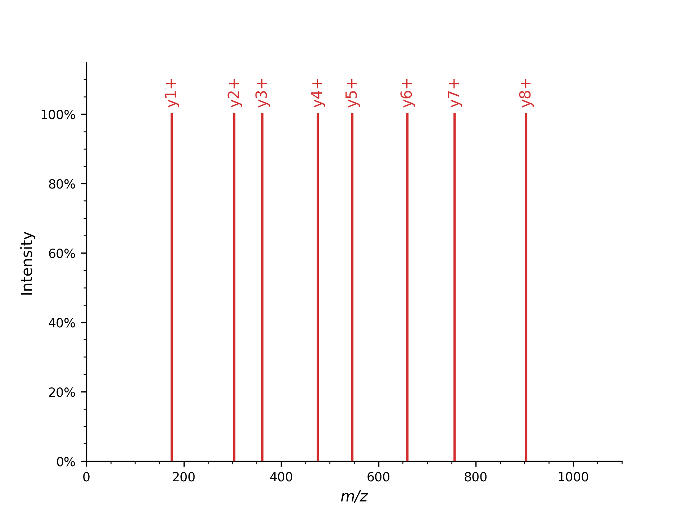
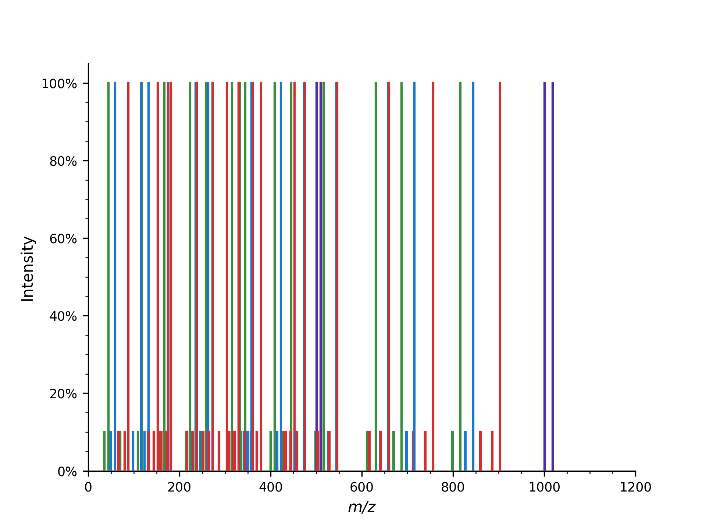
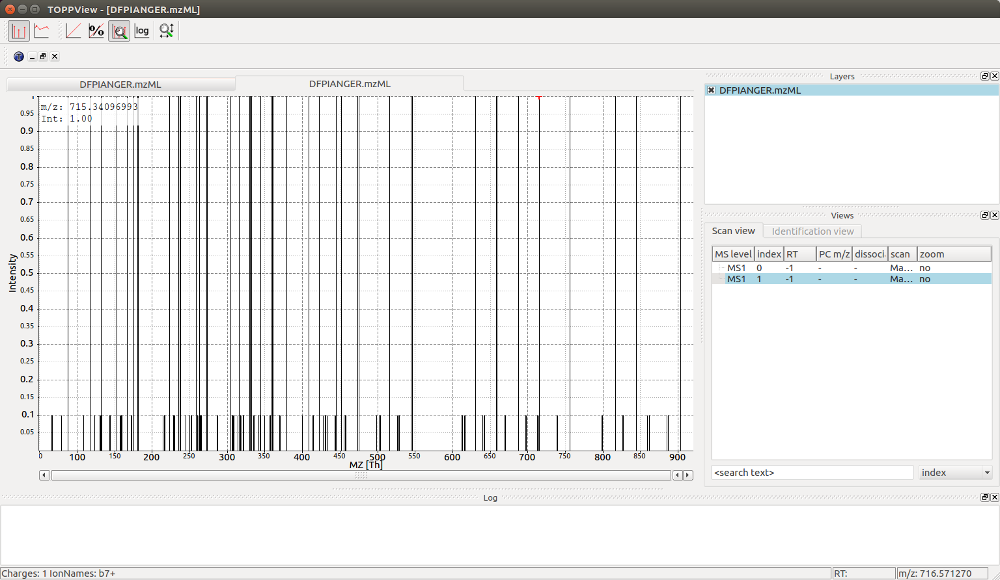

Fragment Spectrum Generation
============================

Generating theoretical fragment spectra is central to many identification tasks in computational mass spectrometry.
:py:class:`~.TheoreticalSpectrumGenerator` can be configured to generate :term:`MS2` spectra from
a given peptide charge combination. There are various parameters which influence
the generated ions e.g. simulating different fragmentation techniques.

Y-ion :term:`Mass Spectrum<mass spectrum>`
******************************************

First, we will generate a simple mass spectrum that only contains y-ions

.. code-block:: python
    :linenos:

    import pyopenms as oms

    tsg = oms.TheoreticalSpectrumGenerator()
    spec1 = oms.MSSpectrum()
    peptide = oms.AASequence.fromString("DFPIANGER")
    # standard behavior is adding b- and y-ions of charge 1
    p = oms.Param()
    p.setValue("add_b_ions", "false")
    p.setValue("add_metainfo", "true")
    tsg.setParameters(p)
    tsg.getSpectrum(spec1, peptide, 1, 1)  # charge range 1:1

    # Iterate over annotated ions and their masses
    print("Spectrum 1 of", peptide, "has", spec1.size(), "peaks.")
    for ion, peak in zip(spec1.getStringDataArrays()[0], spec1):
        print(ion.decode(), "is generated at m/z", peak.getMZ())

which produces all y single charged ions:

.. code-block:: output

    Spectrum 1 of DFPIANGER has 8 peaks.
    y1+ is generated at m/z 175.118952913371
    y2+ is generated at m/z 304.161547136671
    y3+ is generated at m/z 361.18301123237103
    y4+ is generated at m/z 475.225939423771
    y5+ is generated at m/z 546.2630535832709
    y6+ is generated at m/z 659.3471179341709
    y7+ is generated at m/z 756.3998821574709
    y8+ is generated at m/z 903.4682964445709

which you could plot with :py:meth:`pyopenms.plotting.plot_spectrum`, automatically showing annotated ions.:

.. code-block:: python
    :linenos:

    import matplotlib.pyplot as plt
    from pyopenms.plotting import plot_spectrum

    plot_spectrum(spec1)
    plt.show()

Full Fragment Ion :term:`Mass Spectrum<mass spectrum>`
******************************************************

We can also produce additional peaks in the fragment ion mass spectrum, such as
isotopic peaks, precursor peaks, ions from higher charge states, additional ion series, or common neutral
losses:

.. code-block:: python
    :linenos:

    spec2 = oms.MSSpectrum()
    # standard behavior is adding b- and y-ions
    p2 = oms.Param()
    p2.setValue("add_a_ions", "true")
    # adding n-term ion (in this case, a1 and b1)
    p2.setValue("add_first_prefix_ion", "true")
    p2.setValue("add_precursor_peaks", "true")
    # standard is to add precursor peaks with only the largest charge
    p2.setValue("add_all_precursor_charges", "true")
    p2.setValue("add_losses", "true")
    p2.setValue("add_metainfo", "true")
    tsg.setParameters(p2)
    tsg.getSpectrum(spec2, peptide, 1, 2)

    # Iterate over annotated ions and their masses
    print("Spectrum 2 of", peptide, "has", spec2.size(), "peaks.")
    for ion, peak in zip(spec2.getStringDataArrays()[0], spec2):
        print(ion.decode(), "is generated at m/z", peak.getMZ())

    exp = oms.MSExperiment()
    exp.addSpectrum(spec1)
    exp.addSpectrum(spec2)
    oms.MzMLFile().store("DFPIANGER.mzML", exp)

which outputs all 160 peaks that are generated (this is without isotopic
peaks), here we will just show the first few peaks:

.. code-block:: output

        Spectrum 2 of DFPIANGER has 160 peaks.
        a1-H2O1++ is generated at m/z 35.518008514620995
        a1++ is generated at m/z 44.523291046520995
        b1-H2O1++ is generated at m/z 49.515466014621
        b1++ is generated at m/z 58.520748546521
        y1-C1H2N1O1++ is generated at m/z 66.05629515817103
        y1-C1H2N2++ is generated at m/z 67.05221565817102
        a1-H2O1+ is generated at m/z 70.02874056247099
        y1-H3N1++ is generated at m/z 79.54984014222102
        a1+ is generated at m/z 88.03930562627099
        y1++ is generated at m/z 88.06311469007102
        b1-H2O1+ is generated at m/z 98.02365556247099
        a2-H2O1++ is generated at m/z 109.05221565817101
        b1+ is generated at m/z 116.034220626271
        a2++ is generated at m/z 118.05749819007102
        b2-H2O1++ is generated at m/z 123.049673158171
        [...]

which you can again visualize with:

.. code-block:: python
    :linenos:

    import matplotlib.pyplot as plt
    from pyopenms.plotting import plot_spectrum

    plot_spectrum(spec2, annotate_ions=False)
    plt.show()

The first example shows how to put peaks of a certain type, y-ions in this case, into
a mass spectrum. The second mass spectrum is filled with a complete fragment ion mass spectrum
of all peaks (a-, b-, y-ions, precursor peaks, and losses).

Here, from the peptide with 9 amino acids, fragments theoretically can occur in 8
different positions, resulting in 8 peaks per ion type (a, b, and y-ion in this
example code). For instance, b-ions (prefix) and y-ions (suffix) are complementary,
so b3(DFP) and y6(IANGER) fragments make up the peptide "DFPIANGER."

Adding precursor ions with the parameter ``add_precursor_peaks`` add 3 peaks with
the largest charge states (precursor ion (M+H) and its loss of water ([M+H]-H2O) or
ammonia ([M+H]-NH3)). To include all precursor ions with possible charge states, the
``add_all_precursor_charges`` parameter should be set to true.

The losses are based on commonly observed fragment ion losses for specific
amino acids and are defined in the ``Residues.xml`` file, which means that not all
fragment ions will produce all possible losses, as can be observed above: water loss
is not observed for the y1 ion but for the y2 ion since glutamic acid can have a neutral
water loss but arginine cannot. Similarly, only water loss and no ammonia loss is simulated
in the ``a/b/c`` ion series with the first fragment capable of ammonia loss being
asparagine at position 6.

The :py:class:`~.TheoreticalSpectrumGenerator`
has many parameters which have a detailed description located in the class
documentation. Note how the ``add_metainfo`` parameter 
populates the :py:class:`~.StringDataArray` of the output spectrum, allowing us to
iterate over annotated ions and their masses.

Visualization
*************

We can now visualize the resulting spectra using :term:`TOPPView` when we open the
DFPIANGER.mzML file that we produced above in :term:`TOPPView`:

.. image:: img/peptide_y_ions.png

We can see all eight y ion peaks that are produced in the
:py:class:`~.TheoreticalSpectrumGenerator` and when we hover over one of the peaks (:math:`546\ mz` in
this example) there is an annotation in the bottom left corner that indicates
charge state and ion name (:chem:`y5+` for every peak). The larger spectrum with
:math:`146` peaks can also be interactively investigated with :term:`TOPPView` (the second
spectrum in the file):

There are substantially more peaks here and the mass spectrum is much busier, with
singly and double charged peaks of the b, y and a series creating :math:`44` different
individual fragment ion peaks as well as neutral losses adding an additional
:math:`102` peaks (neutral losses easily recognizable by their :math:`10-fold` lower intensity
in the simulated spectrum).
