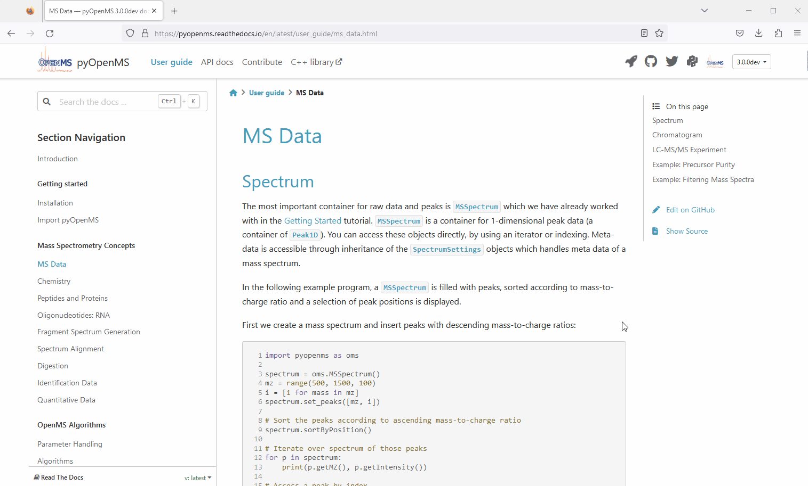

Installation
============

Try online
----------

You can try out pyOpenMS in your browser. Just navigate to a topic you are interested in
by clicking in the menu bar. Then click on the "Launch on Binder" logo.

Note that the first start of binder might take a bit. While binder is perfect
for trying pyOpenMS it only offers a limited amount of memory. You should install
the pyOpenMS binaries on your PC for serious data processing.

We recommend to use pyOpenMS in PyCharm as it works well with source code documentation.

Command Line
------------

To :index:`install` pyOpenMS from the command line using the binary wheels, you
can type

.. code-block:: bash

  pip install numpy
  pip install pyopenms

We have binary packages for OSX, Linux and Windows (64 bit only) available from
`PyPI <https://pypi.org/project/pyopenms>`_. Make sure to download
the 64bit Python release for Windows. Currently we only support
Python 3.9, 3.10, 3.11, 3.12 and 3.13.

You can install Python first from `here <https://www.python.org/downloads/>`_,
again make sure to download the 64bit release. You can then open a shell and
type the two commands above (on Windows you may potentially have to use
``C:\Python37\Scripts\pip.exe`` in case ``pip`` is not in your system path).

Nightly/ CI wheels
------------------

If you want the newest features you can also install nightly builds of pyOpenMS with the following shell command:

.. code-block:: bash

  pip install --index-url https://pypi.cs.uni-tuebingen.de/simple/ pyopenms

Source (advanced users)
-----------------------

To install pyOpenMS from :index:`source`, you will first have to compile OpenMS
successfully on your platform of choice and then follow the `building from
source <../community/build_from_source.html>`_ instructions. Note that this may be
non-trivial and *is not recommended* for most users.

Wrap Classes (advanced users)
-----------------------------

In order to wrap new classes in pyOpenMS, read the following `guide
<../community/wrapping_workflows_new_classes.html>`_.
