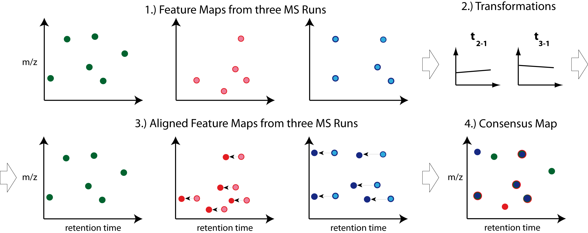
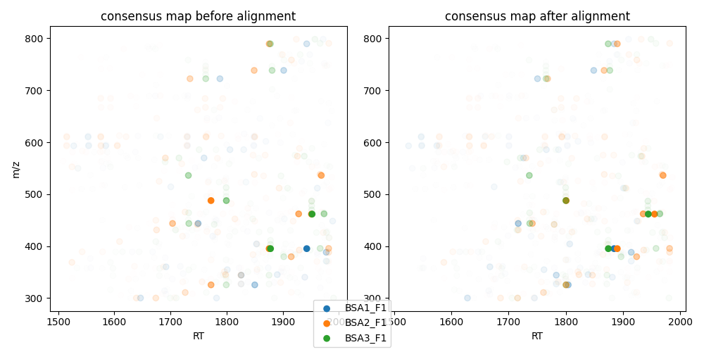
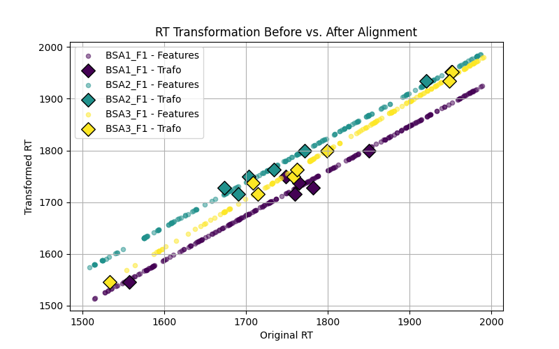

Map Alignment
===============

The pyOpenMS map alignment algorithms transform different maps (:term:`peak maps`, :term:`feature maps`) to a common retention time axis.
This is useful, since chromatographic columns are usually less stable, i.e. the RT of identical compounds will vary when repeating the 
experiment or running another sample.
We want to correct for this, usually by finding common landmarks across runs and adjusting the RT of all features to minimize the distance
of landmarks across feature maps.

Note: Creating a :term:`consensus map` from the aligned maps is performed by a `feature linking algorithm (see next chapter) <feature_linking.html>`_.

Different map alignment algorithms are available in pyOpenMS:

- :py:class:`~.MapAlignmentAlgorithmPoseClustering`
- :py:class:`~.MapAlignmentAlgorithmIdentification`
- :py:class:`~.MapAlignmentAlgorithmKD`

If you want to apply a custom RT mapping, you can use:

- :py:class:`~.MapAlignmentTransformer`

To perform a simple linear alignment (an affine transformation to be exact, i.e. an offset and a slope) we can employ the algorithm :py:class:`~.MapAlignmentAlgorithmPoseClustering`.
This algorithm in OpenMS can also align peak maps, but we usually recommend aligning on the feature level, since
it's much faster (less features than peaks) and also more stable.

Other map alignment algorithms in pyOpenMS require the input data to have :term:`PSMs` annotated. See `Annotating PSMs to features <PSM_to_features.html>`_ on how to do that.
Also, some require (or support) a reference map (the one which all the other feature maps align to). More on this below.
All algorithms except :py:class:`~.MapAlignmentAlgorithmPoseClustering` can correct the RT using a variety of models/functions fitted to the landmarks used across feature maps.

Here is a summary table:

.. list-table:: Comparison of pyOpenMS' map alignment algorithms
    :header-rows: 1

    * - algorithm  
      - input type 
      - transformation in RT 
      - uses & requires PSMs
      - reference map
    * - :py:class:`~.MapAlignmentAlgorithmPoseClustering`
      - feature maps or peak maps
      - linear (affine transformation)
      - no
      - required
    * - :py:class:`~.MapAlignmentAlgorithmIdentification`
      - peak map, feature maps, IDs
      - any [#footnote1]_
      - yes
      - optional
    * - :py:class:`~.MapAlignmentAlgorithmKD`
      - feature maps
      - any [#footnote1]_
      - yes
      - not supported/needed
    
.. [#footnote1] Valid models are "linear","b_spline","lowess" or "interpolated"
  
You should pick the algorithm which does not overfit your data and maximizes the number of complete consensus features during a later `feature linking <feature_linking.html>`_ stage.

Download Example Data
*********************

.. code-block:: python
    :linenos:
    
    import pyopenms as oms
    from urllib.request import urlretrieve

    base_url = (
        "https://raw.githubusercontent.com/OpenMS/pyopenms-docs/master/src/data/"
    )

    # we use featureXML files which already contain PSMs (as obtained by oms.IDMapper())
    # ... so we can use all aligners pyOpenMS has to offer
    feature_files = [
        "BSA1_F1_idmapped.featureXML",
        "BSA2_F1_idmapped.featureXML",
        "BSA3_F1_idmapped.featureXML",
    ]

    feature_maps = []

    # download the feature files and store feature maps in list (feature_maps)
    for feature_file in feature_files:
        urlretrieve(base_url + feature_file, feature_file)
        feature_map = oms.FeatureMap()
        oms.FeatureXMLFile().load(feature_file, feature_map)
        feature_maps.append(feature_map)

Selecting a Reference Map
*************************

Some alignment algorithms in pyOpenMS require to set a reference, e.g. :py:class:`~.MapAlignmentAlgorithmPoseClustering`.
For others, it is optional, e.g., :py:class:`~.MapAlignmentAlgorithmIdentification`.
Finally, :py:class:`~.MapAlignmentAlgorithmKD` is reference-free by definition.

For :py:class:`~.MapAlignmentAlgorithmPoseClustering` we could pick the :term:`feature map` with the largest number of features as a reference,
to provide the maximum number of reference points.
The retention times of the other :term:`feature maps` are aligned to this.

.. code-block:: python
    :linenos:
    
    # set ref_index to feature map index with largest number of features
    ref_index = [
        i[0]
        for i in sorted(
            enumerate([fm.size() for fm in feature_maps]), key=lambda x: x[1]
        )
    ][-1]

    aligner = oms.MapAlignmentAlgorithmPoseClustering()
    aligner.setReference(feature_maps[ref_index])
    
    ## push all maps except the reference into the align method; don't align the reference to itself for max. efficiency
    feature_maps_to_align = feature_maps[:ref_index] + feature_maps[ref_index+1:]
    
    
Map Alignment Algorithm
***********************

Now, let's run an algorithm. Since the interfaces of the aligners differ slightly, we will go though them one by one, starting with :py:class:`~.MapAlignmentAlgorithmPoseClustering`.

.. code-block:: python
    :linenos:

    aligner = oms.MapAlignmentAlgorithmPoseClustering()
    aligner.setReference(feature_maps[ref_index])
    
    
    ## change default params, if you want ...
    p = aligner.getParameters()
    # p.setValue(...)
    aligner.setParameters(p)
    
    # perform alignment and transformation of feature maps to the reference map (exclude reference map)
    for feature_map in feature_maps_to_align:
        trafo = oms.TransformationDescription()
        aligner.align(feature_map, trafo)
        transformer = oms.MapAlignmentTransformer()
        transformer.transformRetentionTimes(
            feature_map, trafo, True
        )  # store original RT as meta value in `feature_map`

The interface of :py:class:`~.MapAlignmentAlgorithmIdentification` is a bit different, so have to adapt our code a bit.
In contrast to :py:class:`~.MapAlignmentAlgorithmPoseClustering`, which always fits a linear model, we can choose which model to fit to the landmarks found by the algorithm. Our choices are "linear","b_spline","lowess" and "interpolated".

.. code-block:: python
    :linenos:
        
    aligner = oms.MapAlignmentAlgorithmIdentification()
    ## we could set a reference map; but we don't. Instead, we rely on the algorithm to use an internal average of all maps
    ref_index = -1   # -1 means 'take the median' for this algorithm

    ## let's change some default parameters of MapAlignmentAlgorithmIdentification, just to see how it's done:
    p = aligner.getParameters()
    p.setValue("max_rt_shift", 0.2)  # 20% of total RT span
    p.setValue("use_feature_rt", "true")
    aligner.setParameters(p)
        
    ## this list will be filled with transformations; you could use them to transform the original mzML, for example
    trafos = list()
    aligner.align(feature_maps, trafos, ref_index)

    # the transformations now contain the landmarks, but we still need to compute (fit) a model to them,
    #   ... before applying it to the feature maps:
    # Possible models are: "linear","b_spline","lowess","interpolated"
    for fm, trafo in zip(feature_maps, trafos):
        trafo.fitModel("linear")
        transformer = oms.MapAlignmentTransformer()
        transformer.transformRetentionTimes(
            fm, trafo, True
        )  # stores original RT as meta value 'original_RT' for each feature in each `feature_map`

You can test different models, but since we only have very few data points in our toy example, the linear model works best.

Visualization
*************

Plotting :term:`feature maps` before and after alignment. We should observe that the data points cluster closer together:

.. code-block:: python
    :linenos:

    import matplotlib.pyplot as plt
    import numpy as np

    def plot_consensus_maps(fmaps):
        """
        Plots consensus maps before and after alignment.

        Parameters:
        - fmaps: List of FeatureMaps.
        """
        fig, axes = plt.subplots(1, 2, figsize=(10, 5))

        titles = ["consensus map before alignment", "consensus map after alignment"]
        x_labels = ["RT", "RT"]
        y_label = "m/z"

        for i, ax in enumerate(axes):
            ax.set_title(titles[i])
            ax.set_xlabel(x_labels[i])
            if i == 0: ax.set_ylabel(y_label)

            for fm in fmaps:
                x_data = [f.getMetaValue("original_RT") if i == 0 else f.getRT() for f in fm]
                y_data = [f.getMZ() for f in fm]
                alpha_values = np.asarray([f.getIntensity() for f in fm]) / max([f.getIntensity() for f in fm])
                ax.scatter(x_data, y_data, alpha=alpha_values)

        fig.tight_layout()
        fig.legend(
            [fmap.getDataProcessing()[0].getMetaValue("parameter: out")[:-11] for fmap in fmaps],
            loc="lower center",
        )
        plt.show()

    # Example usage:
    plot_consensus_maps(feature_maps)

We can also inspect the underlying transformation and the landmarks it is based upon:

.. code-block:: python
    :linenos:
        
    def plot_transformed_rt_with_trafo(fmaps, trafos):
        """
        Plots original RT vs. transformed RT for each feature map and ensures matching colors for transformation points.

        Parameters:
        - fmaps: List of FeatureMaps that have been aligned.
        - trafos: List of Transformations applied to the FeatureMaps.
        """
        fig, ax = plt.subplots(figsize=(8, 5))

        ax.set_title("RT Transformation Before vs. After Alignment")
        ax.set_xlabel("Original RT")
        ax.set_ylabel("Transformed RT")

        colors = plt.cm.viridis(np.linspace(0, 1, len(fmaps)))  # Generate distinct colors for each map

        for i, (fm, trafo) in enumerate(zip(fmaps, trafos)):
            label = fm.getDataProcessing()[0].getMetaValue("parameter: out")[:-11]

            # Extract original and transformed RTs from feature maps
            original_rt = [f.getMetaValue("original_RT") for f in fm]
            transformed_rt = [f.getRT() for f in fm]

            # Plot feature map RTs
            ax.scatter(original_rt, transformed_rt, alpha=0.5, s=20, color=colors[i], label=f"{label} - Features")

            # Extract transformation points
            trafo_points = trafo.getDataPoints()
            original_trafo_rt = [point.first for point in trafo_points]
            transformed_trafo_rt = [point.second for point in trafo_points]

            # Plot transformation points
            ax.scatter(original_trafo_rt, transformed_trafo_rt, marker="D", s=100, edgecolors="black", color=colors[i],
                       label=f"{label} - Trafo")

        ax.legend(loc="upper left")
        ax.grid(True)
        plt.show()

    # Example usage:
    plot_transformed_rt_with_trafo(feature_maps, trafos)

While we do not know the underlying features using just this information, we can see that features in corresponding maps are now nicely aligned  horizontally (the new RT). Also, it seems a linear model nicely fits all the data points in each feature map. Using a more flexible model like LOWESS will likely result in a worse alignment (try and see for yourself).
    
