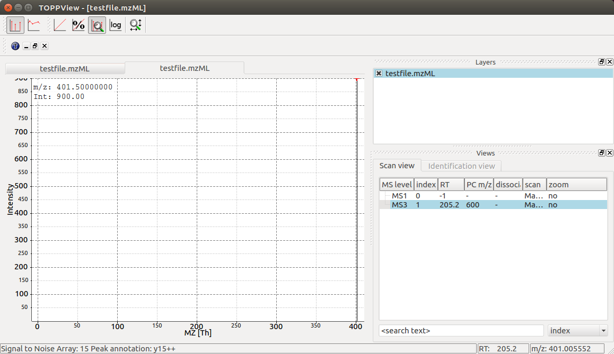
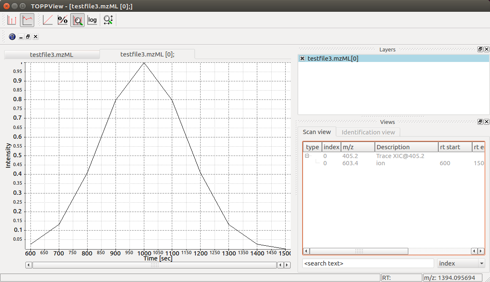

MS Data
=======

Spectrum
********

The most important container for raw data and peaks is :py:class:`~.MSSpectrum` which we
have already worked with in the `Getting Started <getting_started.html>`_
tutorial. :py:class:`~.MSSpectrum` is a container for 1-dimensional peak data (a
container of :py:class:`~.Peak1D`). You can access these objects directly, by using an iterator or indexing.
Meta-data is accessible through inheritance of the :py:class:`~.SpectrumSettings`
objects which handles meta data of a mass spectrum.

In the following example program, a :py:class:`~.MSSpectrum` is filled with peaks, sorted
according to mass-to-charge ratio and a selection of peak positions is
displayed.

First we create a mass spectrum and insert peaks with descending mass-to-charge ratios:

.. code-block:: python
    :linenos:

    import pyopenms as oms

    spectrum = oms.MSSpectrum()
    mz = range(500, 1500, 100)
    i = [1 for mass in mz]
    spectrum.set_peaks([mz, i])

    # Sort the peaks according to ascending mass-to-charge ratio
    spectrum.sortByPosition()

    # Iterate over spectrum of those peaks
    for p in spectrum:
        print(p.getMZ(), p.getIntensity())

    # Access a peak by index
    print("\nFirst peak: ", spectrum[0].getMZ(), spectrum[0].getIntensity())

.. code-block:: output

    500.0 1.0
    600.0 1.0
    700.0 1.0
    800.0 1.0
    900.0 1.0
    1000.0 1.0
    1100.0 1.0
    1200.0 1.0
    1300.0 1.0
    1400.0 1.0

    First peak: 500.0 1.0

Note how lines 11-12 (as well as line 19) use the direct access to the
:py:class:`~.Peak1D` objects (explicit iteration through the :py:class:`~.MSSpectrum` object, which
is convenient but slow since a new :py:class:`~.Peak1D` object needs to be created each
time).
The following example uses the faster access through numpy arrays with :py:meth:`~.MSSpectrum.get_peaks` or
:py:meth:`~.MSSpectrum.set_peaks`. Direct iteration is only shown for demonstration purposes and should not be used in
production code.

.. code-block:: python
    :linenos:

    # More efficient peak access with get_peaks()
    for mz, i in zip(*spectrum.get_peaks()):
        print(mz, i)

.. code-block:: output

    500.0 1.0
    600.0 1.0
    700.0 1.0
    800.0 1.0
    900.0 1.0
    1000.0 1.0
    1100.0 1.0
    1200.0 1.0
    1300.0 1.0
    1400.0 1.0

To discover the full set of functionality of :py:class:`~.MSSpectrum`, we use the Python
:py:func:`~.help` function. In particular, we find several important sets of meta
information attached to the mass spectrum including retention time, the MS level
(:term:`MS1`, :term:`MS2`, ...), precursor ion, ion mobility drift time and extra data arrays.

.. code-block:: python
    :linenos:

    help(oms.MSSpectrum)

We now set several of these properties in a current :py:class:`~.MSSpectrum`:

.. code-block:: python
    :linenos:

    # create spectrum and set properties
    spectrum = oms.MSSpectrum()
    spectrum.setDriftTime(25)  # 25 ms
    spectrum.setRT(205.2)  # 205.2 s
    spectrum.setMSLevel(3)  # MS3

    # Add peak(s) to spectrum
    spectrum.set_peaks(([401.5], [900]))

    # create precursor information
    p = oms.Precursor()
    p.setMZ(600)  # isolation at 600 +/- 1.5 Th
    p.setIsolationWindowLowerOffset(1.5)
    p.setIsolationWindowUpperOffset(1.5)
    p.setActivationEnergy(40)  # 40 eV
    p.setCharge(4)  # 4+ ion

    # and store precursor in spectrum
    spectrum.setPrecursors([p])

    # set additional instrument settings (e.g. scan polarity)
    IS = oms.InstrumentSettings()
    IS.setPolarity(oms.IonSource.Polarity.POSITIVE)
    spectrum.setInstrumentSettings(IS)

    # get and check scan polarity
    polarity = spectrum.getInstrumentSettings().getPolarity()
    if polarity == oms.IonSource.Polarity.POSITIVE:
        print("scan polarity: positive")
    elif polarity == oms.IonSource.Polarity.NEGATIVE:
        print("scan polarity: negative")

    # Optional: additional data arrays / peak annotations
    fda = oms.FloatDataArray()
    fda.setName("Signal to Noise Array")
    fda.push_back(15)
    sda = oms.StringDataArray()
    sda.setName("Peak annotation")
    sda.push_back("y15++")
    spectrum.setFloatDataArrays([fda])
    spectrum.setStringDataArrays([sda])

    # Add spectrum to MSExperiment
    exp = oms.MSExperiment()
    exp.addSpectrum(spectrum)

    # Add second spectrum to the MSExperiment
    spectrum2 = oms.MSSpectrum()
    spectrum2.set_peaks(([1, 2], [1, 2]))
    exp.addSpectrum(spectrum2)

    # store spectra in mzML file
    oms.MzMLFile().store("testfile.mzML", exp)

.. code-block:: output

    scan polarity: positive

We have created a single mass spectrum and set basic mass spectrum properties (drift
time, retention time, MS level, precursor charge, isolation window and
activation energy). Additional instrument settings allow to set e.g. the polarity of the Ion source).
We next add actual peaks into the spectrum (a single peak at Lmath:`401.5` m/z and :math:`900\ intensity`).
Additional metadata can be stored in data arrays for each peak
(e.g. use cases care peak annotations or  "Signal to Noise" values for each
peak. Finally, we add the spectrum to an :py:class:`~.MSExperiment` container to save it using the
:py:class:`~.MzMLFile` class in a file called ``testfile.mzML``.

You can now open the resulting mass spectrum in a mass spectrum viewer. We use the OpenMS
viewer :term:`TOPPView` (which you will get when you install OpenMS from the
official website) and look at our mass spectrum:

:term:`TOPPView` displays our mass spectrum with its single peak at :math:`401.5\ m/z` and it
also correctly displays its retention time at :math:`205.2\ seconds` and precursor
isolation target of :math:`600.0/ m/z`.  Notice how :term:`TOPPView` displays the information
about the S/N for the peak (S/N = 15) and its annotation as :chem:`y15++` in the status
bar below when the user clicks on the peak at :math:`401.5\ m/z` as shown in the
screenshot.

We can also visualize our mass spectrum from before using the :py:func:`~.plot_spectrum` function from the
`spectrum_utils <https://github.com/bittremieux/spectrum_utils>`_ visualization library:

.. code-block:: python
    :linenos:

    import matplotlib.pyplot as plt
    from pyopenms.plotting import plot_spectrum
    import matplotlib.pyplot as plt

    plot_spectrum(spectrum)
    plt.show()

Chromatogram
**********************************

An additional container for raw data is the :py:class:`~.MSChromatogram` container, which
is highly analogous to the :py:class:`~.MSSpectrum` container, but contains an array of
:py:class:`~.ChromatogramPeak` and is derived from :py:class:`~.ChromatogramSettings`:

.. code-block:: python
    :linenos:

    import numpy as np

    def gaussian(x, mu, sig):
        return np.exp(-np.power(x - mu, 2.0) / (2 * np.power(sig, 2.0)))

    # Create new chromatogram
    chromatogram = oms.MSChromatogram()

    # Set raw data (RT and intensity)
    rt = range(1500, 500, -100)
    i = [gaussian(rtime, 1000, 150) for rtime in rt]
    chromatogram.set_peaks([rt, i])

    # Sort the peaks according to ascending retention time
    chromatogram.sortByPosition()

    print("Iterate over peaks with getRT() and getIntensity()")
    for p in chromatogram:
        print(p.getRT(), p.getIntensity())

    print("\nIterate more efficiently over peaks with get_peaks()")
    for rt, i in zip(*chromatogram.get_peaks()):
        print(rt, i)

    print("\nAccess an individual peak by index")
    print(chromatogram[2].getRT(), chromatogram[2].getIntensity())

    # Add meta information to the chromatogram
    chromatogram.setNativeID("Trace XIC@405.2")

    # Store a precursor ion for the chromatogram
    p = oms.Precursor()
    p.setIsolationWindowLowerOffset(1.5)
    p.setIsolationWindowUpperOffset(1.5)
    p.setMZ(405.2)  # isolation at 405.2 +/- 1.5 Th
    p.setActivationEnergy(40)  # 40 eV
    p.setCharge(2)  # 2+ ion
    p.setMetaValue("description", chromatogram.getNativeID())
    p.setMetaValue("peptide_sequence", chromatogram.getNativeID())
    chromatogram.setPrecursor(p)

    # Also store a product ion for the chromatogram (e.g. for SRM)
    p = oms.Product()
    p.setMZ(603.4)  # transition from 405.2 -> 603.4
    chromatogram.setProduct(p)

    # Store as mzML
    exp = oms.MSExperiment()
    exp.addChromatogram(chromatogram)
    oms.MzMLFile().store("testfile3.mzML", exp)

    # Visualize the resulting data using matplotlib
    import matplotlib.pyplot as plt

    for chrom in exp.getChromatograms():
        retention_times, intensities = chrom.get_peaks()
        plt.plot(retention_times, intensities, label=chrom.getNativeID())

    plt.xlabel("time (s)")
    plt.ylabel("intensity (cps)")
    plt.legend()
    plt.show()

.. code-block:: output

    Iterate over peaks with getRT() and getIntensity()
    600.0 0.028565499931573868
    700.0 0.1353352814912796
    800.0 0.4111122786998749
    900.0 0.8007373809814453
    1000.0 1.0
    1100.0 0.8007373809814453
    1200.0 0.4111122786998749
    1300.0 0.1353352814912796
    1400.0 0.028565499931573868
    1500.0 0.003865920240059495

    Iterate more efficiently over peaks with get_peaks()
    600.0 0.0285655
    700.0 0.13533528
    800.0 0.41111228
    900.0 0.8007374
    1000.0 1.0
    1100.0 0.8007374
    1200.0 0.41111228
    1300.0 0.13533528
    1400.0 0.0285655
    1500.0 0.0038659202

    Access an individual peak by index
    800.0 0.4111122786998749

This shows how the :py:class:`~.MSExperiment` class can hold mass spectra as well as chromatograms .

Again we can visualize the resulting data using :term:`TOPPView` using its chromatographic viewer
capability, which shows the peak over retention time:

Note how the annotation using precursor and production mass of our XIC
chromatogram is displayed in the viewer.

We can also visualize the resulting data using ``matplotlib``. Here we can plot every
chromatogram in our :py:class:`~.MSExperiment` and label it with it's native ID.

:term:`LC-MS/MS` Experiment
***************************

In OpenMS, :term:`LC-MS/MS` injections are represented as so-called peak maps (using
the :py:class:`~.MSExperiment` class), which we have already encountered above. The
:py:class:`~.MSExperiment` class can hold a list of :py:class:`~.MSSpectrum` object (as well as a
list of :py:class:`~.MSChromatogram` objects, see below). The :py:class:`~.MSExperiment` object
holds such peak maps as well as meta-data about the injection. Access to
individual mass spectra is performed through :py:meth:`~.MSExperiment.getSpectrum` and
:py:meth:`~.MSExperiment.getChromatogram`.

In the following code, we create an :py:class:`~.MSExperiment` and populate it with
several mass spectra:

.. code-block:: python
    :linenos:

    # The following examples creates an MSExperiment which holds six
    # MSSpectrum instances.
    exp = oms.MSExperiment()
    for i in range(6):
        spectrum = oms.MSSpectrum()
        spectrum.setRT(i)
        spectrum.setMSLevel(1)
        for mz in range(500, 900, 100):
            peak = oms.Peak1D()
            peak.setMZ(mz + i)
            peak.setIntensity(100 - 25 * abs(i - 2.5))
            spectrum.push_back(peak)
        exp.addSpectrum(spectrum)

    # Iterate over spectra
    for i_spectrum, spectrum in enumerate(exp, start=1):
        print("Spectrum {i:d}:".format(i=i_spectrum))
        for peak in spectrum:
            print(spectrum.getRT(), peak.getMZ(), peak.getIntensity())

.. code-block:: output

    Spectrum 1:
    0.0 500.0 37.5
    0.0 600.0 37.5
    0.0 700.0 37.5
    0.0 800.0 37.5
    Spectrum 2:
    1.0 501.0 62.5
    1.0 601.0 62.5
    1.0 701.0 62.5
    1.0 801.0 62.5
    Spectrum 3:
    2.0 502.0 87.5
    2.0 602.0 87.5
    2.0 702.0 87.5
    2.0 802.0 87.5
    Spectrum 4:
    3.0 503.0 87.5
    3.0 603.0 87.5
    3.0 703.0 87.5
    3.0 803.0 87.5
    Spectrum 5:
    4.0 504.0 62.5
    4.0 604.0 62.5
    4.0 704.0 62.5
    4.0 804.0 62.5
    Spectrum 6:
    5.0 505.0 37.5
    5.0 605.0 37.5
    5.0 705.0 37.5
    5.0 805.0 37.5

In the above code, we create six instances of :py:class:`~.MSSpectrum` (line 4), populate
it with three peaks at :math:`500`, :math:`900` and :math:`100` m/z and append them to the
:py:class:`~.MSExperiment` object (line 13).  We can easily iterate over the mass spectra in
the whole experiment by using the intuitive iteration on lines 16-19 or we can
use list comprehensions to sum up intensities of all mass spectra that fulfill
certain conditions:

.. code-block:: python
    :linenos:

    # Sum intensity of all spectra between RT 2.0 and 3.0
    print(
        sum(
            [
                p.getIntensity()
                for s in exp
                if s.getRT() >= 2.0 and s.getRT() <= 3.0
                for p in s
            ]
        )
    )

.. code-block:: output

    700.0
		

We could store the resulting experiment containing the six mass spectra as mzML
using the :py:class:`~.MzMLFile` object:

.. code-block:: python
    :linenos:

    # Store as mzML
    oms.MzMLFile().store("testfile2.mzML", exp)

Again we can visualize the resulting data using :term:`TOPPView` using its 3D
viewer capability, which shows the six scans over retention time where the
traces first increase and then decrease in intensity:

Alternatively we can visualize our data directly with Python. For smaller data sets
we can use ``matplotlib`` to generate a 2D scatter plot with the peak intensities
represented by a colorbar. With this plot we can zoom in and inspect our data in more detail.

The following example figures were generated using a
`mzML file <https://github.com/OpenMS/OpenMS/blob/develop/src/tests/topp/FeatureFinderMetaboIdent_1_input.mzML>`_
provided by OpenMS.

.. code-block:: python
    :linenos:

    import numpy as np
    import matplotlib.pyplot as plt
    import matplotlib.colors as colors

    def plot_spectra_2D(exp, ms_level=1, marker_size=5):
        exp.updateRanges()
        for spec in exp:
            if spec.getMSLevel() == ms_level:
                mz, intensity = spec.get_peaks()
                p = intensity.argsort()  # sort by intensity to plot highest on top
                rt = np.full([mz.shape[0]], spec.getRT(), float)
                plt.scatter(
                    rt,
                    mz[p],
                    c=intensity[p],
                    cmap="afmhot_r",
                    s=marker_size,
                    norm=colors.LogNorm(
                        exp.getMinIntensity() + 1, exp.getMaxIntensity()
                    ),
                )
        plt.clim(exp.getMinIntensity() + 1, exp.getMaxIntensity())
        plt.xlabel("time (s)")
        plt.ylabel("m/z")
        plt.colorbar()
        plt.show()  # slow for larger data sets

    from urllib.request import urlretrieve

    gh = "https://raw.githubusercontent.com/OpenMS/pyopenms-docs/master"
    urlretrieve(gh + "/src/data/FeatureFinderMetaboIdent_1_input.mzML", "test.mzML")

    exp = oms.MSExperiment()
    oms.MzMLFile().load("test.mzML", exp)

    plot_spectra_2D(exp)

For larger data sets this will be too slow since every individual peak gets displayed.
However, we can use :py:class:`~.BilinearInterpolation` which produces an overview image of our mass spectra.
This can be useful for a brief visual inspection of your sample in quality control.

.. code-block:: python
    :linenos:

    import numpy as np
    import matplotlib.pyplot as plt

    def plot_spectra_2D_overview(experiment):
        rows = 200.0
        cols = 200.0
        exp.updateRanges()

        bilip = oms.BilinearInterpolation()
        tmp = bilip.getData()
        tmp.resize(int(rows), int(cols), float())
        bilip.setData(tmp)
        bilip.setMapping_0(0.0, exp.getMinRT(), rows - 1, exp.getMaxRT())
        bilip.setMapping_1(0.0, exp.getMinMZ(), cols - 1, exp.getMaxMZ())
        for spec in exp:
            if spec.getMSLevel() == 1:
                mzs, ints = spec.get_peaks()
                rt = spec.getRT()
                for i in range(0, len(mzs)):
                    bilip.addValue(rt, mzs[i], ints[i])

        data = np.ndarray(shape=(int(cols), int(rows)), dtype=np.float64)
        for i in range(int(rows)):
            for j in range(int(cols)):
                data[i][j] = bilip.getData().getValue(i, j)

        plt.imshow(np.rot90(data), cmap="gist_heat_r")
        plt.xlabel("retention time (s)")
        plt.ylabel("m/z")
        plt.xticks(
            np.linspace(0, int(rows), 20, dtype=int),
            np.linspace(exp.getMinRT(), exp.getMaxRT(), 20, dtype=int),
        )
        plt.yticks(
            np.linspace(0, int(cols), 20, dtype=int),
            np.linspace(exp.getMinMZ(), exp.getMaxMZ(), 20, dtype=int)[::-1],
        )
        plt.show()

    plot_spectra_2D_overview(exp)

Example: Precursor Purity
**************************

When an :term:`MS2` spectrum is generated, the precursor from the :term:`MS1` spectrum is gathered, fragmented and measured.
In practice, the instrument gathers the ions in a user-defined window around the precursor m/z - the so-called
precursor isolation window.

In some cases, the precursor isolation window contains contaminant peaks from other analytes.
Depending on the analysis requirements, this can lead to issues in quantification for example, for
isobaric experiments.

Here, we can assess the purity of the precursor to filter spectra with a score below our expectation.

.. code-block:: python
    :linenos:

    from urllib.request import urlretrieve

    gh = "https://raw.githubusercontent.com/OpenMS/pyopenms-docs/master"
    urlretrieve(
        gh + "/src/data/PrecursorPurity_input.mzML", "PrecursorPurity_input.mzML"
    )

    exp = oms.MSExperiment()
    oms.MzMLFile().load("PrecursorPurity_input.mzML", exp)

    # for this example, we check which are MS2 spectra and choose one of them
    for i, element in enumerate(exp):
        print(str(i) + ": MS" + str(element.getMSLevel()))

    # get the precursor information from the MS2 spectrum at index 3
    ms2_precursor = exp[3].getPrecursors()[0]

    # get the previous recorded MS1 spectrum
    isMS1 = False
    i = 3  # start at the index of the MS2 spectrum
    while isMS1 == False:
        if exp[i].getMSLevel() == 1:
            isMS1 = True
        else:
            i -= 1

    ms1_spectrum = exp[i]

    # calculate the precursor purity in a 10 ppm precursor isolation window
    purity_score = oms.PrecursorPurity().computePrecursorPurity(
        ms1_spectrum, ms2_precursor, 10, True
    )

    print("\nPurity scores")
    print("total:", purity_score.total_intensity)  # 9098343.890625
    print("target:", purity_score.target_intensity)  # 7057944.0
    print(
        "signal proportion:", purity_score.signal_proportion
    )  # 0.7757394186070014
    print("target peak count:", purity_score.target_peak_count)  # 1
    print("residual peak count:", purity_score.residual_peak_count)  # 4

.. code-block:: output

    0: MS1
    1: MS2
    2: MS2
    3: MS2
    4: MS2
    5: MS2
    6: MS1

    Purity scores
    total: 9098343.890625
    target: 7057944.0
    signal proportion: 0.7757394186070014
    target peak count: 1
    residual peak count: 4

We could assess that we have four other non-isotopic peaks apart from our precursor and its isotope peaks within our precursor isolation window.
The signal of the isotopic peaks correspond to roughly 78% of all intensities in the precursor isolation window.

Example: Filtering Mass Spectra
*******************************

Here we will look at some code snippets that might come in handy
when dealing with mass spectra data.

But first, we will load some test data:

.. code-block:: python
    :linenos:

    gh = "https://raw.githubusercontent.com/OpenMS/pyopenms-docs/master"
    urlretrieve(gh + "/src/data/tiny.mzML", "test.mzML")

    inp = oms.MSExperiment()
    oms.MzMLFile().load("test.mzML", inp)

Filtering Mass Spectra by :term`MS` Level
~~~~~~~~~~~~~~~~~~~~~~~~~~~~~~~~~~~~~~~~~

We will filter the data from ``test.mzML`` file by only retaining
mass spectra that are not :term:`MS1` spectra
(e.g. :term:`MS2`, :term:`MS3` or MSn spectra):

.. code-block:: python
    :linenos:

    filtered = oms.MSExperiment()
    for s in inp:
        if s.getMSLevel() > 1:
            filtered.addSpectrum(s)

    # filtered now only contains spectra with MS level > 2

Filtering by Scan Number
~~~~~~~~~~~~~~~~~~~~~~~~

We could also use a list of scan numbers as filter criterion
to only retain a list of MS scans we are interested in:

.. code-block:: python
    :linenos:

    scan_nrs = [0, 2, 5, 7]

    filtered = oms.MSExperiment()
    for k, s in enumerate(inp):
        if k in scan_nrs:
            filtered.addSpectrum(s)

Filtering Mass Spectra and Peaks
~~~~~~~~~~~~~~~~~~~~~~~~~~~~~~~~

Suppose we are interested in only in a small m/z window of our fragment ion mass spectra.
We can easily filter our data accordingly:

.. code-block:: python
    :linenos:

    mz_start = 6.0
    mz_end = 12.0
    filtered = oms.MSExperiment()
    for s in inp:
        if s.getMSLevel() > 1:
            filtered_mz = []
            filtered_int = []
            for mz, i in zip(*s.get_peaks()):
                if mz > mz_start and mz < mz_end:
                    filtered_mz.append(mz)
                    filtered_int.append(i)
            s.set_peaks((filtered_mz, filtered_int))
            filtered.addSpectrum(s)

    # filtered only contains only fragment spectra with peaks in range [mz_start, mz_end]

Note that in a real-world application, we would set the ``mz_start`` and
``mz_end`` parameter to an actual area of interest, for example the area
between 125 and 132 which contains quantitative ions for a :term:`TMT` experiment.

Similarly we could only retain peaks above a certain
intensity or keep only the top N peaks in each mass spectrum.

For more advanced filtering tasks pyOpenMS provides special algorithm classes.
We will take a closer look at some of them in the algorithm section.
