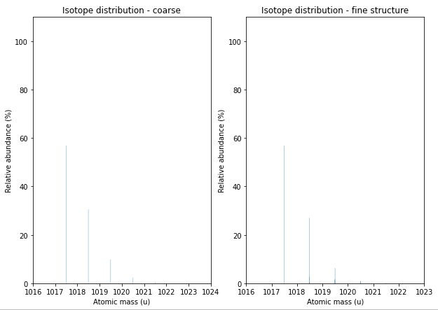

Peptides and Proteins
=====================

Sequences of amino acids form peptides and proteins.

Amino Acid Sequences
********************

The :py:class:`~.AASequence` class handles amino acid sequences in OpenMS. A string of
amino acid residues can be turned into a instance of :py:class:`~.AASequence` to provide
some commonly used operations like chemical formula, weight, and isotope distribution calculations.

The example below shows how amino acid sequences can be created and how basic mass calculations are conducted.

.. code-block:: python

    import pyopenms as oms

    seq = oms.AASequence.fromString(
        "DFPIANGER"
    )  # create AASequence object from string representation
    prefix = seq.getPrefix(4)  # extract prefix of length 4
    suffix = seq.getSuffix(5)  # extract suffix of length 5
    concat = seq + seq  # concatenate two sequences

    # print string representation of sequences
    print("Sequence:", seq)
    print("Prefix:", prefix)
    print("Suffix:", suffix)
    print("Concatenated:", concat)

    # some mass calculations
    mfull = seq.getMonoWeight()  # weight of M
    mprecursor = seq.getMonoWeight(oms.Residue.ResidueType.Full, 2)  # weight of M+2H

    # we can calculate mass-over-charge manually
    mz = seq.getMonoWeight(oms.Residue.ResidueType.Full, 2) / 2.0  # m/z of [M+2H]2+
    # or simply by:
    mz = seq.getMZ(2)  # same as above

    print()
    print("Monoisotopic mass of peptide [M] is", mfull)
    print("Monoisotopic mass of peptide precursor [M+2H]2+ is", mprecursor)
    print("Monoisotopic m/z of [M+2H]2+ is", mz)

Which prints the amino acid sequence as well as the result of
concatenating two sequences or taking the suffix of a sequence.
We then compute the mass of the full peptide (:chem:`[M]`), the mass of the
peptide precursor (:chem:`[M+2H]2+`) and m/z value of the
peptide precursor (:chem:`[M+2H]2+`).
Note that, the mass of the peptide precursor is shifted by two protons that are now attached to the
molecules as charge carriers. (Detail: the proton mass of :math:`1.007276\ u` is
slightly different from the mass of an uncharged hydrogen atom at :math:`1.007825\ u`).
We can easily calculate the charged weight of a :chem:`(M+2H)2+` ion and compute m/z simply dividing by the charge.

.. code-block:: output

    Sequence: DFPIANGER
    Prefix: DFPI
    Suffix: ANGER
    Concatenated: DFPIANGERDFPIANGER

    Monoisotopic mass of peptide [M] is 1017.4879641373001
    Monoisotopic mass of peptide precursor [M+2H]2+ is 1019.5025170708421
    Monoisotopic m/z of [M+2H]2+ is 509.7512585354211

The :py:class:`~.AASequence` object also allows iterations directly in Python:

.. code-block:: python
    :linenos:

    seq = oms.AASequence.fromString("DFPIANGER")

    print("The peptide", str(seq), "consists of the following amino acids:")
    for aa in seq:
        print(aa.getName(), ":", aa.getMonoWeight())

Which will print

.. code-block:: output

    The peptide DFPIANGER consists of the following amino acids:
    Aspartate : 133.0375092233
    Phenylalanine : 165.0789793509
    Proline : 115.0633292871
    Isoleucine : 131.0946294147
    Alanine : 89.04767922330001
    Asparagine : 132.0534932552
    Glycine : 75.0320291595
    Glutamate : 147.05315928710002
    Arginine : 174.1116764466

The N- and C-Terminus as well as the residues themself can be modified.
The example below shows how to check for such modifications.

.. code-block:: python

    seq = oms.AASequence.fromString("C[143]PKCK(Label:13C(6)15N(2))CR")

    # check if AASequence has a N- or C-terminal modification
    if seq.hasNTerminalModification():
        print("N-Term Modification: ", seq.getNTerminalModification().getFullId())
    if seq.hasCTerminalModification():
        print("C-Term Modification: ", seq.getCTerminalModification().getFullId())
    # iterate over all residues and look for modifications
    for aa in seq:
        if aa.isModified():
            print(
                aa.getName(), ":", aa.getMonoWeight(), ":", aa.getModificationName()
            )
        else:
            print(aa.getName(), ":", aa.getMonoWeight())

Which will print:

.. code-block:: output

    N-Term Modification:  Pyro-carbamidomethyl (N-term C)
    Cysteine : 121.01974995329999
    Proline : 115.06332928709999
    Lysine : 146.1055284466
    Cysteine : 121.01974995329999
    Lysine : 154.11972844660002 : Label:13C(6)15N(2)
    Cysteine : 121.01974995329999
    Arginine : 174.1116764466

Molecular Formula
~~~~~~~~~~~~~~~~~

We can now combine our knowledge of :py:class:`~.AASequence` with what we learned in
about :py:class:`~.EmpiricalFormula` to get accurate mass and isotope distributions from
the amino acid sequence. But first, let's get the formula of peptide:

.. code-block:: python

    seq = oms.AASequence.fromString("DFPIANGER")
    seq_formula = seq.getFormula()
    print("Peptide", seq, "has molecular formula", seq_formula)

Isotope Patterns
~~~~~~~~~~~~~~~~

We now want to print the coarse (e.g., peaks only at nominal masses) distribution.

.. code-block:: python

    # print coarse isotope distribution
    coarse_isotopes = seq_formula.getIsotopeDistribution(
        oms.CoarseIsotopePatternGenerator(6)
    )
    for iso in coarse_isotopes.getContainer():
        print(
            "Isotope", iso.getMZ(), "has abundance", iso.getIntensity() * 100, "%"
        )

For most applications in computational proteomics, the coarse isotope distribution is sufficient.
But if we deal with very high resolution instruments, we still might want to calculate the isotopic fine structure. 
We use the :py:class:`~.FineIsotopePatternGenerator` in OpenMS to reveal these additional peaks:

.. code-block:: python

    # print fine structure of isotope distribution
    fine_isotopes = seq_formula.getIsotopeDistribution(
        oms.FineIsotopePatternGenerator(0.01)
    )  # max 0.01 unexplained probability
    for iso in fine_isotopes.getContainer():
        print(
            "Isotope", iso.getMZ(), "has abundance", iso.getIntensity() * 100, "%"
        )

And plot the very similar looking distributions using standard ``matplotlib`` functionality:

.. code-block:: python

    import math
    from matplotlib import pyplot as plt

    def plotIsotopeDistribution(isotope_distribution, title="Isotope distribution"):
        plt.title(title)
        distribution = {"mass": [], "abundance": []}
        for iso in isotope_distribution.getContainer():
            distribution["mass"].append(iso.getMZ())
            distribution["abundance"].append(iso.getIntensity() * 100)

        bars = plt.bar(
            distribution["mass"], distribution["abundance"], width=0.01, snap=False
        )  # snap ensures that all bars are rendered

        plt.ylim([0, 110])
        plt.xticks(
            range(
                math.ceil(distribution["mass"][0]) - 2,
                math.ceil(distribution["mass"][-1]) + 2,
            )
        )
        plt.xlabel("Atomic mass (u)")
        plt.ylabel("Relative abundance (%)")

    plt.figure(figsize=(10, 7))
    plt.subplot(1, 2, 1)
    plotIsotopeDistribution(coarse_isotopes, "Isotope distribution - coarse")
    plt.subplot(1, 2, 2)
    plotIsotopeDistribution(fine_isotopes, "Isotope distribution - fine structure")
    plt.show()

Fragment Ions
~~~~~~~~~~~~~

We can easily calculate different ion types for amino acid sequences:

.. code-block:: python

    suffix = seq.getSuffix(3)  # y3 ion "GER"
    print("=" * 35)
    print("y3 ion sequence:", suffix)
    y3_formula = suffix.getFormula(oms.Residue.ResidueType.YIon, 2)  # y3++ ion
    suffix.getMonoWeight(oms.Residue.ResidueType.YIon, 2) / 2.0  # CORRECT
    suffix.getMonoWeight(oms.Residue.ResidueType.XIon, 2) / 2.0  # CORRECT
    suffix.getMonoWeight(oms.Residue.ResidueType.BIon, 2) / 2.0  # INCORRECT

    print("y3 mz:", suffix.getMonoWeight(oms.Residue.ResidueType.YIon, 2) / 2.0)
    print("y3 molecular formula:", y3_formula)

Which will produce

.. code-block:: output

    ===================================
    y3 ion sequence: GER
    y3 mz: 181.09514385
    y3 molecular formula: C13H24N6O6

Easy, isn't it? To generate full theoretical spectra watch out for the more specialized
(and faster) :py:class:`~.TheoreticalSpectrumGenerator` which we will take a look at later.

Modified Sequences
******************

The :py:class:`~.AASequence` class can also handle modifications,
modifications are specified using a unique string identifier present in the
:py:class:`~.ModificationsDB` in round brackets after the modified amino acid or by providing
the mass of the residue in square brackets. For example
``AASequence.fromString(".DFPIAM(Oxidation)GER.")`` creates an instance of the
peptide "DFPIAMGER" with an oxidized methionine. There are multiple ways to specify modifications, and
``AASequence.fromString("DFPIAM(UniMod:35)GER")``,
``AASequence.fromString("DFPIAM[+16]GER")`` and
``AASequence.fromString("DFPIAM[147]GER")`` are all equivalent). 

.. code-block:: python

        seq = oms.AASequence.fromString("PEPTIDESEKUEM(Oxidation)CER")
        print(seq.toUnmodifiedString())
        print(seq.toString())
        print(seq.toUniModString())
        print(seq.toBracketString())
        print(seq.toBracketString(False))

        print(oms.AASequence.fromString("DFPIAM(UniMod:35)GER"))
        print(oms.AASequence.fromString("DFPIAM[+16]GER"))
        print(oms.AASequence.fromString("DFPIAM[+15.99]GER"))
        print(oms.AASequence.fromString("DFPIAM[147]GER"))
        print(oms.AASequence.fromString("DFPIAM[147.035405]GER"))

The above code outputs:

.. code-block:: output

    PEPTIDESEKUEMCER
    PEPTIDESEKUEM(Oxidation)CER
    PEPTIDESEKUEM(UniMod:35)CER
    PEPTIDESEKUEM[147]CER
    PEPTIDESEKUEM[147.0354000171]CER

    DFPIAM(Oxidation)GER
    DFPIAM(Oxidation)GER
    DFPIAM(Oxidation)GER
    DFPIAM(Oxidation)GER
    DFPIAM(Oxidation)GER

Note there is a subtle difference between
``AASequence.fromString(".DFPIAM[+16]GER.")`` and
``AASequence.fromString(".DFPIAM[+15.9949]GER.")`` - while the former will try to
find the first modification matching to a mass difference of :math:`16 \pm 0.5`, the
latter will try to find the closest matching modification to the exact mass.
The exact mass approach usually gives the intended results while the first
approach may or may not. In all instances, it is better to use an exact description of the desired modification, such as UniMod, instead of mass differences.

N- and C-terminal modifications are represented by brackets to the right of the dots
terminating the sequence. For example, ``".(Dimethyl)DFPIAMGER."`` and
``".DFPIAMGER.(Label:18O(2))"`` represent the labelling of the N- and C-terminus
respectively, but ``".DFPIAMGER(Phospho)."`` will be interpreted as a
phosphorylation of the last arginine at its side chain:

.. code-block:: python

        s = oms.AASequence.fromString(".(Dimethyl)DFPIAMGER.")
        print(s, s.hasNTerminalModification())
        s = oms.AASequence.fromString(".DFPIAMGER.(Label:18O(2))")
        print(s, s.hasCTerminalModification())
        s = oms.AASequence.fromString(".DFPIAMGER(Phospho).")
        print(s, s.hasCTerminalModification())

Arbitrary / unknown amino acids (usually due to an unknown modification) can be
specified using tags preceded by :chem:`X`: :chem:`X[weight]`. This indicates a new amino
acid (":chem:`X`") with the specified weight, e.g. :chem:`RX[148.5]T`. Note that this tag
does not alter the amino acids to the left (:chem:`R`) or right (:chem:`T`). Rather, :chem:`X`
represents an amino acid on its own. Be careful when converting such :py:class:`~.AASequence`
objects to an EmpiricalFormula using :py:meth:`~.AASequence.getFormula`, as tags will not be
considered in this case (there exists no formula for them). However, they have
an influence on :py:meth:`~.AASequence.getMonoWeight` and :py:meth:`~.AASequence.getAverageWeight`!

Applying Fixed or Variable Modifications to Sequences
*****************************************************

In this tutorial, we will cover a step-by-step guide on how to use the pyopenms library to generate modified peptides from a given amino acid sequence.

.. code-block:: python

    import pyopenms as poms

    # Create an amino acid sequence using the fromString() method of the AASequence class.
    # In this example, we will use the amino acid sequence "TESTMTECSTMTESTR"
    sequence = poms.AASequence.fromString("TESTMTECSTMTESTR")
    
    # We use the names "Oxidation (M)" and "Carbamidomethyl (C)" for the variable and fixed modifications, respectively.
    variable_mod_names = [b"Oxidation (M)"]
    fixed_mod_names = [b"Carbamidomethyl (C)"]
    
    # We then use the getModifications() method of the ModifiedPeptideGenerator class to get the modifications for these names.
    variable_modifications = poms.ModifiedPeptideGenerator.getModifications(variable_mod_names)
    fixed_modifications = poms.ModifiedPeptideGenerator.getModifications(fixed_mod_names)
    
    # Apply the fixed modifications to the amino acid sequence
    poms.ModifiedPeptideGenerator.applyFixedModifications(fixed_modifications, sequence)
    
    # Define the maximum number of variable modifications allowed
    max_variable_mods = 1
    
    # Generate the modified peptides
    peptides_with_variable_modifications = []
    keep_unmodified_in_result = False
    poms.ModifiedPeptideGenerator.applyVariableModifications(variable_modifications, sequence, max_variable_mods,
                                                             peptides_with_variable_modifications,
                                                             keep_unmodified_in_result)
    
    # Print the modified peptides generated using Fixed modifications and their mono-isotopic mass.
    print("Fixed:", sequence.toString())
    print("Mono-isotopic mass:", sequence.getMonoWeight())
    
    # Print the modified peptides generated using variable modifications and their mono-isotopic mass.
    for peptide in peptides_with_variable_modifications:
        print("Variable:", peptide.toString())
        print("Mono-isotopic mass:", peptide.getMonoWeight())
        
The above code outputs:

.. code-block:: output

     Fixed: TESTMTEC(Carbamidomethyl)STMTESTR
     Mono-isotopic mass: 1850.7332409542007
     Variable: TESTMTEC(Carbamidomethyl)STM(Oxidation)TESTR
     Mono-isotopic mass: 1866.7281559542005
     Variable: TESTM(Oxidation)TEC(Carbamidomethyl)STMTESTR
     Mono-isotopic mass: 1866.7281559542005

Proteins and :term:`FASTA` Files
********************************

Protein sequences, can be loaded from and stored in :term:`FASTA` protein databases using :py:class:`~.FASTAFile`.
The example below shows how protein sequences can be stored in :term:`FASTA` files and loaded back in pyOpenMS:

.. code-block:: python

        bsa = oms.FASTAEntry()  # one entry in a FASTA file
        bsa.sequence = "MKWVTFISLLLLFSSAYSRGVFRRDTHKSEIAHRFKDLGE"
        bsa.description = "BSA Bovine Albumin (partial sequence)"
        bsa.identifier = "BSA"
        alb = oms.FASTAEntry()
        alb.sequence = "MKWVTFISLLFLFSSAYSRGVFRRDAHKSEVAHRFKDLGE"
        alb.description = "ALB Human Albumin (partial sequence)"
        alb.identifier = "ALB"

        entries = [bsa, alb]

        f = oms.FASTAFile()
        f.store("example.fasta", entries)

Afterwards, the ``example.fasta`` file can be read again from the disk:

.. code-block:: python

        entries = []
        f = oms.FASTAFile()
        f.load("example.fasta", entries)
        print(len(entries))
        for e in entries:
            print(e.identifier, e.sequence)

