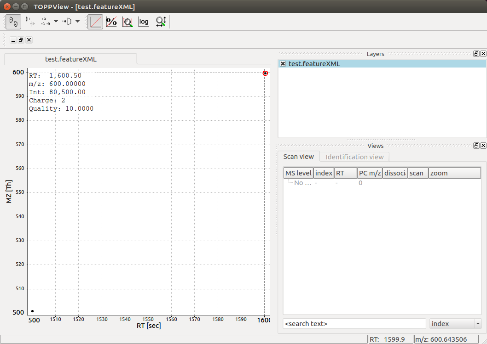
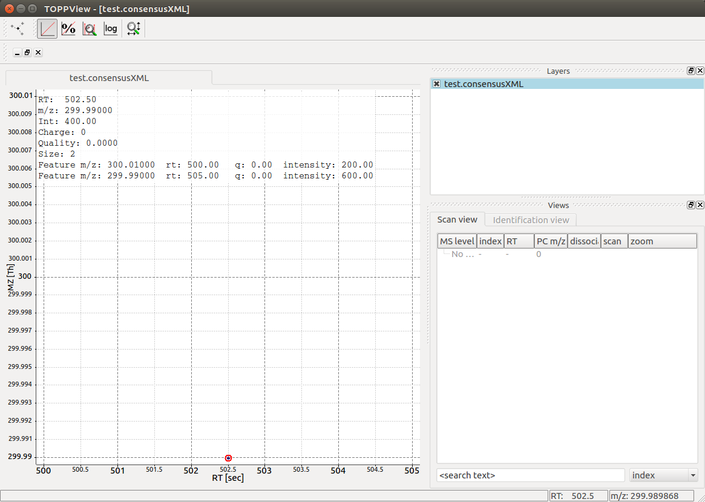

Quantitative Data
=================

Features
**************************

In OpenMS, information about quantitative data is stored in a so-called
:py:class:`~.Feature`.  Each
:py:class:`~.Feature` represents a region in RT and m/z for quantitative
analysis.

.. code-block:: python
    :linenos:

    import pyopenms as oms

    feature = oms.Feature()
    feature.setMZ(500.9)
    feature.setCharge(2)
    feature.setRT(1500.1)
    feature.setIntensity(30500)
    feature.setOverallQuality(10)
..    py 2.4
      masstrace = []
      for i in range(10):
        p = DPosition2(feature.getRT() + i - 5, 200 - abs(i-5))
        masstrace.push_back(p)

Usually, the quantitative features would be produced by a so-called
`FeatureFinder` algorithm, which we will discuss in the `next chapter <feature_detection.html>`_. The
features can be stored in a :py:class:`~.FeatureMap` and written to disk.

.. code-block:: python
    :linenos:

    fm = oms.FeatureMap()
    fm.push_back(feature)
    feature.setRT(1600.5)
    feature.setCharge(2)
    feature.setMZ(600.0)
    feature.setIntensity(80500.0)
    fm.push_back(feature)
    oms.FeatureXMLFile().store("test.featureXML", fm)

Opening the resulting feature map in :term:`TOPPView` allows to visualize the two
features (each represented by a black dot in the top right and bottom left, respectively).
Hovering over a feature displays m/z, RT and other properties:

In the above example, only two features are present. In a typical :term:`LC-MS/MS`
experiment, you can expect thousands of features.

:term:`Feature Maps<feature maps>`
**********************************

The resulting :py:class:`~.FeatureMap` can be used in various ways to extract
quantitative data directly and it supports direct iteration in Python:

.. code-block:: python
    :linenos:

    fmap = oms.FeatureMap()
    oms.FeatureXMLFile().load("test.featureXML", fmap)
    for feature in fmap:
        print("Feature: ", feature.getIntensity(), feature.getRT(), feature.getMZ())

:term:`Consensus Features<consensus features>`
**********************************************

Often :term:`LC-MS/MS` experiments are run to compare quantitative features across
experiments. In OpenMS, linked features from individual experiments are
represented by a :py:class:`~.ConsensusFeature`

.. code-block:: python
    :linenos:

    cf = oms.ConsensusFeature()
    cf.setMZ(500.9)
    cf.setCharge(2)
    cf.setRT(1500.1)
    cf.setIntensity(80500)

    # Generate ConsensusFeature from features of two maps (with id 1 and 2)
    ### Feature 1
    f_m1 = oms.ConsensusFeature()
    f_m1.setRT(500)
    f_m1.setMZ(300.01)
    f_m1.setIntensity(200)
    f_m1.ensureUniqueId()
    ### Feature 2
    f_m2 = oms.ConsensusFeature()
    f_m2.setRT(505)
    f_m2.setMZ(299.99)
    f_m2.setIntensity(600)
    f_m2.ensureUniqueId()
    cf.insert(1, f_m1)
    cf.insert(2, f_m2)

We have thus added two features from two individual maps (which have the unique
identifier ``1`` and ``2``) to the :py:class:`~.ConsensusFeature`.
Next, we inspect the :term:`consensus feature`, compute a "consensus" m/z across
the two maps and output the two linked features:

.. code-block:: python
    :linenos:

    # The two features in map 1 and map 2 represent the same analyte at
    # slightly different RT and m/z
    for fh in cf.getFeatureList():
        print(fh.getMapIndex(), fh.getIntensity(), fh.getRT())

    print(cf.getMZ())
    cf.computeMonoisotopicConsensus()
    print(cf.getMZ())

    # Generate ConsensusMap and add two maps (with id 1 and 2)
    cmap = oms.ConsensusMap()
    fds = {1: oms.ColumnHeader(), 2: oms.ColumnHeader()}
    fds[1].filename = "file1"
    fds[2].filename = "file2"
    cmap.setColumnHeaders(fds)

    cf.ensureUniqueId()
    cmap.push_back(cf)
    oms.ConsensusXMLFile().store("test.consensusXML", cmap)

Inspection of the generated ``test.consensusXML`` reveals that it contains
references to two :term:`LC-MS/MS` runs (``file1`` and ``file2``) with their respective
unique identifier. Note how the two features we added before have matching
unique identifiers. 

Visualization of the resulting output file reveals a single
:py:class:`~.ConsensusFeature` of size 2 that links to the two individual features at
their respective positions in RT and m/z:

:term:`Consensus Maps<consensus maps>`
**************************************

The resulting :py:class:`~.ConsensusMap` can be used in various ways to extract
quantitative data directly and it supports direct iteration in Python:

.. code-block:: python
    :linenos:

    cmap = oms.ConsensusMap()
    oms.ConsensusXMLFile().load("test.consensusXML", cmap)
    for cfeature in cmap:
        cfeature.computeConsensus()
        print(
            "ConsensusFeature",
            cfeature.getIntensity(),
            cfeature.getRT(),
            cfeature.getMZ(),
        )
        # The two features in map 1 and map 2 represent the same analyte at
        # slightly different RT and m/z
        for fh in cfeature.getFeatureList():
            print(" -- Feature", fh.getMapIndex(), fh.getIntensity(), fh.getRT())
