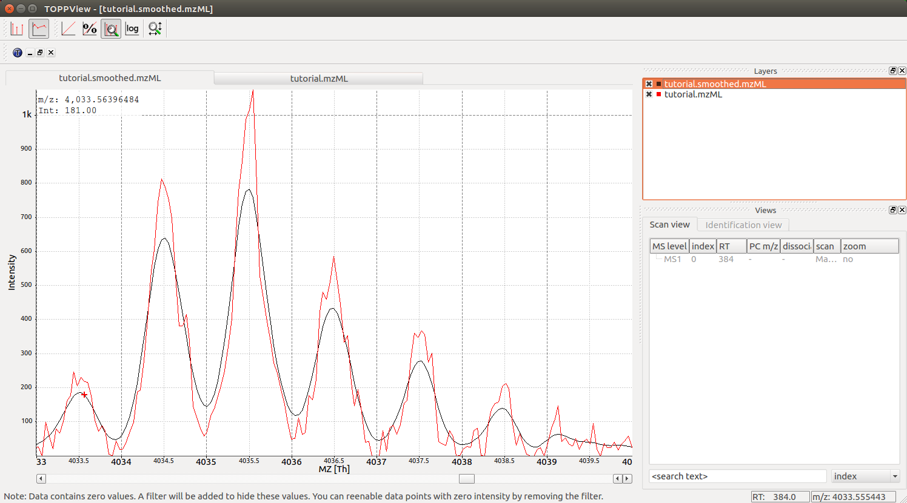

Smoothing 
=========

In many applications, mass spectrometric data should be smoothed first before
further analysis

.. code-block:: python
    :linenos:

    from urllib.request import urlretrieve
    import pyopenms as oms

    gh = "https://raw.githubusercontent.com/OpenMS/pyopenms-docs/master"
    urlretrieve(
        gh + "/src/data/peakpicker_tutorial_1_baseline_filtered.mzML",
        "tutorial.mzML",
    )

    exp = oms.MSExperiment()
    gf = oms.GaussFilter()
    param = gf.getParameters()
    param.setValue("gaussian_width", 1.0)  # needs wider width
    gf.setParameters(param)

    oms.MzMLFile().load("tutorial.mzML", exp)
    gf.filterExperiment(exp)
    oms.MzMLFile().store("tutorial.smoothed.mzML", exp)

We can now load our data into :term:`TOPPView` to observe the effect of the smoothing,
which becomes apparent when we overlay the two files (drag onto each other) and
then zoom into a given mass range using Ctrl-G and select :math:`4030` to :math:`4045`:

In the screenshot above we see the original data (red) and the smoothed data
(black), indicating that the smoothing does clean up noise in the data
significantly and will prepare the data for downstream processing, such as
peak-picking.

