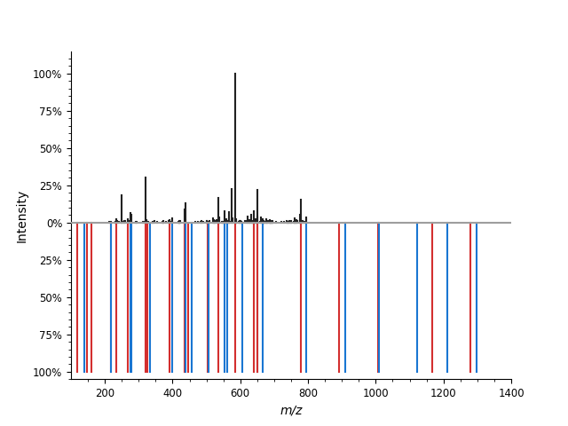
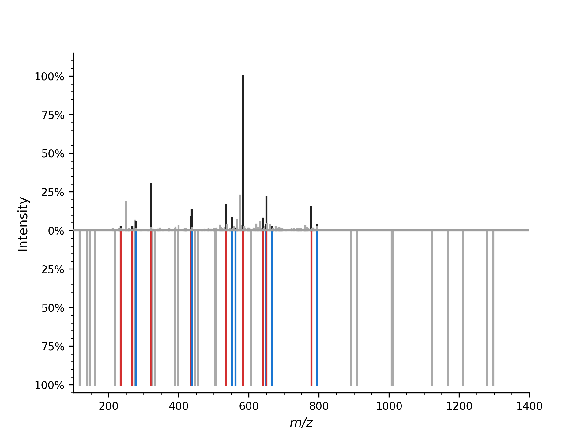

Spectrum Alignment
==================

OpenMS provides several ways to find matching peaks between two mass spectra.
The most basic one :py:class:`~.SpectrumAlignment` returns a list of matching peak indices between a query and target mass spectrum.
In this example, we take an observed (measured) mass spectrum and align a theoretical mass spectrum to it.

First we load a (chemically modified) peptide:

.. code-block:: python
    :linenos:

    from urllib.request import urlretrieve
    import pyopenms as oms

    gh = "https://raw.githubusercontent.com/OpenMS/pyopenms-docs/master"
    urlretrieve(
        gh + "/src/data/YIC(Carbamidomethyl)DNQDTISSK.mzML", "observed.mzML"
    )

    exp = oms.MSExperiment()
    # Load mzML file and obtain spectrum for peptide YIC(Carbamidomethyl)DNQDTISSK
    oms.MzMLFile().load("observed.mzML", exp)

    # Get first spectrum
    spectra = exp.getSpectra()
    observed_spectrum = spectra[0]

Now we generate the theoretical mass spectrum of that peptide:

.. code-block:: python
    :linenos:

    tsg = oms.TheoreticalSpectrumGenerator()
    theo_spectrum = oms.MSSpectrum()
    p = tsg.getParameters()
    p.setValue("add_y_ions", "true")
    p.setValue("add_b_ions", "true")
    p.setValue("add_metainfo", "true")
    tsg.setParameters(p)
    peptide = oms.AASequence.fromString("YIC(Carbamidomethyl)DNQDTISSK")
    tsg.getSpectrum(theo_spectrum, peptide, 1, 2)

Now we can plot the observed and theoretical mass spectrum as a mirror plot:

.. code-block:: python
    :linenos:

    import matplotlib.pyplot as plt
    from pyopenms.plotting import mirror_plot_spectrum

    mirror_plot_spectrum(
        observed_spectrum,
        theo_spectrum,
        spectrum_bottom_kws={"annotate_ions": False},
    )
    plt.show()

which produces

Now we want to find matching peaks between observed and theoretical mass spectrum.

.. code-block:: python
    :linenos:

    alignment = []
    spa = oms.SpectrumAlignment()
    p = spa.getParameters()
    # use 0.5 Da tolerance (Note: for high-resolution data we could also use ppm by setting the is_relative_tolerance value to true)
    p.setValue("tolerance", 0.5)
    p.setValue("is_relative_tolerance", "false")
    spa.setParameters(p)
    # align both spectra
    spa.getSpectrumAlignment(alignment, theo_spectrum, observed_spectrum)

The alignment contains a list of matched peak indices. We can simply inspect matching peaks with:

.. code-block:: python
    :linenos:

    from tabulate import tabulate

    # Print matching ions and mz from theoretical spectrum
    print("Number of matched peaks: " + str(len(alignment)))
    t = []
    for theo_idx, obs_idx in alignment:
        ion_name = theo_spectrum.getStringDataArrays()[0][theo_idx].decode()
        ion_charge = theo_spectrum.getIntegerDataArrays()[0][theo_idx]
        t.append(
            [
                ion_name,
                str(ion_charge),
                str(theo_spectrum[theo_idx].getMZ()),
                str(observed_spectrum[obs_idx].getMZ()),
            ]
        )
    print(tabulate(t, headers=["ion", "charge", "theo. m/z", "observed m/z"]))

.. code-block:: output

    Number of matched peaks: 16
    ion      charge    theo. m/z    observed m/z
    -----  --------  -----------  --------------
    y2+           1      234.145         234.123
    y5++          2      268.158         268.105
    b2+           1      277.155         277.246
    y3+           1      321.177         321.297
    y4+           1      434.261         434.288
    b3+           1      437.185         437.291
    y5+           1      535.309         535.189
    b4+           1      552.212         552.338
    b9++          2      562.24          562.421
    y10++         2      584.251         584.412
    y11++         2      640.793         640.954

The mirror plot can also be used to visualize the aligned mass spectrum:

.. code-block:: python
    :linenos:

    import matplotlib.pyplot as plt
    from pyopenms.plotting import mirror_plot_spectrum

    match_peaks_observed, match_peaks_theoretical = list(zip(*alignment))
    mirror_plot_spectrum(
        observed_spectrum,
        theo_spectrum,
        spectrum_top_kws={"matched_peaks": match_peaks_theoretical},
        spectrum_bottom_kws={"annotate_ions": False, "matched_peaks": match_peaks_observed}
    )
    plt.show()

which produces

