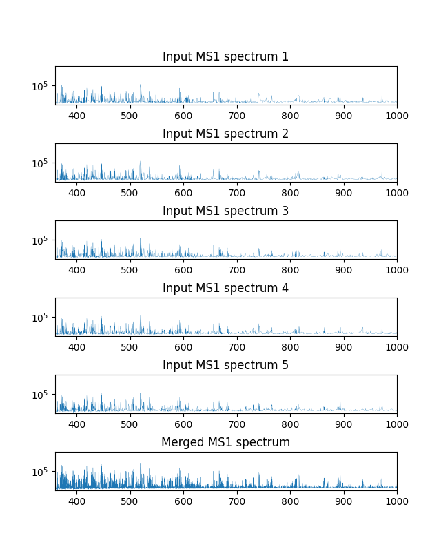
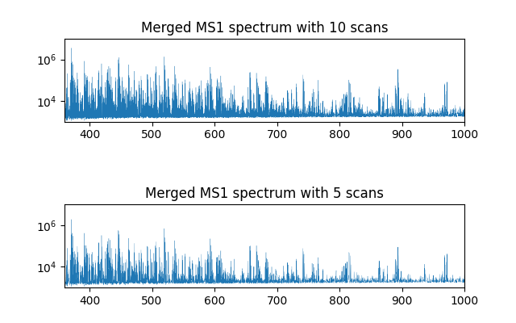
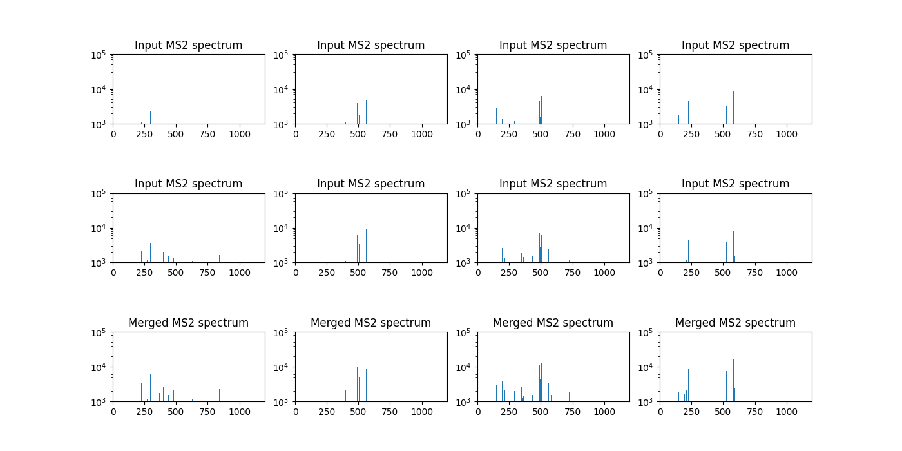
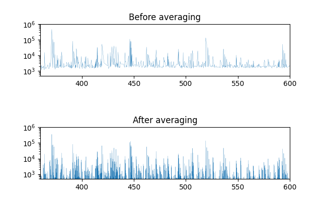

Spectra Merge Algorithm
*************************

OpenMS provides spectra merging and averaging algorithms in :py:class:`~.SpectraMerger` class. Spectra merging is to merge multiple related spectra into a single one - thus, often we end up with a reduced number of spectra.
For instance, MS1 spectra within a pre-defined retention time window or MS2 spectra from the same precursor ion. On the other hand, spectra averaging averages neighbouring spectra for each spectrum.
Thus, the number of spectra remains the same after spectra averaging. Both merging and averaging attempt to increase the quality of spectrum by increasing its signal to noise ratio. 

Spectra merging and averaging are implemented in SpectraMerger in pyOpenMS, which provides two merging (block wise and precursor method - see below) and two averaging methods (gaussian and tophat - see below).
For merging, we can use 

- mergeSpectraBlockWise
- mergeSpectraPrecursors

and for averaging, we use 

- average 

with two different options: gaussian and tophat methods. :py:class:`~.SpectraMerger` inherits :py:class:`~.DefaultParamHandler`. Thus you could list the full set of parameters as described in `Parameter handling <parameter_handling.html>`_.

Loading the Raw Data
--------------------

Let's take a look at the different algorithms in the examples below. First we download a test MS/MS dataset.

.. code-block:: python
  :linenos:

  # retrieve data
  from urllib.request import urlretrieve
  import pyopenms as oms
  import matplotlib.pyplot as plt

  gh = "https://raw.githubusercontent.com/OpenMS/pyopenms-docs/master"
  urlretrieve(gh + "/src/data/small.mzML", "test.mzML")

  # load MS data and store as MSExperiment object
  exp = oms.MSExperiment()
  oms.MzMLFile().load('test.mzML', exp)

Block wise spectra merging
-----------------------
Our first example merges MS1 spectra block wise.

.. code-block:: python
  :linenos:

  spectra = exp.getSpectra()

  # Collecting only MS1 spectra
  spectra_ms1 = [s for s in spectra if s.getMSLevel() == 1]
  print(f'Number of MS1 spectra before merge are {len(spectra_ms1)}')

  # merges blocks of MS1
  merger = oms.SpectraMerger()
  merger.mergeSpectraBlockWise(exp)

  # Get spectra from the updated (merged) experiment
  spectraMerged = exp.getSpectra()
  spectraMerged_ms1 = [s for s in spectraMerged if s.getMSLevel() == 1]
  print(f'Number of MS1 spectra after merge are {len(spectraMerged_ms1)}')
  # store merged spectra in the disk
  oms.MzMLFile().store("blockwiseMerged.mzML", exp)

  # Setting up subplots for five original spectra and merged spectrum
  fig, axs = plt.subplots(6)
  fig.set_figheight(8)
  plt.subplots_adjust(hspace=1)

  for i in range(0, 6):
      s = spectra_ms1[i] if i < 5 else spectraMerged_ms1[0]
      axs[i].plot(s.get_peaks()[0], s.get_peaks()[1], linewidth=.2)
      axs[i].set_yscale("log")
      axs[i].set_ylim(1e3, 1e7)
      axs[i].set_xlim(360, 1000)
      axs[i].title.set_text('Input MS1 spectrum ' + str(i + 1) if i < 5 else 'Merged MS1 spectrum')
  plt.show()

.. code-block:: output 
  
  Number of MS1 spectra before merge are 183
  Number of MS1 spectra after merge are 37
  Cluster sizes:
    size 3: 1x
    size 5: 36x
  Number of merged peaks: 87177/360394 (24.19 %) of blocked spectra

Above example clearly demonstrates the benefit of spectra merging.  The upper rows show the input spectra and the bottom the merged one. The merged spectrum (bottom) has far more signal peaks of higher intensities than the input spectra.

By default, the method ``mergeSpectraBlockWise`` of :py:class:`~.SpectraMerger` merges 5 consecutive MS1 spectra into a block.
The block size could be adjusted by using ``block_method:rt_block_size`` parameter as follow:

.. code-block:: python
  :linenos:

  # again load MS data and store as MSExperiment object
  exp = oms.MSExperiment()
  oms.MzMLFile().load('test.mzML', exp)

  # again load MS data and store as MSExperiment object
  exp = oms.MSExperiment()
  oms.MzMLFile().load('test.mzML', exp)

  # adjust block size to 10 spectra and merge
  merger = oms.SpectraMerger()
  param = merger.getParameters()
  param.setValue("block_method:rt_block_size", 10)
  merger.setParameters(param)
  merger.mergeSpectraBlockWise(exp)

  spectraMerged = exp.getSpectra()
  spectraMerged_ms1_10scans = [s for s in spectraMerged if s.getMSLevel() == 1]

  # store merged spectra in the disk
  oms.MzMLFile().store("blockwiseMerged_10scans.mzML", exp)

  fig, axs = plt.subplots(2)
  fig.set_figheight(4)
  plt.subplots_adjust(hspace=1)

  for i in range(0, 2):
      s = spectraMerged_ms1_10scans[0] if i == 0 else spectraMerged_ms1[0]
      axs[i].plot(s.get_peaks()[0], s.get_peaks()[1], linewidth=.2)
      axs[i].set_yscale("log")
      axs[i].set_ylim(1e3, 1e7)
      axs[i].set_xlim(360, 1000)
      axs[i].title.set_text('Merged MS1 spectrum with 10 scans' if i == 0 else 'Merged MS1 spectrum with 5 scans')
  plt.show()

.. code-block:: output

  Number of MS1 spectra after merge are 19
  Cluster sizes:
    size 3: 1x
    size 10: 18x
  Number of merged peaks: 117793/360394 (32.68 %) of blocked spectra
  72 spectra and 1 chromatograms stored.

As shown in the above figure, clearer signal peaks are obtained with 10 MS1 scans being merged than 5 MS1 scans. Note that the y-axis is in log scale. But if too many scans are merged,
spectra containing too different sets of molecules would be merged, yielding a poor quality spectrum. The users may want to try a few different parameters to produce spectra of optimal quality.

MS2 spectra merging with precursor method
-----------------------
Next we perform MS2 spectra merging with precursor method by using the ``mergeSpectraPrecursors`` method. With this method, the MS2 spectra from the same precursor m/z (subject to tolerance) are merged.

.. code-block:: python 
  :linenos:

  # load MS data and store as MSExperiment object
  exp = oms.MSExperiment()
  oms.MzMLFile().load('test.mzML', exp)

  spectra = exp.getSpectra()

  # spectra with ms_level = 2
  spectra_ms2 = [s for s in spectra if s.getMSLevel() == 2]
  print(f'Number of MS2 spectra before merge are {len(spectra_ms2)}')

  # merge spectra with similar precursors
  merger = oms.SpectraMerger()
  merger.mergeSpectraPrecursors(exp)

  spectraMerged = exp.getSpectra()
  spectraMerged_ms2 = [s for s in spectraMerged if s.getMSLevel() == 2]
  print(f'Number of MS2 spectra after merge are {len(spectraMerged_ms2)}')

.. code-block:: output

  Number of MS2 spectra before merge are 53
  Number of MS2 spectra after merge are 53
  Cluster sizes:
  Number of merged peaks: 0/0 (nan %) of blocked spectra

In the above example, no MS2 spectra have been merged because no MS2 spectra had the same precursor m/z values (subject to tolerance) within retention time window.
By default, the retention time window size is 5.0 seconds and the precursor m/z tolerance is 1e-4Th. If you opens the test.mzML file, you can see a few MS2 spectra (e.g., scan numbers 2077 and 2099)
have quite close precursor m/z values (both have precursor m/z of 432.902Th), but they are apart from each other by about 10 seconds. We adjust both m/z tolerance and retention time so such MS2 spectra are merged together with ``precursor_method:mz_tolerance`` and ``precursor_method:rt_tolerance`` parameters.

.. code-block:: python
  :linenos:

  # adjust mz and rt tolerances for MS2 spectra grouping for merging
  param = merger.getParameters()
  param.setValue("precursor_method:rt_tolerance", 10.0)
  param.setValue("precursor_method:mz_tolerance", 1e-3)
  merger.setParameters(param)
  merger.mergeSpectraPrecursors(exp)

  # now rerun precursor method merging of MS2 spectra
  spectraMerged = exp.getSpectra()
  spectraMerged_ms2 = [s for s in spectraMerged if s.getMSLevel() == 2]
  print(f'Number of MS2 spectra after merge are {len(spectraMerged_ms2)}')

  # store modified data
  oms.MzMLFile().store("precursorMethodMerged.mzML", exp)

.. code-block:: output

  Number of MS2 spectra after merge are 45
  Cluster sizes:
  size 2: 8x
  Number of merged peaks: 488/2262 (21.57 %) of blocked spectra

To check which MS2 spectra are merged together, one can print out the native IDs of the spectra.
The native ID of each merged spectrum contains all native IDs of the spectra being merged (comma separated) - this also holds for block wise merging method.

.. code-block:: python
  :linenos:

  # check which input MS2 spectra were merged
  merged_spectra = dict()
  for index, s in enumerate(spectraMerged_ms2):
      native_IDs = s.getNativeID().split(",")
      if len(native_IDs) > 1:  # spectrum is merged
          print(native_IDs)
          merged_specs = []
          for native_ID in native_IDs:
              for s2 in spectra_ms2:  # original spectra
                  if native_ID == s2.getNativeID():
                      merged_specs.append(s2)
                      break
          merged_spectra[index] = merged_specs

.. code-block:: output

  ['controllerType=0 controllerNumber=1 scan=1986', 'controllerType=0 controllerNumber=1 scan=2010']
  ['controllerType=0 controllerNumber=1 scan=1991', 'controllerType=0 controllerNumber=1 scan=2015']
  ['controllerType=0 controllerNumber=1 scan=1992', 'controllerType=0 controllerNumber=1 scan=2014']
  ['controllerType=0 controllerNumber=1 scan=2026', 'controllerType=0 controllerNumber=1 scan=2050']
  ['controllerType=0 controllerNumber=1 scan=2037', 'controllerType=0 controllerNumber=1 scan=2059']
  ['controllerType=0 controllerNumber=1 scan=2062', 'controllerType=0 controllerNumber=1 scan=2088']
  ['controllerType=0 controllerNumber=1 scan=2077', 'controllerType=0 controllerNumber=1 scan=2099']
  ['controllerType=0 controllerNumber=1 scan=2084', 'controllerType=0 controllerNumber=1 scan=2107']

We can confirm that scans 2077 and 2099 have been merged. In addition, we had a few more pairs of MS2 spectra that were merged. We also plot the input and merged spectra below.

.. code-block:: python
  :linenos:

  # plot the merged and merging MS2 spectra

  fig, axs = plt.subplots(3, min(4, len(merged_spectra)))
  fig.set_figheight(7)
  fig.set_figwidth(14)
  plt.subplots_adjust(hspace=1)

  for index, item in enumerate(merged_spectra.items()):
      if index == 4:  # show 4 examples
          break
      specs = item[1]
      for i in range(0, 3):
          s = specs[i] if i < 2 else spectraMerged_ms2[item[0]]
          axs[i, index].bar(s.get_peaks()[0], s.get_peaks()[1], width=1)
          axs[i, index].set_yscale("log")
          axs[i, index].set_ylim(1e3, 1e5)
          axs[i, index].set_xlim(0, 1200)
          axs[i, index].title.set_text('Input MS2 spectrum' if i < 2 else 'Merged MS2 spectrum')
  plt.show()

Four examples of MS2 spectra before and after merging are provided above. Each column shows an example. The upper rows show the input spectra and the bottom the merged one. The input MS2 spectra selected by the precursor method show quite similar peak distributions, indicating they are indeed from the same molecule ions.
Moreover, as in the above block wise merging, we can check that a merged MS2 spectrum has more peaks than input spectra, possibly containing more complete fragmentation ion masses.

Spectra averaging : gaussian and top hat methods
-----------------------

:py:class:`~.SpectraMerger` presents a method ``average`` to average peak intensities over neighbouring spectra for a given spectrum.
As mentioned above, apart from spectra merging, the number of spectra after averaging does not change since it is carried out for each individual input spectrum.
The two averaging methods (``gaussian`` or ``tophat``) determine how neighbouring spectra are collected and how weights for the averaging are determined.
The ``gaussian`` method performs weighted average over the neighbouring spectra with weights having the shape of gaussian shape (i.e., sharply decreasing from the center).
On the other hand, the ``tophat`` method, as the name implies, performs a simple averaging over the neighbouring spectra. Below we perform ``gaussian`` averaging method.

.. code-block:: python 
  :linenos:

  # load MS data and store as MSExperiment object
  exp = oms.MSExperiment()
  oms.MzMLFile().load('test.mzML', exp)
  spectra = exp.getSpectra()

  # number of MS1 spectra before averaging
  spectra_ms1 = [s for s in spectra if s.getMSLevel() == 1]
  print(f'Number of MS1 spectra before averaging are {len(spectra_ms1)}')

  # average spectra with gaussian
  merger = oms.SpectraMerger()
  merger.average(exp, "gaussian")
  spectraAveraged = exp.getSpectra()

  # number of MS1 spectra after averaging
  spectraAveraged_ms1 = [s for s in spectraAveraged if s.getMSLevel() == 1]
  print(f'Number of MS1 spectra after averaging are {len(spectraAveraged_ms1)}')

  fig, axs = plt.subplots(2)
  fig.set_figheight(4)
  plt.subplots_adjust(hspace=1)

  for i in range(0, 2):
      s = spectra_ms1[0] if i == 0 else spectraAveraged_ms1[0]
      axs[i].plot(s.get_peaks()[0], s.get_peaks()[1], linewidth=.2)
      axs[i].set_yscale("log")
      axs[i].set_ylim(5e2, 1e6)
      axs[i].set_xlim(360, 600)
      axs[i].title.set_text('Before averaging' if i == 0 else 'After averaging')
  plt.show()

  # store modified data
  oms.MzMLFile().store("averagedData.mzML", exp)

.. code-block:: output

  Number of MS1 spectra before averaging are 183
  Number of MS1 spectra after averaging are 183

After averaging has been applied, the the number of spectra does not change as we mentioned above. But the above plots show that the base line intensity has decreased significantly after averaging.  The signal peaks are better separated in the averaged spectrum than in the original spectrum as well.