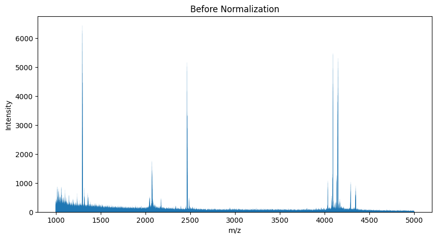
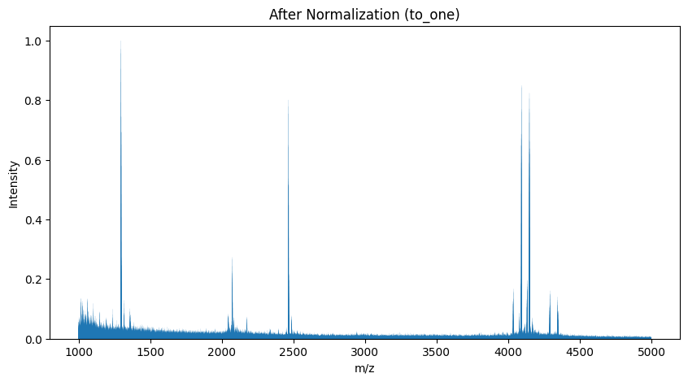
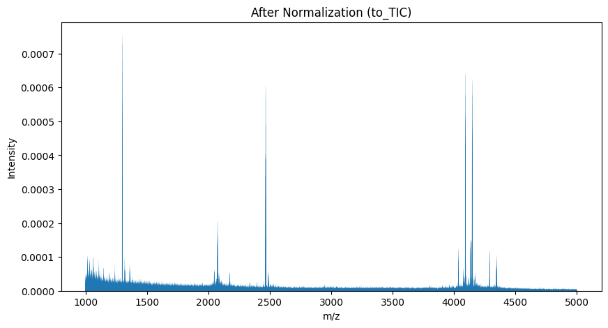

Spectrum Normalization
======================

Normalization by base peak intensity is a fundamental processing step in mass spectrometry. This method scales the peak intensities in a spectrum such that the highest peak reaches a maximum value, typically set to one. This approach facilitates the comparison of different spectra by standardizing the intensity scale.

Loading the Raw Data
--------------------

To begin, we need to load the mass spectrometry data. The following Python code demonstrates how to load a spectrum from an mzML file using the pyOpenMS library.

.. code-block:: python
  :linenos:

  from urllib.request import urlretrieve
  import pyopenms as oms
  import matplotlib.pyplot as plt

  gh = "https://raw.githubusercontent.com/OpenMS/pyopenms-docs/master"
  urlretrieve(gh + "/src/data/peakpicker_tutorial_1_baseline_filtered.mzML", "tutorial.mzML")

  exp = oms.MSExperiment()
  oms.MzMLFile().load("tutorial.mzML", exp)

  plt.bar(exp.getSpectrum(0).get_peaks()[0], exp.getSpectrum(0).get_peaks()[1], snap=False)
  plt.show()

Normalization Procedure
-----------------------

After loading the data, the next step is to apply normalization. We use
the :py:class:`~.Normalizer` class.

.. code-block:: python
  :linenos:

  normalizer = oms.Normalizer()
  param = normalizer.getParameters()
  param.setValue("method", "to_one")
  normalizer.setParameters(param)

  normalizer.filterPeakMap(exp)
  plt.bar(exp.getSpectrum(0).get_peaks()[0], exp.getSpectrum(0).get_peaks()[1], snap=False)
  plt.show()

To list all available normalization methods of the :py:class:`~.Normalizer`, either look into its documentation, or
query the valid values of its `method` parameter:

.. code-block:: python
  :linenos:

  normalizer = oms.Normalizer()
  param = normalizer.getParameters()
  print(param.getValidStrings("method"))  # [b'to_one', b'to_TIC']

TIC Normalization
-----------------

Another approach to normalization is using the Total Ion Count (TIC). This method adjusts the intensities so that their total sum equals 1.0 in each mass spectrum.

.. code-block:: python
  :linenos:

  param.setValue("method", "to_TIC")
  normalizer.setParameters(param)
  normalizer.filterPeakMap(exp)
  plt.bar(exp.getSpectrum(0).get_peaks()[0], exp.getSpectrum(0).get_peaks()[1], snap=False)
  plt.show()

